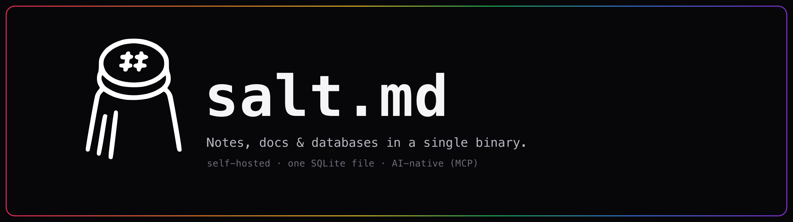

<p align="center">
  
</p>

<p align="center">
  <b>The open-source workspace for people and AI agents.</b><br>
  Docs, databases and realtime collaboration for your team — and an MCP server
  in the same binary, so an agent works <i>in</i> that workspace instead of
  talking about it.
</p>

<p align="center">
  <a href="https://salt.md">Website</a> ·
  <a href="https://salt.md/wiki/">Documentation</a> ·
  <a href="#quickstart">Quickstart</a> ·
  <a href="#what-an-agent-can-do">Agents</a> ·
  <a href="https://salt.md/demo/">Live demo</a>
</p>

<p align="center">
  
</p>

---

An agent asks to organise the launch notes. A page appears, a database is
created, the rows fill in — and a person opens the same board a second later and
carries on editing. Same pages, same permissions, same history.

That is the whole idea. Everything below is how it works.

## Quickstart

```sh
curl -fsSL https://raw.githubusercontent.com/saltmd/salt.md/main/install.sh | sh
salt
```

The installer downloads one binary for your platform. `salt` then starts it on
`http://localhost:8420`, where you create the first account. There is nothing
else to install — no database server, no cache, no object store, no separate
realtime service.

Docker, if you prefer:

```sh
docker run -d -p 8420:8420 -v salt-data:/data ghcr.io/saltmd/salt.md:latest
```

## Why salt.md exists

Agents increasingly need somewhere to put durable, structured work — not a chat
log, not a vector store, but pages and tables a person will read tomorrow.

Today they get one of two bad options. A workspace built for humans, with an AI
feature bolted to the side, which means the agent talks *about* the content
through a chat window. Or agent infrastructure with a decent API and no
interface a human being would willingly use.

salt.md is one workspace with two front doors. A block editor, databases and
realtime editing for people. An MCP endpoint for agents, on the same objects
and the same permission model. And you run the whole thing yourself.

## What an agent can do

Connect any MCP client to `/mcp` and it gets **33 tools** over the same
workspace you use:

- **Read and write pages** — create, update, move, duplicate, trash, restore
- **Work with databases** — create one, change its schema, add and query rows,
  configure views
- **Search** the whole workspace, with the same permission checks a person gets
- **Import** from a URL or a Notion export, in bulk
- **Comment**, and write to a page's append-only note trail
- **Announce what it is working on**, which shows live in the interface beside
  the page — so you can see an agent is mid-edit before you start typing

**And a bounded set it cannot touch.** An agent may not create or delete
accounts, change two-factor settings, issue API tokens, take or restore a
backup, alter instance settings, or change who is in a workspace. That list is
not a promise in a README — the server sends it to every agent that connects.

Full reference: [MCP tools](https://salt.md/wiki/mcp-tools/).

## Agents get permissions, not a master key

A credential belongs to a person and carries that person's access — never more.
Beyond that:

- Every workspace decides for itself what agents may do there: anything they
  were granted, only signed-in connections, or nothing at all.
- Tokens narrow by scope and by workspace.
- Agent actions are attributable — the activity log distinguishes them from
  yours.
- Administration is deliberately out of reach of any token.

Giving an agent write access is only useful if you can still say who reached
what, and what changed. See [Permissions](https://salt.md/wiki/permissions/).

## And it is a real workspace

Not developer infrastructure with a login screen.

**Write** — a block editor with a slash menu, nested lists, checklists, quotes,
code, tables, images and callouts. Page links, backlinks, tags, covers and
icons. Comments in a side panel.

**Organise** — turn any page into a collection with typed properties: text,
number, select, multi-select, date, person, checkbox, checklist, URL, relation,
rollup, formula and backrelation. Look at it as a table, board, list, gallery,
calendar, timeline or form. Filter, sort, group.

**Together** — realtime editing with live cursors, comments, page history and an
activity log. Share a page publicly with an optional password and expiry.

Full-text search covers page text and the contents of uploaded PDFs, with
German stemming so *Verträge* finds *Vertrag*.

## Architecture

```
   Claude · ChatGPT · Cursor · any MCP client
                     │
                    MCP
                     │
              ┌─────────────┐
   people ──▶ │   salt.md   │ ◀── REST API
    (browser) └─────────────┘     webhooks · ICS
                     │
            SQLite file + uploads
```

One Go process. `CGO_ENABLED=0`, so the binary is static and the SQLite driver
is pure Go. The frontend is embedded in it. Backing up is copying one file and
one directory.

No PostgreSQL, no Redis, no object store, no separate collaboration server.

## Self-hosting

| | |
| --- | --- |
| Install | one binary, `install.sh`, or the Docker image |
| Data | one SQLite file plus an uploads directory |
| Update | swap the binary or pull the image, restart |
| Backup | stop, copy two paths, start |
| Platforms | Linux, macOS and Windows, amd64 and arm64 |

A desktop application for macOS is available too — it is a window onto a server
you run, not a second copy of the product. See
[The desktop app](https://salt.md/wiki/desktop-app/).

## Documentation

[salt.md/wiki](https://salt.md/wiki/) — 40 pages covering every screen, every
property type, every tool an agent can call and every setting on the server.

It is derived from this source and checked against it on every build: a tool
name that stopped existing, an API path that is not a route, a screenshot whose
component has changed — each one fails the build. Every page is also available
as plain Markdown at the same address with `.md` on the end, and
[/wiki/llms.txt](https://salt.md/wiki/llms.txt) indexes them for agents.

## Contributing

Issues and pull requests are welcome. Pull requests need a signed
[CLA](CLA.md) — see [CONTRIBUTING.md](CONTRIBUTING.md) for what that means and
why it exists.

Security reports: **dev@salt.md**, not a public issue. See
[SECURITY.md](SECURITY.md).

## License

[AGPL-3.0](LICENSE). Use it, run it at work, change it. If you offer it to
others over a network, publish your changes.
