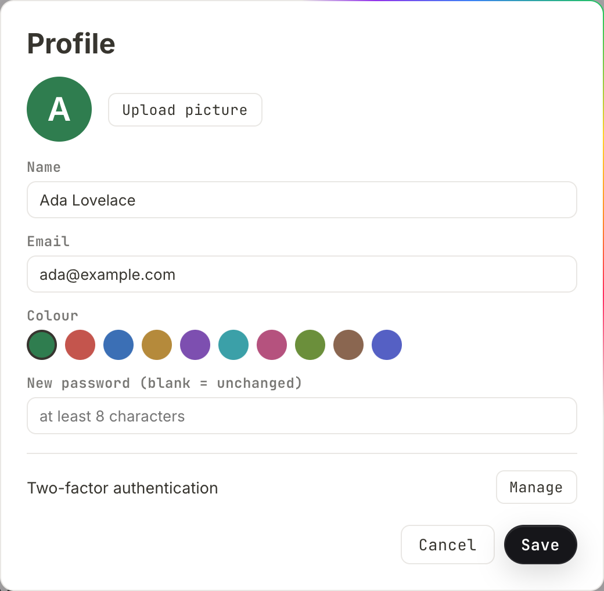
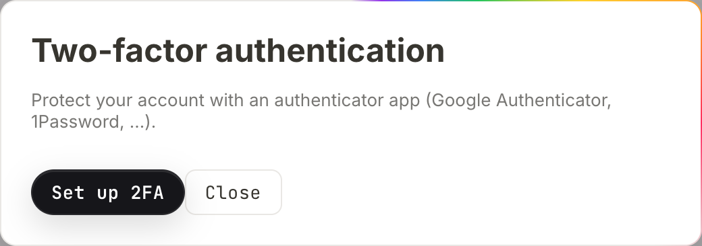
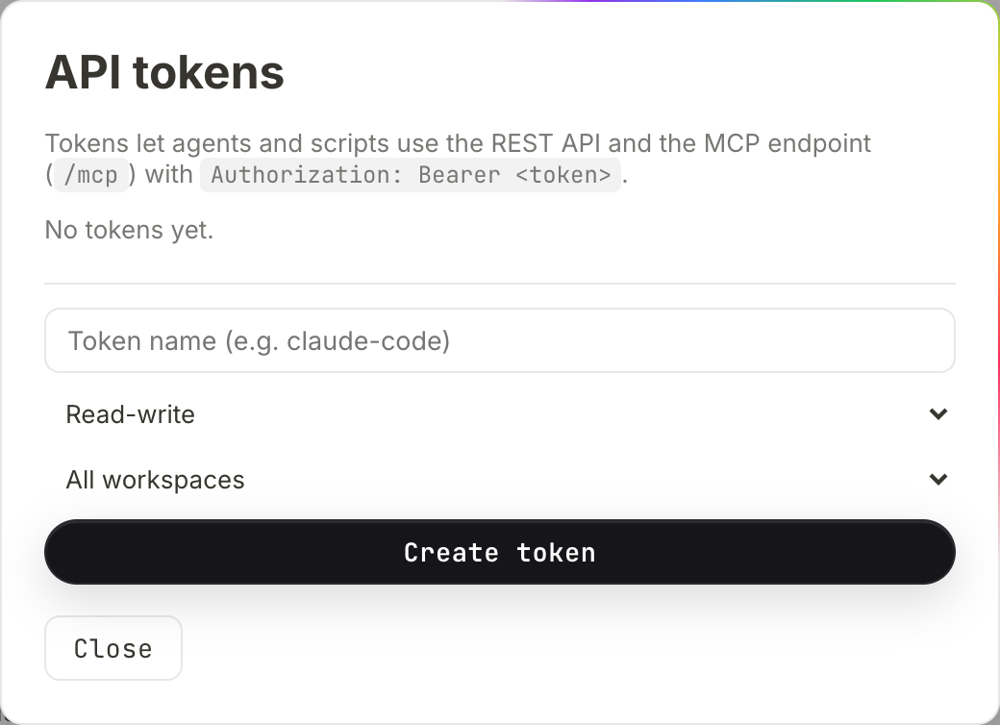

# Your account

Everything that belongs to you rather than to a workspace: how the account came
into existence, your name, picture and colour, how you sign in, the second
factor, the keys and connections you hand to agents, and what happens to your
work when an account is deactivated or deleted. Most of it sits behind the
button at the bottom of the sidebar that shows your picture and your name.

Two words are used precisely on this page. An **instance admin** administers the
server — accounts, settings, invitations. The **instance owner** is the single
account that carries the instance: emergency access, the instance backup,
deleting accounts. There is exactly one owner, and the owner is always an admin
too. See [Administration](administration.md).

## Where accounts come from

Three routes, and which of them are open is an instance setting — **Instance
settings** → *Access* → **Who may register?**, one of **By invitation only**,
**Email domain allowed** or **Open (anyone)**.

### Registering yourself

When the instance is open, or your address is on the allowed-domain list, the
sign-in screen carries **New here? Create an account**. It asks for **Name**,
**Email** and **Password (min. 8 characters)**, and **Create account** signs you
straight in. An address the policy does not cover is turned away with "This
email address cannot register on its own. Ask for an invitation." — deliberately
without naming which domains are allowed, because that list says whose mail this
instance trusts.

On an invitation-only instance the option is not offered at all.

### Accepting an invitation

A workspace admin creates an invitation from **Members** in the workspace menu.
You get a link, by email or by hand, valid for **14 days**. Opening it shows
which workspace you were invited to, and:

- **If you have no account**, the screen asks for **Your name**, **Email** and
  **Password (min. 8 characters)**; **Join** creates the account, puts you in the
  workspace, gives you a personal space of your own and signs you in. If the
  invitation was addressed to a particular email, that field is fixed.
- **If an account with that address already exists**, the link is not a way in
  on its own: the password is required, and a valid code if you have
  [two-factor sign-in](#two-factor-sign-in). The field is labelled **2FA code**
  here — the sign-in screen calls the same thing **2FA code (6 digits)**.
- **If you are already signed in**, it is one button — **Join** — and no
  credentials are collected. An invitation bound to somebody else's address says
  so and asks you to sign out first.

### An admin creating one outright

In **Manage users**, **+ User** opens *Create a new user* with the note *Creates
the account straight away — no email is sent.* It takes **Name**, **Email**,
**Initial password (min. 8 characters)**, an **Instance admin (may manage
everything)** checkbox, and a role per workspace — **No access**, **Viewer**,
**Member** or **Admin** — defaulting to no access, so every grant is deliberate.
**Create user** finishes it. There is no email, so somebody has to pass the
password on.

## The account menu

| Item | What it opens |
| --- | --- |
| **Agents & MCP** | connecting an agent to this instance — see [Agents](agents.md) |
| **Profile** | name, email, picture, colour, password |
| **API tokens** | the keys agents and scripts sign in with |
| **Activity log** | the most recent changes, noting whether a human or an agent made them — see [History and audit](history-and-audit.md) |
| **Subscribe to calendar** | a private feed of every date property you can read |
| **Two-factor (2FA)** | the second factor for signing in |
| **Language and time** | five settings — see [Language and time](language-and-time.md) |
| **Notes mode** | the note list as a third column — see [The interface](interface.md) |
| **Salt fonts** | the fonts shipped with the program, on or off |
| **Manage users** | instance admins only |
| **Instance settings** | instance admins only |
| **Sign out** | ends this session |

**Notes mode** and **Salt fonts** carry a dot that lights up when they are on.
Both are remembered in the browser you set them in, not on your account, so they
do not follow you to another machine. Notes mode takes effect on desktop widths
only.

Immediately to the right of the account button sits the **Appearance** switch:
three choices, **Light**, **Automatic — follows the system** and **Dark**. It is
per-browser too, for the same reason. Everything under **Language and time**, by
contrast, lives on the account and follows you everywhere.

## Name, picture and colour

**Profile** holds five things: **Name**, **Email**, **Colour**, a picture, and
your password.



Your circle shows the picture if you uploaded one, otherwise a letter on your
colour. Which letter depends on where you are looking: the account button and
the profile dialog show the **first letter of your name**, while the presence
dots at the top of a page, the avatars in comments and `person` properties in a
collection show your **initials — up to two letters**. "Ada Lovelace" is *A* in
the sidebar and *AL* everywhere else. A person property whose value matches
nobody on the instance still gets a circle, but with a colour derived from the
text rather than an account colour.

- **Upload picture** takes an image file and stores it as an ordinary upload.
  **Remove picture** appears once one is set and puts you back to the letter.
  A picture must be a file you uploaded here; a link to somewhere else is
  refused.
- **Colour** offers ten swatches, and the dialog is the only place in the
  interface that sets it. The API (`PATCH /api/users/{id}`) accepts any plain
  `#rgb` or `#rrggbb` value as well. A new account is given one of the ten
  automatically.
- An empty **Name** is ignored rather than saved.

Press **Save** to apply, **Cancel** to drop the changes. The sidebar and your
account button show the new name at once, without a reload. What other people
see — your name and colour beside your cursor and in the presence dots — follows
the next time you open a page: the editor sends your details when it opens a
document, so a page already on screen keeps broadcasting the old ones.

### Changing your email address

Type the new address into **Email**. A **Current password (needed to change the
email)** field appears; the change is refused without it. The address must be
unique on the instance — a second account already using it gives "another
account already uses this email".

One consequence worth knowing before you do it. Single sign-on only signs in an
account whose address is **confirmed**, and an address you set on yourself
counts as unconfirmed — nothing in the product confirms it afterwards. On an
instance with Microsoft or Google sign-in ([Single sign-on](sso.md)), changing
your address here means the sign-in button stops working for you: it answers
"This address belongs to an account that has not confirmed it. Please sign in
with a password or contact your administrator." Password sign-in with the new
address is unaffected. If your instance uses SSO, have an admin create the
account with the right address rather than correcting it here.

## Changing your password

1. Open **Profile** from the account menu.
2. Type into **New password (blank = unchanged)** — at least 8 characters.
3. A **Confirm new password** field appears; the two must match.
4. **Current password (to confirm)** appears as well and is required.
5. **Save**.

The toast says *Password changed — other sessions were signed out*, and it
understates what happened. A password change ends **every session of the
account** and **revokes every API token it owns**. The browser you changed it in
is signed straight back in; every other browser, phone and desktop app has to
sign in again, and every agent connected with one of your tokens stops working
until you mint a new one.

Two things it does **not** touch, both worth knowing: your calendar link keeps
working, and so does every agent connected by [signing in rather than by
token](#agents-that-sign-in-instead) — those connections are ended one at a
time, not by changing a password.

The instance owner can set another account's password; an instance admin cannot,
and gets "Only the owner can change another account's password or email. As an
admin you can send an invitation." Setting somebody's password means being able
to read everything they see, so it sits with the one person who has the backup
anyway.

## Signing in and sessions

The sign-in screen asks for **Email** and **Password**, and offers **Sign in
with Google** or **Sign in with Microsoft** when the instance has them
configured. Wrong details give "Wrong email or wrong password." — the same
sentence whether or not the address exists here, and the server takes the same
time over both, so a stranger cannot use the login form to find out who has an
account. Repeated attempts from one network address are throttled (30 a minute)
and answer "too many login attempts, please wait".

A deactivated account is told so only after the password was right: "This
account has been deactivated — talk to an admin."

The **desktop app** has no password box of its own. It opens your real browser
at a sign-in page, and once you are signed in the browser asks *Sign in to the
desktop app?* with **Allow** and **Not now**. Approving hands the app a session
and nothing else; the approval step is what stops any web page you happen to
open from quietly signing a waiting program in. See
[Desktop app](desktop-app.md).

A successful sign-in stores a session cookie. It lasts **90 days** by default;
an instance admin can set 1 to 365 under **Sign-in session length (days)** in
**Instance settings**. There is no list of your open sessions anywhere in the
product. What ends one:

| What happens | What ends |
| --- | --- |
| **Sign out** | that session only — other devices stay signed in |
| you change your password | every session and every API token of the account |
| the session reaches its age | that session |
| an admin deactivates the account | every session, every API token, the calendar link, and any open editor at once |

## Two-factor sign-in

A time-based code (TOTP) from an authenticator app — Google Authenticator,
1Password, and anything else that scans an `otpauth://` code. It applies to
password sign-in on this instance.

### Turning it on

1. Open **Two-factor (2FA)** from the account menu, or **Profile** →
   *Two-factor authentication* → **Manage**.
2. Press **Set up 2FA**.
3. Scan the QR code with your app. The code and the key are generated on the
   instance and never leave it. If you cannot scan, *No scanner? Type the key in
   by hand:* shows the same key in blocks of four; clicking it copies it.
4. Type the current code into the **6-digit code** field and press **Enable**. A
   wrong code says "Wrong code" and nothing changes.



The toast *2FA enabled* confirms it. Codes are six digits over 30-second
windows, and the code from the window before or after yours is accepted too, so
a clock a few seconds out does not lock you out.

### What sign-in looks like afterwards

Enter email and password as usual. The server answers "Please enter the 6-digit
code from your authenticator app.", a **2FA code (6 digits)** field appears
below the password, and you submit both together. A wrong code gives "Wrong code
— try again." Accepting an invitation into a workspace with an account that
already exists asks for the code in the same way, in a field labelled **2FA
code**.

Signing in with Google or Microsoft does **not** ask for a code — the second
factor there is whatever your identity provider enforces.

### Turning it off, and moving to a new phone

While 2FA is on, the dialog offers exactly two things: *2FA is active. Enter a
current code to switch it off.*, a code field, and **Disable 2FA**. Type a
current code and press it; the toast says *2FA disabled*. Setting up a new
device means disabling first and setting up again — there is no **Set up 2FA**
button while it is on, so a half-finished setup can never invalidate the app
that works. (Over the API the attempt is refused with "2FA is already enabled —
disable it first to set up a new device".)

**There are no recovery codes, and nothing in the interface or the API can clear
somebody else's second factor** — not an admin's, not the owner's. Switching it
off requires a code from the app. Keep the key from step 3 somewhere safe, or
enrol a second device while the first still works.

## API tokens

A token lets an agent or a script use the REST API and the MCP endpoint. It
carries **your** identity — everything you can read, it can read — and narrows
in exactly two ways.



| Narrowing | Options | Effect |
| --- | --- | --- |
| Scope | **Read-write**, **Read-only** | a read-only token is refused any create, edit, delete or upload, over REST and over MCP alike |
| Workspaces | **All workspaces**, **Specific workspaces…** | "all" also covers workspaces you join later; a named list is fixed |

### Creating one

1. Open **API tokens**.
2. Give it a name — *Token name (e.g. claude-code)*. Blank becomes "API token".
3. Pick **Read-write** or **Read-only**.
4. Pick **All workspaces** or **Specific workspaces…**, which reveals a
   checkbox per workspace. You can only pick workspaces you are a member of;
   picking none is refused rather than quietly becoming a token for everything.
5. **Create token**.

The token is shown once, under *Copy this token now — it will not be shown
again:*, with **Copy token** beside it. Below it sits a ready-made connection
line and **Copy MCP command**:

```
claude mcp add --transport http salt https://salt.example.com/mcp/salt_1a2b3c…
```

The address is the instance's public one when it has a domain or a tunnel
configured, because an agent running elsewhere cannot reach a LAN address.

There are two ways to present a token, and the dialog names both. In the URL, as
above — which every client can do, including ones with no place to type a
header. Or as a header, `Authorization: Bearer <token>`, against `/mcp` and the
REST API alike. Prefer the header where the client allows it, for the reason in
the next paragraph.

### The list

Each token shows its name, **read-only** or **read-write**, the workspaces it
reaches ("all workspaces" or their names), when it was last used or "never
used", and **the address it was last used from**. That last one is the point of
the list. A token that travels in a URL cannot be kept secret — it sits in the
client's configuration and in the logs of whatever is in between. What can be
done is noticing: an address you do not recognise is worth a question, and
**Revoke** (the ✕) takes effect immediately.

### What a token cannot do

Administration needs a human in a browser. A token — including your own,
including read-write — is turned away from account administration, **changing**
instance settings, the instance backup, two-factor settings, minting further
tokens, applying workspace rules, managing people from **Manage users**, and
your own language and time settings, with "This action requires signing in
through a browser — an API token is not enough."

Two edges of that line are easy to get wrong:

- **Reading the instance settings is not refused.** If your account is an
  instance admin, a token of yours — a read-only one included, since it is a
  GET — can read `/api/settings`: instance name, who may register, allowed
  domains, mail host and sender, the sign-in client ids, the public address, the
  upload cap, the trash and session lengths. It cannot write any of them.
- **Membership inside a workspace is not refused.** A read-write token whose
  human is an admin of that workspace can add members, change their roles and
  remove them, exactly as the human could in the **Workspace members** dialog.
  What needs a browser is the instance-wide route behind **Manage users**.

An agent can ask what it holds: the `whoami` tool answers with the account, the
scope, the workspaces in reach and a list of things deliberately unavailable
over MCP. A workspace can also refuse tokens on its own account — see
[Workspaces](workspaces.md) and [Agent access](agent-access.md).

## Agents that sign in instead

A token is not the only kind of key. An agent can also **sign in** to this
instance the way an app signs in to a service: it sends you to an approval page
headed *Grant access?*, which names the client, warns that "That name was chosen
by whoever set up the connection", says whether it wants to read or to read and
change, and asks for **Every workspace, including ones added later** or **Only
the ones I pick**. **Allow** or **Deny** ends it. Approving needs a browser
session — a token cannot approve one, because a key that mints better keys is
not a key any more.

Each connection is recorded against your account: which client, the scope, the
workspaces, when it was created, when it was last used and from which address.
Ending one ends it completely — the connection and every access token minted
from it go at once.

**There is no dialog for this yet.** The list and the disconnect exist only over
the API (`GET /api/oauth/grants`, `DELETE /api/oauth/grants/{id}`), so the
consent screen's closing line about ending the connection in your account
settings promises a screen that is not there. Two consequences follow. A
connection survives a password change, unlike an API token. And it stops the
moment the account is deactivated, like everything else.

See [Agent access](agent-access.md).

## The calendar link

**Subscribe to calendar** hands out a private URL for Apple Calendar, Google
Calendar or Outlook. **What should the calendar contain?** picks the scope:
**Everything I can see**, one workspace, or one collection. A collection only
appears in that list once it has a date property — otherwise the feed would be
permanently empty.

Below it sits the *Subscription link (webcal):* itself, plus three buttons:
**Open in calendar** hands the link to the calendar app, **Copy URL** puts the
`https` form on the clipboard, and **Reset the link** issues a new one.

Anyone holding the URL sees what it contains, so treat it as a password. There
is **one** token behind every scope, so **Reset the link** stops all of them
working at once, not just the one on screen — the toast says *New calendar link
created (the old one no longer works)*. The link survives a password change and
is deleted when the account is deactivated or deleted. See
[Automation](automation.md).

## Leaving a workspace

Any member can take themselves out of a shared workspace: open **Members** from
the workspace menu and press the ✕ on your own row — the tooltip reads
**Leave**. You can only remove yourself; removing anybody else is for workspace
admins.

Two refusals, and one warning:

- **You are the last admin.** "You are the last admin of this workspace. Make
  somebody else an admin first — or delete the workspace if it should go."
- **Your own personal space.** It belongs to exactly one account and cannot be
  left: "That is this person's personal space — they cannot be removed from it."
- **Private pages stay behind.** If you have private pages there, the dialog
  says how many and that they will be visible to the workspace's admins only,
  and asks **Leave anyway?** before doing it.

## Leaving: deactivating

Deactivating is the normal case when somebody leaves, and it loses nothing.
Instance admins do it in **Manage users**: pick the person, then **Deactivate
account**.

- Sign-in is closed, by password and by single sign-on alike.
- Every session and every API token ends immediately, and so does the calendar
  link. Somebody with the editor open is disconnected there and then rather than
  at their next page load.
- Everything they wrote stays where it is and stays attributed to them. Their
  personal space stays theirs.
- The entry appears in the activity log as *deactivated the account:*.

**Reactivate** puts it all back except the credentials: the revoked tokens have
to be created again, and the calendar dialog issues a fresh URL — the old one
stays dead. Two accounts cannot be deactivated: your own ("You cannot deactivate
your own account.") and the owner's ("The owner cannot be deactivated — hand the
owner role on first.").

## Leaving: deleting

Deleting is **owner only**. An admin looking at somebody else's account sees
instead: "Only the owner can delete permanently — the account would take this
person's personal space with it."

Press **Delete user** and the confirmation names the consequences before
anything happens — which workspaces disappear, which are kept and why, and how
many pages are involved. It ends with *Deactivating is usually enough — nothing
is lost that way.* Confirm with **Delete**.

What happens to the workspaces the account was in:

| Situation | What happens |
| --- | --- |
| their personal space, no guests | deleted with all its pages, beyond recovery — along with the uploads no other page uses |
| their personal space, other members in it | kept and becomes an ordinary workspace; the longest-serving active member takes it over as admin, an existing admin among them first. The deleted account's **private** pages in it are deleted |
| a shared workspace with another active admin | nothing changes for the members; if the deleted account owned it, the longest-serving remaining admin becomes its owner |
| a shared workspace where they were the last member | the instance owner takes it over |
| a shared workspace with members but no active admin | nobody inherits it. It appears in the owner's clean-up list, where the advice is to appoint one of the members as admin |
| somebody else's personal space they were a guest in | untouched; only the guest membership goes |

Pages the account owned in shared workspaces stay where they are. The private
ones among them remain private — after the deletion that means the workspace's
admins can still see them and nobody else can.

Three deletions are refused: your own ("you cannot delete yourself"), the last
remaining instance admin ("cannot delete the last admin"), and the owner's ("The
owner cannot be deleted — hand the owner role to another account first."). If
the consequences cannot be worked out for any reason, the deletion is refused
rather than carried out half-blind.

## Handing things over

### A workspace with nobody in charge

The owner reaches **With nobody in charge…** from the workspace menu at the top
of the sidebar. It lists every workspace without a member, or without an active
admin, under the heading *Workspaces with nobody in charge*, each row showing
its page, member and admin counts. It offers exactly what is defensible:

- **Adopt** — only when literally nobody is left in it, and never for a personal
  space. As long as somebody is a member, the workspace belongs to those people:
  the row then carries no **Adopt** button at all, only the note *Still has
  members: make one of them an admin.*
- **Delete** — for one with no members, personal spaces included. It asks you to
  type the workspace name.
- An orphaned personal space also says *Orphaned personal space — clean up only,
  do not open.*

A personal space whose person is still a member of it never appears here, even
while the account is deactivated — that is the ordinary state after somebody
leaves, and it would otherwise fill the list with noise.

This is deliberately not a master key. A personal space cannot be looked into
even with emergency access — "it belongs to exactly one account" — and adopting
requires that nobody is there to ask.

### The instance itself

The owner can hand the instance to another account, from **Manage users**:
select an account that is an active **instance admin**, then **Hand over the
instance**. The confirmation spells out that the other person gets emergency
access, the instance backup and the right to delete accounts, and that you will
be an ordinary admin afterwards and cannot undo it yourself.

The handover is complete — there is never a second owner. Any emergency access
the outgoing owner had running ends with the role, and the change is written to
the activity log as *handed the instance to:*.

## What other people can and cannot do to your account

| They can | They cannot |
| --- | --- |
| an admin: deactivate and reactivate it, grant or revoke instance admin, set your role in workspaces they administer | an admin: change your password or your email |
| the owner: all of that, plus set your password or email, and delete the account | anyone: read your personal space — not even the owner, not even with emergency access |
| the owner: take time-limited read access to a shared workspace, with a stated reason | anyone: change your two-factor setting, or clear it for you |

Emergency access is read-only and lasts **two hours**. The reason is not a
formality: it must be at least **10 characters**, or the request is refused with
"Please give a reason somebody can follow (at least 10 characters) — it is
logged and shown to the people in charge of this workspace." The workspace's
admins are **emailed** as well as shown the entry, and they can end a running
grant themselves rather than waiting it out — it is not only the owner who can
stop it. See [Permissions](permissions.md).

None of this is a promise against the person who runs the server. Whoever holds
the machine holds the database file, and the owner can download an instance
backup that contains every workspace. What the product guarantees is that the
ordinary routes leave a trace: an emergency look is logged and announced, and
there is no path that quietly turns administration into reading somebody's
private pages.
