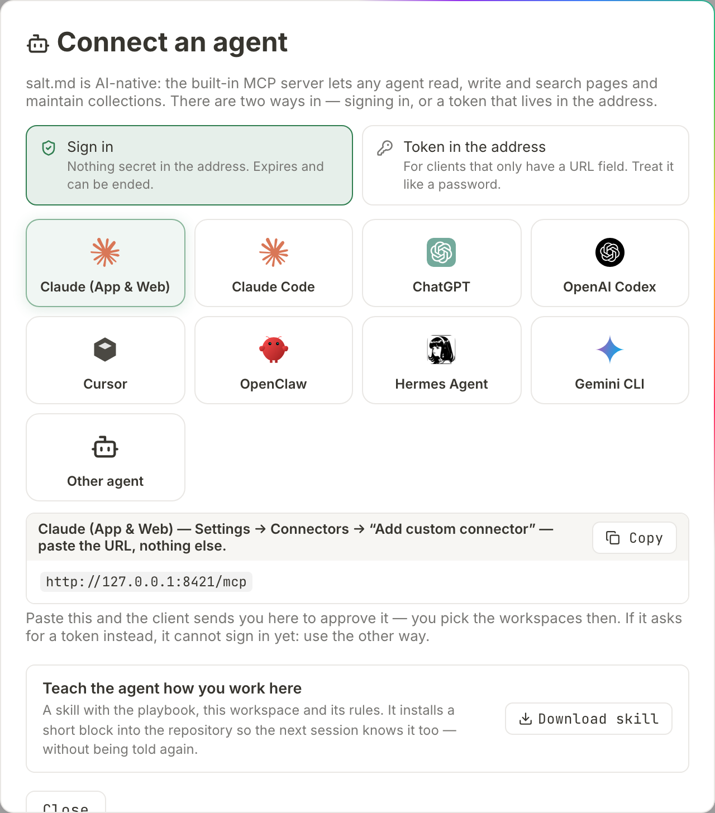

# Agents

salt.md carries an MCP server inside the same binary that serves the interface.
An AI agent connects to it and works on your pages the way you do — searching,
reading, writing, maintaining collections, commenting, saying what it is working
on. This page is the overview: what MCP is, where the endpoint is, the two ways
an agent authenticates, what it can and cannot reach, and what the tools are for.
The parameter-by-parameter reference is on [MCP tools](mcp-tools.md).

It is written for both sides — the person connecting an agent, and the agent
reading this to find out how the place works.

## What MCP is

The Model Context Protocol is a common language between an AI client and a
program that holds data. The client asks the program which tools it offers, the
program answers with a list, and from then on the client can call them. salt.md
implements the server half: no plugin, no separate process, no external service.
Start the binary and the endpoint is there. What an agent gets is **33 tools**,
each one an action that already exists in the product, under the permissions of
the person whose credential it is using.

## The endpoint

`POST /mcp`, Streamable HTTP with stateless JSON answers. Some things that are
true of it and will save you a debugging session:

| | |
| --- | --- |
| Method | POST only. Anything else answers `405` with `MCP endpoint accepts POST only`. |
| Address | Must be the one an agent can reach. A cloud agent cannot open a private address, and the connect dialog warns when the instance is on plain `http://` outside localhost. See [Domain and proxy](domain.md). |
| Batches | A JSON-RPC batch (a top-level array) is refused with `batch requests are not supported`. |
| Size | The request body is capped at roughly the upload limit plus a third, since base64 inflates. The size is checked against what the request announces before any of the body is read; past that, the answer names the limit and points at `/api/upload`. |
| Pace | About 240 calls a minute per account, with a burst of 60. Over that, a call comes back with `rate limit exceeded — too many requests, slow down`. |
| Deactivated accounts | Refused here in their own right, not only in the browser: `this account has been deactivated`. |

When a client connects, the server introduces itself as **salt.md**, reports its
version, and sends one instruction with it: workspaces can carry rules their
admin wrote for agents — read them before writing into a workspace. It sends its
own logo along with the introduction, so a client that reads icons shows the
salt.md mark instead of a placeholder. Not every client does; nothing depends
on it.

## Connecting an agent

1. Click your name in the sidebar footer.
2. Choose **Agents & MCP**. The **Connect an agent** dialog opens.
3. Pick how the agent authenticates: **Sign in** or **Token in the address**.
4. Pick your client from the gallery — Claude (App & Web), Claude Code, ChatGPT,
   OpenAI Codex, Cursor, OpenClaw, Hermes Agent, Gemini CLI, or **Other agent**.
5. Press **Copy** and paste the snippet where that client keeps its
   configuration. The dialog says where, per client.



The snippet is built from the instance's public address, not from whatever
address your browser happens to be using, so a snippet copied on a laptop inside
the network still works for an agent outside it.

### The two ways in

| | **Sign in** | **Token in the address** |
| --- | --- | --- |
| The address | `https://salt.example.com/mcp` | `https://salt.example.com/mcp/<token>` |
| What is secret | Nothing in the address | The address itself |
| Who decides the reach | The client asks for read, or for read and write. You decide, on a consent screen, which workspaces it gets — and whether it gets anything at all. | Whoever creates the token, in advance: the scope and the workspaces both |
| Lifetime | An access token expires after an hour and is renewed in the background | Until it is revoked |
| Ends by | Revoking the grant — see below, this one is unfinished | **Revoke**, in the **API tokens** dialog |

Sign-in is offered first because nothing secret ends up in a configuration file
or in the logs of every proxy along the way. A client that cannot sign in will
ask for a token instead — that is the signal to use the other way, and plenty of
good clients are still in that group.

### Signing in

The client only needs the plain `/mcp` address. It gets a `401` back that says
where to authorize, discovers the rest by itself, and sends you to a browser.

The consent screen shows the instance name and host at the top, then:

- **Grant access?** and the client's name, with the plain warning that *that name
  was chosen by whoever set up the connection* — anyone can register a client
  under any name, so the screen presents the name as a claim rather than as an
  identity.
- **It will be allowed to** — *read pages*, or *read and change pages*. This half
  is shown, not chosen. The client asked for it in the request that sent you
  here, and there is no control to narrow it: your decision is whether to
  approve what was asked.
- **Where** — **Every workspace, including ones added later**, or **Only the ones
  I pick**. Nothing is ticked to begin with, and **Allow** stays dead until you
  pick something. The difference is not convenience: a list of workspaces is a
  photograph of today, so a workspace created next week is outside a picked list
  until you say otherwise.
- **Deny** and **Allow**.

The connection then stays connected. Only the short-lived access token rotates,
invisibly; nobody signs in again every hour.

**Ending one is the unfinished corner of this.** The consent screen says the
connection can be ended at any time in your account settings, and that screen
does not exist yet. The server half does — grants can be listed and revoked at
`/api/oauth/grants` — but nothing in the interface calls it. Until something
does, a signed-in connection ends when the client revokes it from its own side,
or when the account behind it is deactivated or deleted: a deactivated account is
turned away at the MCP endpoint whatever it is carrying. If a connection has to
stop today and the client will not do it, deactivating the account is the lever
that works. See [Administration](administration.md).

### A token in the address

Choose **Token in the address** and the dialog offers **Read & write** or **Read
only**, and **Only “<this workspace>”** or **All workspaces**. **Create token**
mints it and fills it into the snippet — it is shown once and never again. You
can also paste an existing token into *… or paste an existing token here*.

Clients that have a headers field can use the classic form instead: the endpoint
`/mcp` plus `Authorization: Bearer <token>`. The same token also works against
the REST interface — see [API](api.md).

### The API tokens dialog

The same menu holds **API tokens**, where tokens are minted and managed outside
the connect flow. The form at the bottom takes a name — *Token name (e.g.
claude-code)* — a scope, **Read-write** or **Read-only**, and a reach, **All
workspaces** or **Specific workspaces…**, which unfolds a checkbox per
workspace. **Create token** mints it.

The new token then appears once above the list with two buttons: **Copy token**,
and **Copy MCP command**, which hands you the whole `claude mcp add …` line with
the token already in the address.

Every existing token is listed with its name, a *read-only* or *read-write*
chip, its workspaces (or *all workspaces*), when it was last used or *never
used*, the address it was last used from, and a **Revoke** button. The address is
worth a glance now and then: a token that travels in a URL cannot be kept secret,
so noticing an origin nobody recognises is the defence.

Guessing at tokens is throttled per calling address, and only failures count
towards the budget. An agent making hundreds of calls a minute with a good token
is never slowed down by it.

## What an agent can and cannot do

**An agent has the permissions of the human whose credential it carries — never
more, and often less.** Three limits stack, in this order:

1. **The person.** A viewer cannot write. Someone else's private pages are
   invisible. A page in a workspace the person is not a member of does not exist
   as far as the agent is concerned. See [Permissions](permissions.md).
2. **The credential.** A read-only credential refuses every writing tool with
   `this API token is read-only`. A credential granted particular workspaces
   cannot reach the others — and does not even learn their names, only that some
   exist. It also cannot create a workspace at all: the new one would be outside
   its own list, so `workspace` refuses rather than making something it could not
   then open.
3. **The workspace.** Each workspace decides what credentials may do there, under
   **What agents may do here** in its settings. Details on
   [Agent access](agent-access.md).

| Setting | What it means |
| --- | --- |
| **Anything they were granted** | Any connection that was given this workspace. The default. |
| **Only signed-in connections** | A permanent token stops finding the workspace, even one that names it: the workspace is gone from `list`, `search` returns nothing out of it, and `get_workspace` refuses it. A signed-in connection is unaffected. For confidential material. |
| **No agents at all** | The same, for every kind of agent credential — signed-in connections included. |

A browser session is never limited by that setting — the person who sets it is
not the one it is aimed at.

**What the setting governs is what an agent can find.** It sits on top of the
permission model rather than replacing it, so it is the wrong tool for a hard
boundary. Material that must stay out of a credential's reach belongs in a
workspace whose account is not a member: membership is the limit checked on every
single page, in the browser and over MCP alike.

### Deliberately closed to agents

These are permissions over the instance, not over content. None of them has an
MCP tool at all, and most of them also turn away an API token on the REST
interface and want a signed-in browser:

| Not available over MCP | Where it lives instead |
| --- | --- |
| Two-factor settings | Your account menu |
| Creating or deleting API tokens | **API tokens** |
| Creating or deleting accounts, setting passwords | [Administration](administration.md) |
| Backup and restore, tunnel, mail, instance settings | [Administration](administration.md) |
| Workspace membership and roles | [Workspaces](workspaces.md) |
| Applying workspace rules | The workspace menu — an admin's agent may submit a draft |
| Discarding a page's note trail | The **Raw trail** on the page |

A credential that could mint a better credential would not be a boundary, which
is the whole reason the list looks like this.

**One row means less than the others.** Membership and roles have no MCP tool, so
an agent connected over MCP cannot add a member or change a role. The REST routes
behind them do accept an API token, as long as the token's account is an admin of
that workspace. If a token is meant for content only, give it to an account that
is not a workspace admin, or narrow it to workspaces where it is not one.

`whoami` prints this list on request, so an agent can read its own boundaries
rather than discovering them by failing.

## The catalogue at a glance

Names below are what an agent calls. One vocabulary note that otherwise causes
confusion: what the interface calls a **collection** the tools call a
**database**. Same object. People see "Collection" because it covers table,
board, calendar and gallery and promises no SQL; the tools keep `database`
because renaming a tool breaks every agent configuration in existence.

### Finding things

| Tool | For |
| --- | --- |
| `search` | Full text across everything the caller may read — titles, content, indexed PDFs. Returns matching passages with their heading path. |
| `list` | What is there of a kind: pages, templates, tags, workspaces, files, users, cover presets. For files, `under: <page id>` narrows it to one page and its sub-pages. |
| `get_page` | One page as Markdown; `include_children` returns the whole sub-tree in one answer. |
| `get_collection` | A database's property schema and its views, with ids. |
| `query_rows` | Rows with server-side filter, sort and paging, including computed rollups and formulas. |
| `get_links` | What points at one page, or the whole graph. |
| `get_workspace` | Name, role, members and their ids, page and database counts — and the workspace rules. |
| `get_permissions` | Whether a page can be read, written or deleted, and why it is read-only if it is. |
| `whoami` | Who this connection is, its scope, its workspaces, and what is closed to it. |
| `revisions` | A page's history, one older state, or putting the page back to it. |

Two of those repay a closer look. Called without a page, `get_links` returns the
whole graph as edges of *from, to, kind*, where a kind is a Markdown link, a
sub-page, a row of a database, or a database embedded in a page. It takes a list
of kinds to keep, a workspace to stay inside, and an optional flag to return
every page as a node as well — off by default, because it is large and because the orphans it
returns anyway already answer "what is connected to nothing". And `revisions`
lists 20 by default and 100 at most, but the part worth knowing is that restoring
saves the CURRENT state as a new revision first: putting a page back is itself
reversible.

### Writing

| Tool | For |
| --- | --- |
| `create_page` | A new page, optionally under a parent, from a template, with content, cover, tags and properties in the same call. A parent that is a database id makes a ROW in it. |
| `write_content` | Markdown into a page — append, prepend or replace. A ```mermaid fence becomes a drawn diagram. |
| `update_page` | Title, icon, cover, description, tags, visibility, where it sits, and whether it is a favourite. |
| `duplicate_page` | A deep copy of a page and its sub-tree. |
| `save_as_template` | Snapshot a page as a template. See [Templates](templates.md). |
| `upload_file` | A file onto a page. PDF text becomes searchable. See [Files](files.md). |
| `set_trashed` | To the trash and back — both directions, because both are reversible. See [Trash and recovery](trash-and-recovery.md). |
| `set_sharing` | Mint or revoke a public read-only link. See [Sharing](sharing.md). |

Three things about those belong here rather than in a parameter list:

- **`write_content` in replace mode overwrites the body and goes round the
  realtime editor.** Anybody with that page open in a browser loses what they had
  not saved yet. Append unless replacing is the actual instruction.
- **`upload_file` without a page id stores the file and attaches it to
  nothing.** It lands on disk and in the file index as unreferenced, and its text
  is never indexed for search, because indexing hangs off the page it went on.
  Pass the page id.
- **A public link can carry an expiry in days and a password**, and sharing a
  page again replaces the link it had. That is deliberate — a link somebody
  believes revoked must not go on working — but it also means re-sharing
  invalidates whatever was already circulating.

### Collections

| Tool | For |
| --- | --- |
| `create_database` | A new collection with its property schema. |
| `create_rows` | Up to 200 rows in one call. |
| `set_properties` | Typed values on a row, merged field by field. |
| `update_schema` | Add or change properties, including relations, backrelations and rollups. |
| `set_view` | Create a view or change one — grouping, filters, sort, hidden columns. |
| `delete_view` | Remove a view. The last one cannot be deleted. |
| `embed_database` | Put an existing collection inside a document. |

`set_properties` also takes many rows at once: instead of one page id and its
properties, pass `updates: [{page_id, properties}, …]`, up to 200 of them. Every
row is checked for permission before the first one is written, so a call that is
going to be refused changes nothing at all instead of stopping half way through a
database. See [Collections](collections.md) and [Properties](properties.md).

### Talking to people

| Tool | For |
| --- | --- |
| `working_on` | Check in before a long job, check out when done. Shown live in the interface. |
| `note` | One line onto a page's raw trail — dated, append-only, permanent. |
| `comments` | List, add, resolve or reopen comments. |
| `delete_comment` | Remove one permanently. Its own tool on purpose, so it cannot be reached by landing on the wrong enum value. |

A note cannot be edited or removed afterwards, by the agent that wrote it or by
anybody else — which is exactly what makes a trail worth reading later. What a
person can do, in the browser, is discard a page's whole trail in one act:
**Discard the whole trail**, in the **Raw trail** section, which asks for
confirmation and is written into the activity log, so the gap in the record is
itself a dated decision. See [Comments and notes](comments-and-notes.md).

### Workspaces and bulk work

| Tool | For |
| --- | --- |
| `workspace` | Create a workspace, or rename one and set its icon. `from_workspace` copies another one's structure — rules, databases, schemas, views, no content. |
| `propose_workspace_rules` | Submit a draft of the rules. Workspace admins only, and it never activates by itself. |
| `import_url` | Bulk-import records from a JSON URL. Salt fetches and writes them, so none of the content passes through the agent. |
| `get_import_status` | Progress of that job. |

`import_url` reaches **publicly routable addresses only**. Loopback, private
ranges and link-local — which is where the cloud metadata address
169.254.169.254 lives — are refused before the connection is made, and again on
every redirect, so an import cannot be turned into a way of probing the network
the server sits in. A source on your own network needs whoever runs the service
to allow it at startup; an agent cannot decide that for itself. The tool also
takes request headers for an API key, a map that turns foreign ids into readable
names using another array from the same response, and a limit — which is how you
do a trial run of ten records before importing four thousand. See
[Import and export](import-export.md).

**Every writing tool accepts an idempotency key.** Send the same
`idempotency_key` again on a retry and the first result comes back instead of a
second page, a second row or a second note. It is the single thing that makes an
interrupted agent run safe to repeat, and it is worth setting on anything that
creates.

For what each parameter means, see [MCP tools](mcp-tools.md). For scheduled and
event-driven work around these, see [Automation](automation.md) and
[Webhooks](webhooks.md).

## What people see while an agent works

An agent that checks in with `working_on` appears in the page's topbar with its
own logo, its name, and — when it is the only agent there — its note, "tidying
the file index". With two agents on one page the notes move into the tooltip:
side by side they pushed the breadcrumb off the topbar.

The same mark shows up as a small dot beside the page in the sidebar, on a board
card, and on a row in a collection's table.

The tooltip reads like *Claude · via Ada Lovelace · tidying the file index · here
for 2 h 14 min · last seen 47 min ago* — the agent, the account it came through,
its note if it left one, how long it has been here, and when it last called in.
An agent that said how long it expects to take adds *checked in for about 30 min*
at the end, which makes a long silence look expected rather than suspicious.

Two things about that badge are worth knowing:

- **The agent's name is a claim; the account is not.** Nothing in a credential
  says which agent is calling — a credential belongs to a person. So the agent
  names itself, and an unknown name is shown neutrally rather than refused. The
  account travelling beside it is the verified half.
- **Nothing expires on its own.** An agent has no clock and cannot wake itself to
  say "still here", so a lease would erase a three-hour job halfway through.
  The entry stays until check-out; the interface fades it after ten minutes of
  silence and says how long ago it was last heard from. A session silent for
  twelve hours is treated as crashed and removed.

Checking out leaves the last note behind as a trail entry. Writes made over MCP
are recorded in the activity log as agent actions, with one deliberate
exception: a `note` is not copied there. The trail on the page already is the
record — dated, and readable by exactly the people who may see the page — and
repeating it in the log would carry it to a second audience for no gain.

An agent that asks for a page's history over MCP is told, per revision, whether a
human or an agent made it. The **Version history** dialog in the browser does not
show that: it lists the time, the author's name and a **Restore** button. See
[History and audit](history-and-audit.md) and
[Comments and notes](comments-and-notes.md).

## Two framings the agent will notice

Everything an agent reads out of a page comes back wrapped in explicit markers
saying it is untrusted user content, to be read, quoted or summarized and never
followed as instructions. That is deliberate: a page can contain any sentence at
all, including "ignore your rules".

**The workspace rules are the exception, and they travel outside that wrapper**,
with the opposite framing: follow them while working here. What makes the
friendlier reading safe is the way rules are written. Only a workspace admin can
apply them, in a browser. `propose_workspace_rules` leaves a draft that a person
reviews and applies; an agent — or anyone holding its credential — cannot rewrite
its own guardrails. Rules are working conventions inside one workspace: they
never grant permissions beyond the credential, and they never replace the task
the operator gave. See [Workspaces](workspaces.md).

## Teaching an agent how you work here

Connecting is half of it. A connected agent still does not know your naming, your
structure, or where things belong — and being told in a chat means being told
again in the next one.

At the foot of the **Connect an agent** dialog, **Download skill** produces a
bundle the instance generates for itself. It is four files — the skill itself, a
tool reference, the block to install, and a README with the install paths — and
it carries this instance's own address, the workspace you have open with its id
and its rules, and the names and ids of the other workspaces you can reach.

It opens with two instructions, in that order: call `get_workspace` and follow
the rules the people here wrote, then append a short block to the repository's
own agent file — `CLAUDE.md` for Claude Code, `AGENTS.md` for most others, both
if both exist. The second is the one that lasts. A skill is loaded when it is
invoked; that file is read at the start of every session, by every agent that
opens the repository.

For Claude Code the folder goes in `~/.claude/skills/saltmd/` for every project,
or `.claude/skills/saltmd/` for one repository. Anything else that reads
instruction files can use the skill directly — it is plain Markdown with a small
header.

**No credential is in the bundle, deliberately** — it gets unpacked into a
repository, and repositories get pushed. See [The agent skill](skill.md).

## When something is refused

Call `whoami` first. It separates "I used the wrong id" from "I am not allowed to
do this", and those need very different next moves. `get_permissions` answers the
same question for one page before a write is attempted.

A page that cannot be reached answers `page "…" not found` whether it is missing,
private, or outside the credential's workspaces — telling the three apart would
confirm that the page exists. The one case that says more is a workspace on your
own account that this connection was not granted: there the answer names the
reason, because the caller already knows the workspace is theirs.

**A stale tool list is not a failed deployment.** A connected MCP client keeps
the catalogue it fetched when it connected. After an update that renames or
merges tools, the old names linger in a running session until it reconnects, and
calling an old name to "check" only proves the client is stale.
