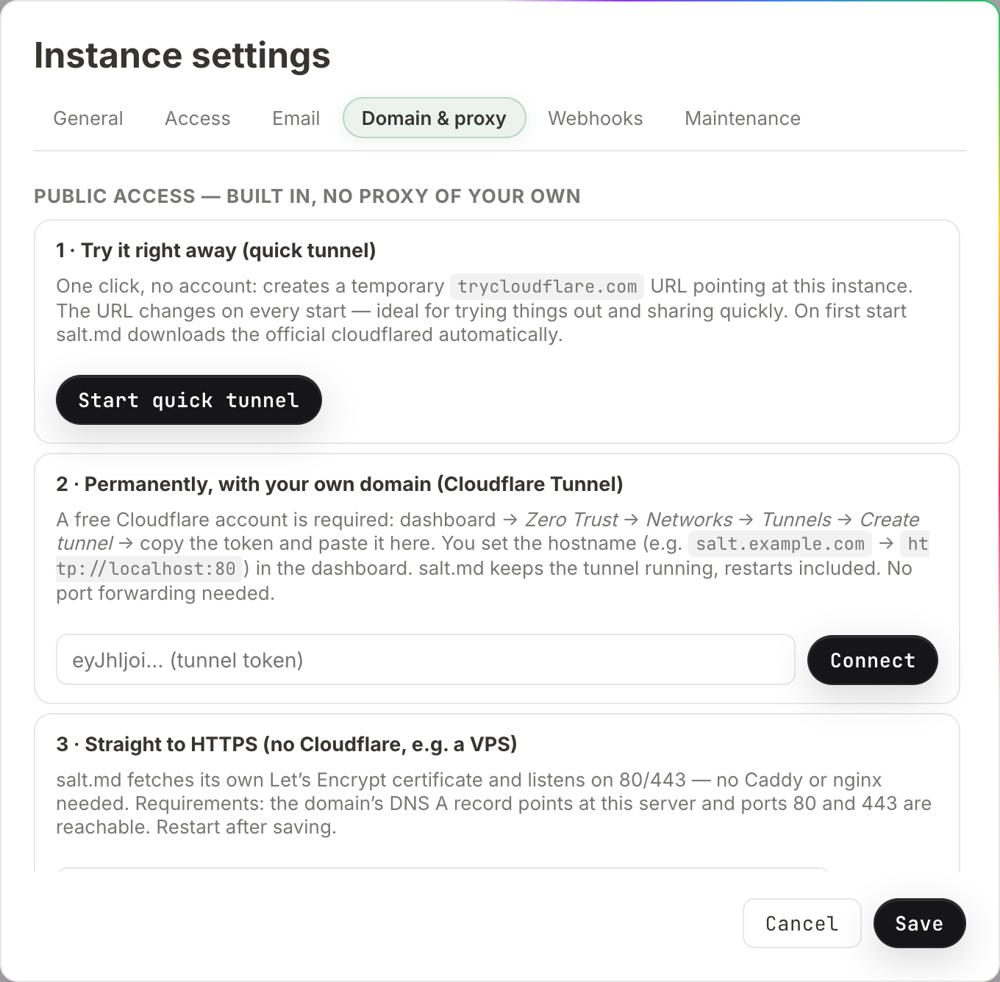

# Reaching your instance from outside

A fresh salt.md listens on `:8420` and answers on every network interface of the
machine it runs on. That is enough for a laptop and for a server on your own
network. The moment you want a share link that works from a phone, an invitation
that a colleague can open, a calendar subscription, sign-in through Google or
Microsoft, or an agent connecting from somewhere else, you need two things: a
name the outside world can resolve, and salt.md knowing what that name is.

This page covers both. It is written for whoever administers the instance —
everything here lives in **Instance settings**, which only instance admins see
(the account menu at the bottom of the sidebar → **Instance settings**).

## The public base address

**Instance settings → General → `Public base URL (for links, mail, calendars)`.**
One field, one value, ending without a slash: `https://notes.example.com`.

It is not what the server listens on. It is what salt.md writes into links it
hands to somebody else. The browser you are using knows the address you typed;
an email does not, a calendar app does not, and a cloud agent certainly does not.

Everything in this list is built from it:

| What | Where it shows up |
| --- | --- |
| Public page links | the share dialog, and `set_sharing` over MCP |
| Public form links | the form-share dialog for a collection |
| Invitation links | the members dialog, and the mail sent with them |
| Calendar subscription | **Subscribe to calendar**, both the `https://` and the `webcal://` form |
| The MCP address | **Connect an agent**, in the snippet you copy |
| The downloadable skill | the address written into the file an agent later reads |
| The instance icon | what an MCP client shows next to this server's name |

### What happens when you leave it empty

salt.md does not simply fall over — it guesses, in this order, and the guess is
good enough often enough that the field gets forgotten:

1. the public base URL, if set;
2. the domain from the built-in HTTPS setting, if that is switched on;
3. the address of a running **quick tunnel**;
4. the address the current request arrived on.

Step 4 is the one that bites. A link generated while you are browsing at
`http://192.0.2.10:8420` carries that address, and it is correct — for anybody
standing on that network, at that moment. Emailed to someone outside, or written
into a repository for an agent, it is a dead end that looks like a working link.

Step 3 has its own trap: a quick tunnel's address changes every time it starts,
so links minted while one was running stop working when it is restarted.

A **named** Cloudflare tunnel never appears in that list at all. salt.md hands
the traffic to Cloudflare and never learns the hostname you chose in the
dashboard — the status line says exactly that:
`Tunnel connected — reachable under the hostname set in the Cloudflare dashboard.`
With a named tunnel, filling in the field is not optional.

### Sign-in resolves it slightly differently

Three things do not use the list above: the redirect URIs for Google and
Microsoft sign-in, the discovery documents an MCP client fetches before signing
in, and the redirect used when an admin connects a Google or Microsoft mailbox
for outgoing mail. They know exactly two sources — the configured base URL, and
the host the request came in on.

**Neither a running tunnel nor the built-in HTTPS domain counts there.** With
built-in HTTPS that rarely shows, because you are browsing that domain anyway
and the request carries it. Behind a tunnel, or when you reach the instance by
IP address, it is the difference between a redirect URI that matches what you
registered with the provider and one that does not. So if you sign in with
Google — see [Signing in with Microsoft or Google](sso.md) — or send mail
through a connected mailbox ([Email](mail.md)), set the field.

With the field set, salt.md also redirects the start of an OAuth sign-in to that
origin. Click **Sign in with Google** on `http://192.0.2.10:8420` and the browser
jumps to `https://notes.example.com` first. That is deliberate: the state cookie
set at the start of the round trip belongs to the host that set it, and a flow
that starts on one host and returns on another fails with nothing useful to read.
Connecting a mailbox on the **Email** tab makes the same hop for the same reason.

### The redirect URIs a provider console asks for

**Instance settings → `Access` → `Sign in with Google / Microsoft (OAuth)`**
prints both, read-only, and selects the whole value when you click into the
field:

- `/api/oauth/google/callback`
- `/api/oauth/microsoft/callback`

The prefix is the public base URL; failing that, a running **quick** tunnel;
failing that, whatever address your browser is using. A named tunnel does not
appear here either.

Two warnings show up under those fields when they apply:

- `⚠ Google and Microsoft accept HTTPS redirect URIs only (localhost aside). Start a tunnel (the “Domain & proxy” tab) or enter a public HTTPS base URL under “General” — it then appears here on its own.`
- `⚠ This is the URL of the running quick tunnel — it changes on every start. For OAuth that lasts, use a named tunnel or your own domain and enter it as the base URL.`

Connecting a mailbox uses a **different** redirect URI on the same base —
`/api/admin/mail-oauth/google/callback`, and the same with `microsoft` — and
that one is not printed anywhere in the dialog. Register it in the provider
console alongside the sign-in one, or the mail connection fails at the last step
([Email](mail.md)).

## Route 1 — the built-in Cloudflare tunnel

**Instance settings → `Domain & proxy`.** The tab has two halves, and their
headings are what to scan for: `Public access — built in, no proxy of your own`
holds the three numbered cards (this route and the next), and
`Manual — your own reverse proxy` everything below them (Route 3).



The machine dials out to Cloudflare and keeps the connection open; nothing has to
accept an incoming connection. This works behind NAT, behind a firewall you do
not administer, and on a home line with no fixed address. No port forwarding.

salt.md runs `cloudflared` itself. It looks for the program on the system's
`PATH` first, then at `bin/cloudflared` inside the data directory
(`bin/cloudflared.exe` on Windows), and only if neither has it does it download
the official release over HTTPS. What triggers that download is a tunnel
**start** — normally an admin pressing a button, but also the automatic restart
of a stored tunnel after a reboot, which happens with nobody watching.

Builds exist for Linux (x86-64, arm64, 386, arm), macOS (x86-64, arm64) and
Windows (x86-64). Anything else answers `install cloudflared manually` — put the
binary on `PATH` or at `bin/cloudflared` in the data directory, the two places
above, and the tunnel starts.

### Trying it — the quick tunnel

Card **`1 · Try it right away (quick tunnel)`** → **`Start quick tunnel`**.

Within a few seconds the status line turns into `Publicly reachable:` followed by
a `trycloudflare.com` address and a **`Copy`** button. No Cloudflare account is
involved. The address is thrown away and regenerated on the next start, so this
is for showing somebody something, not for running on.

**`Stop`** ends it — and so does anything else that ends the process, because a
quick tunnel is not supervised (see below).

The status line refreshes itself every two and a half seconds, but only while the
`Domain & proxy` or `Access` tab is open. A status that looks stuck is worth
re-opening the tab for, rather than reloading the page.

### Keeping it — a named tunnel

Card **`2 · Permanently, with your own domain (Cloudflare Tunnel)`**.

What salt.md needs from you is one value: the tunnel **token**, a long string
starting `eyJhIjoi…`. Everything else happens on Cloudflare's side, and their
documentation is the authority on those screens because they change. The dialog
names the path it expects — *Zero Trust → Networks → Tunnels → Create tunnel* —
and what you have to set up there is:

- a Cloudflare account with your domain in it (the free tier is enough);
- a tunnel, which yields the token;
- a **public hostname** on that tunnel — `notes.example.com` — pointing at this
  machine's own address. That is `http://localhost:8420` with the default listen
  address. The dialog's example says `http://localhost:80`, which is the port
  the systemd unit in the repository uses; match it to your own `SALT_ADDR`.

Then, in salt.md:

1. Paste the token into the field on that card. It is a password field; once
   stored, the placeholder reads `•••••• (token stored)` and you never have to
   paste it again.
2. Press **`Connect`**.
3. Wait for `Tunnel connected — reachable under the hostname set in the
   Cloudflare dashboard.`
4. Go to **General** and set the public base URL to `https://notes.example.com`.

A rejected token shows as `Token rejected (Cloudflare refused the connection)`.
An error line carries a **`Reset`** button.

**`Reset` is `Stop` wearing another label.** It sends the same instruction, and
stopping also clears the flag that brings a named tunnel back after a reboot. So
a tunnel you reset after an error stays away on the next start until you press
**`Connect`** again.

**One tunnel at a time.** While one is running or starting, both
**`Start quick tunnel`** and **`Connect`** are greyed out, and the server refuses
a second start with `tunnel is already running`. Swapping in a new Cloudflare
token therefore begins with **`Stop`**.

### What it does once it is up

- **It survives restarts.** A named tunnel is remembered and comes back on the
  next start, on its own. salt.md waits (up to 30 seconds) for its own port to
  answer before dialling out, so the domain does not serve errors during the gap.
- **A named tunnel restarts itself.** If cloudflared exits, salt.md waits five
  seconds and starts it again — unless you pressed **`Stop`**, which is the one
  thing that turns the feature off. **A quick tunnel is not supervised**: when
  its process ends, the status goes to error and nothing brings it back.
- **It leaves cleanly.** On shutdown salt.md tells Cloudflare the connection is
  going away before it stops serving. Skipping that leaves a dead route
  registered at the edge and the domain unreachable for minutes after a restart.
- **It switches on proxy trust for you.** Behind Cloudflare the forwarded-IP
  headers are trustworthy, so the checkbox further down the same tab
  (`Run behind a reverse proxy (trust X-Forwarded-For)`) is enabled
  automatically, and the sign-in rate limit, the limiter that throttles guessed
  API tokens and the log line written for every rejected credential start seeing
  real visitor addresses instead of Cloudflare's. Stopping the tunnel does
  **not** switch it back off — if the instance goes back to being reached
  directly, untick it by hand.

Starting and stopping a tunnel requires a browser session. An API token is
refused with *This action requires signing in through a browser — an API token is
not enough*, the same rule that guards the rest of instance administration
([Administration](administration.md)).

**A tunnel is reachability, not a lock.** Whoever finds the address still meets
the sign-in screen, and that is the thing protecting the content. Whatever you
put in front of the tunnel sits in front of `/mcp` as well, and an agent has no
way to work through a sign-in page it did not expect — so an access layer at the
edge has to let `/mcp` through. See [Agent access](agent-access.md).

## Route 2 — built-in HTTPS, no proxy at all

Card **`3 · Straight to HTTPS (no Cloudflare, e.g. a VPS)`**, on the same tab.

Enter the domain (`notes.example.com`), tick **`Active`**, press **`Save`**, and
restart the process. salt.md then fetches and renews its own Let's Encrypt
certificate.

What this changes at startup:

- it listens on **`:443`**, whatever `SALT_ADDR` says;
- a second listener on **`:80`** answers the certificate challenge and redirects
  everything else to HTTPS;
- certificates are cached in `certs/` inside the data directory, so a restart
  does not fetch new ones.

What it needs from the outside: an A or AAAA record for that exact domain
pointing at this machine, and ports 80 and 443 reachable from the internet. Both,
or the certificate is never issued.

What it needs from the machine: permission to take two ports below 1024. The
systemd unit in the repository grants exactly that
(`AmbientCapabilities=CAP_NET_BIND_SERVICE`) while running as an unprivileged
`salt` user. Started by hand as an ordinary user, the process does not get them.

The two ways that fails look nothing alike. If `:443` cannot be bound, the
process stops and prints why. If only `:80` fails, the process **keeps running**
and logs one line, `http-01 listener: …` — after which everything looks normal
while the certificate is never issued, because the challenge has nowhere to land.
An instance answering on `:443` with every browser complaining about the
certificate is that line, in the log, from startup.

`SALT_TLS_CERT` wins over this setting, and the check is on that one variable
alone. Set it without `SALT_TLS_KEY` and you get the worst of both: the
automatic path switches off, the incomplete pair is not used either, and the
server serves plain HTTP on `SALT_ADDR` without saying so.

## Route 3 — your own reverse proxy

nginx, Caddy, Traefik, HAProxy, a cloudflared you manage yourself. salt.md asks
for nothing unusual, but four things have to be right.

1. **Pass `X-Forwarded-Proto`.** It is how the instance knows the outside is
   HTTPS, which decides whether the session cookie is marked secure.
   (`X-Forwarded-Ssl: on` is accepted too.)
2. **Let WebSockets through.** Live editing runs over one (`/collab/{id}`). A
   proxy that quietly drops the upgrade leaves an editor where nobody else's
   cursor ever appears and changes arrive only on reload — see
   [Working together](collaboration.md).
3. **Do not buffer `/api/events`.** It is a stream that stays open. salt.md sends
   `X-Accel-Buffering: no`, which nginx honours; other proxies need telling.
4. **Raise the body limit** to at least the value in
   `Max. file size per upload (MB)` on the General tab, or uploads fail at the
   proxy before salt.md ever sees them.

Then tick **`Run behind a reverse proxy (trust X-Forwarded-For)`** on the
`Domain & proxy` tab **and press `Save`**. The tunnel buttons on that tab act the
moment you press them; this checkbox does not. It is part of the dialog and
reaches the server only when the dialog is saved — tick it, close the dialog, and
nothing has changed.

Without it, salt.md ignores forwarded-IP headers and every visitor looks like the
proxy: one shared bucket for the sign-in limit and for the public-form limit, one
address on every rejected-credential log line a fail2ban jail would read
([History and audit](history-and-audit.md)), and the proxy's address recorded as
the origin beside every API token in an account. **Leave it off when there is no
proxy**: those headers are written by whoever is calling, so trusting them
without a proxy in front lets an attacker invent a new IP for every password
guess.

`X-Forwarded-For` is read first, `X-Real-Ip` when that one is absent — so a proxy
that sets only the latter works too. Nothing else is consulted. The hint under
the checkbox also mentions the audit log; that is the one place an address never
goes. The activity log records who did what, never from where.

**Bind the instance to loopback while you are at it.** With a proxy in front,
nothing needs to reach the port from outside: `SALT_ADDR=127.0.0.1:8420` makes
the instance answer on the machine itself only, and both a proxy and the built-in
tunnel reach it there. (With built-in HTTPS switched on this has no effect —
that route takes `:443` regardless.)

### The generated configuration

Under the checkbox, the field `Internal address of the instance (upstream)` is
prefilled with the address your browser is using. It is not stored anywhere: it
feeds the snippets below and nothing else, so it reads back as your browser's
address the next time the dialog opens.

Below it, three ready-made snippets, each with a **`Copy`** button:

| Block | What it contains |
| --- | --- |
| `Caddy (automatic HTTPS)` | a three-line site block — Caddy handles certificates and WebSockets by itself |
| `Cloudflare Tunnel (no open port needed)` | the commands to create a tunnel by hand plus a `config.yml` |
| `nginx` | a `server` block with the forwarded headers, the WebSocket upgrade, `proxy_read_timeout 3600s` and `client_max_body_size` filled in from your upload limit |

The domain in all three comes from the public base URL, so set that first —
otherwise the examples read `salt.example.com` and you will paste a placeholder
into a real config file.

One line under the blocks is easy to scroll past and answers a real question:
with Cloudflare, leave the DNS record **Proxied** (the orange cloud); WebSockets
are on by default there.

### Checking that proxy trust actually works

**Instance settings → `Maintenance`** shows
`Your IP (as the server sees it)`. It reads back the address salt.md attributes
to your request, with `proxy headers active` appended when the checkbox is on.
If that shows the proxy's address rather than yours, the header is not arriving.

**And one way to switch it off by accident.** Connecting a tunnel turns proxy
trust on at the server. A settings dialog that was already open when that
happened still shows the value it loaded — unticked — and pressing **`Save`**
writes that stale value back. If the address in Maintenance stops looking right
after a round of settings changes, re-open the dialog and tick the box again.

## Serving TLS directly from a certificate you already have

Two environment variables, both required:

```sh
SALT_TLS_CERT=/path/fullchain.pem SALT_TLS_KEY=/path/key.pem salt
```

Only one set and the server quietly serves plain HTTP — and, as above,
`SALT_TLS_CERT` on its own also disables the built-in HTTPS route. The rest of
the environment is in [Self-hosting](self-hosting.md).

## Where a fresh installation listens

```sh
curl -fsSL https://raw.githubusercontent.com/saltmd/salt.md/main/install.sh | sh
salt
```

The installer detects the platform (Linux and macOS, x86-64 and arm64), downloads
the matching prebuilt binary and puts it in `/usr/local/bin` — or `$HOME/.local/bin`
when that is not writable and there is no `sudo`. `BIN_DIR=/path` overrides it,
`SALT_VERSION=v1.0.0` pins a version. It then tells you to open
`http://localhost:8420`.

It installs a program; it does not open a port, register a service or configure a
domain. The default listen address `:8420` binds every interface, so the instance
is already reachable from the rest of your network — one of the three routes above
is what makes it reachable beyond that.

The repository also carries a systemd unit and a script to install it, which runs
salt.md as its own user out of `/opt/salt`, keeps its data in `/opt/salt/data`
and listens on port 80 instead.

## Checking it from outside

```sh
curl https://notes.example.com/api/health
{"status":"ok","version":"…"}
```

`/api/health` needs no sign-in and pings the database, so it distinguishes a
healthy instance from one that is answering but broken — it returns `503` and
`{"status":"unavailable"}` in that case. It is the right target for a monitor.
The `version` is whatever build is running. The full surface is in
[The HTTP API](api.md).

To see what address the instance believes it has, ask it from a signed-in
session: `/api/public-base` returns the resolved value — the same one the
**Connect an agent** dialog shows and the same one written into the downloadable
[skill](skill.md). Unlike `/api/health` it sits behind the sign-in, so send a
session cookie or an API token; without one it answers `401`.

## The three mistakes that cost an afternoon

**The base URL is empty and everything looks fine.** It does, from your desk.
Test a share link from a phone on mobile data before believing it —
[Sharing](sharing.md) and [Forms](forms.md) both hand out addresses built this
way.

**Sign-in starts on one host and returns on another.** The cookie is scoped to
the host that set it, so nothing arrives back and the error says little. Set the
base URL and use that address; the redirect described above then keeps the flow
on one origin by itself.

**The base URL has a typo.** Nothing validates it — it is stored as typed. A
wrong host there does more than produce bad links: OAuth sign-in redirects the
browser to it before the flow starts. If sign-in suddenly lands nowhere after a
settings change, that field is the first place to look, and
[Troubleshooting](troubleshooting.md) has the rest.
