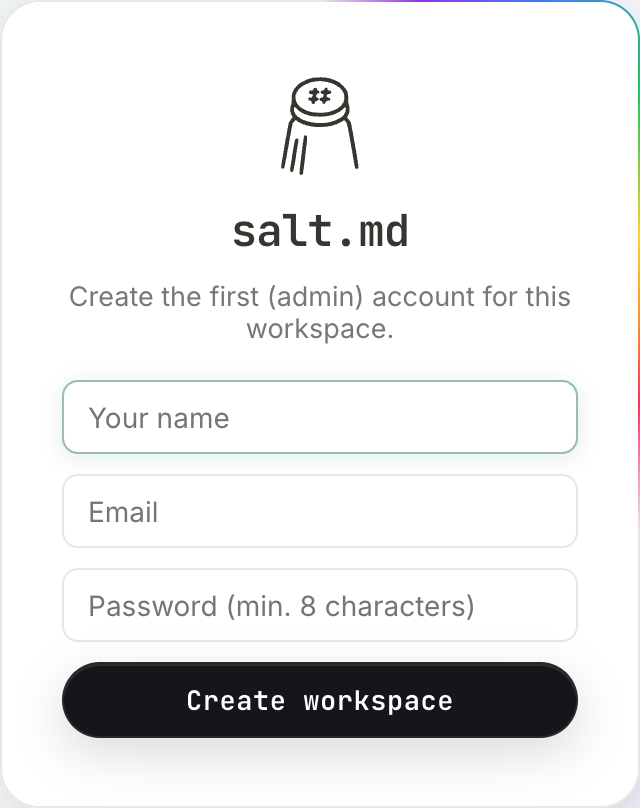
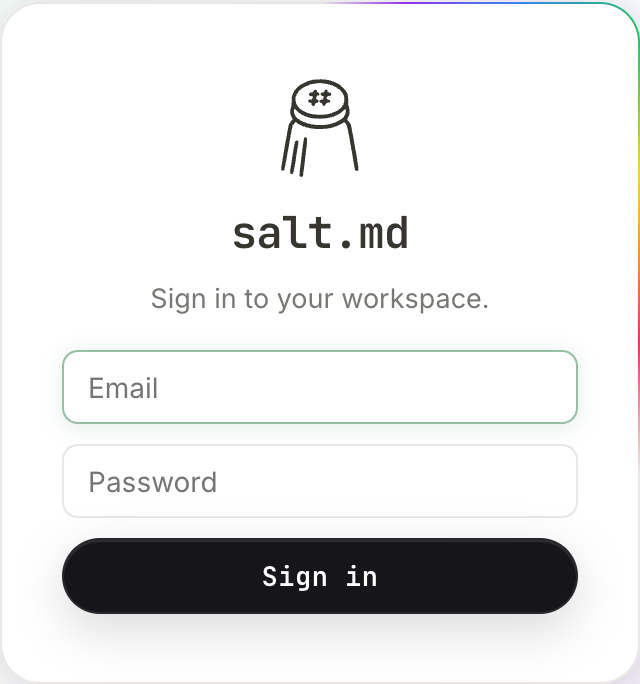

# Getting started

salt.md is one program: a single executable file that contains the server, the
web interface, full-text search and the agent endpoint. There is no database to
install beside it, no Node, no runtime. This page takes you from nothing to a
running instance with your account in it and your first page open — what you
download, what the very first screen asks for, what a brand new instance already
contains, and the handful of things worth knowing before you fill it up.

## What you download

The installer picks the right build for your machine and puts it somewhere on
your path:

```sh
curl -fsSL https://raw.githubusercontent.com/saltmd/salt.md/main/install.sh | sh
```

It detects your operating system and processor, downloads the matching file from
the GitHub release, makes it executable and moves it to `/usr/local/bin/salt` —
or to `$HOME/.local/bin/salt` when that directory is not writable and `sudo` is
not available. It finishes by printing either `Run it:   salt` or, when the
directory it chose is not on your path, the full command to type instead.

Two variables change what it does:

| Variable | Effect |
| --- | --- |
| `BIN_DIR=/path` | install there instead of the default |
| `SALT_VERSION=v1.6.0` | fetch that release rather than the latest |

Each release carries five binaries and a checksum file:

| File | For |
| --- | --- |
| `salt-linux-amd64` | Linux on Intel/AMD |
| `salt-linux-arm64` | Linux on ARM |
| `salt-darwin-amd64` | macOS on Intel |
| `salt-darwin-arm64` | macOS on Apple silicon |
| `salt-windows-amd64.exe` | Windows |
| `SHA256SUMS.txt` | checksums for all of them |

The installer handles Linux and macOS only; on Windows, download the `.exe` from
the release page and run it. It also refuses a download that turns out to be an
HTML page rather than a program, which is what a missing release asset looks
like from the outside.

### Or Docker

```sh
docker run -d --name salt --restart unless-stopped \
  -p 8420:8420 -v salt-data:/data --memory=4g \
  ghcr.io/saltmd/salt.md:latest
```

The image already sets the listen address to `:8420` and the data directory to
`/data`, declares `/data` as a volume, and runs the process as a non-root user.

**Set `--memory`.** A container cannot see how much the host means to give it,
so without a limit salt.md deliberately assumes a small machine — 2 GiB, however
large the host is — and indexes the text of fewer and smaller PDFs than it
could. It says so in its startup log. This never affects whether an upload
succeeds, only how much of a document's text reaches the search index. In a
nested setup where even the cgroup cap is a lie (Docker inside LXC), say it
outright with `SALT_MEMORY_MB`. [Self-hosting](self-hosting.md) covers memory,
HTTPS and reverse proxies.

### Or from source

`make build` compiles the web interface first and then embeds it into the
binary. The frontend build runs a check gate before it produces anything, and
that gate is not optional — it is what keeps the translations and the
documentation honest.

## Running it the first time

```sh
salt
```

That is the whole command. The server writes a few lines as it starts, in this
order:

- `search index: rebuilt (version 3, 1 pages)` — the full-text index being built
  for the first time
- `file index: built (version 2, 0 files on 0 pages, 0 unreferenced)`
- `memory: … MB available, soft limit … MB, PDF indexing up to … MB, …
  extraction(s) at a time` — on machines where it cannot tell, this line is
  absent
- `salt.md <version> listening on :8420 (data: ./data)`

**The last line is the one to read.** `./data` is relative to the directory you
were in when you started it. Start salt.md from somewhere else tomorrow and it
will create a second, empty data directory and look as if everything is gone.
Set `SALT_DATA` to an absolute path on any instance you intend to keep.

Inside that directory: `salt.db` (the SQLite database, plus its `-wal` and
`-shm` companions while the server runs) and a `files` directory holding every
upload. Those two things are the entire instance — see
[Self-hosting](self-hosting.md) for backups.

Five environment variables decide the rest. Every one of them starts with
`SALT_`; a bare `DATA=…` is ignored in silence.

| Variable | Effect |
| --- | --- |
| `SALT_DATA` | where the database and the uploads live (default `./data`) |
| `SALT_ADDR` | the address to listen on (default `:8420`; `127.0.0.1:9000` binds to this machine only) |
| `SALT_TLS_CERT` and `SALT_TLS_KEY` | serve HTTPS directly from your own certificate and key, with no proxy in front. Both or neither |
| `SALT_MEMORY_MB` | how much memory to assume, when neither the container nor the machine reports the truth |
| `SALT_RESTORE_FORCE=1` | permit `salt restore` to overwrite a data directory that already holds a database |

An admin can also switch on automatic HTTPS from the settings dialog, which
takes over ports 80 and 443 and fetches its own certificate —
[Domain and HTTPS](domain.md).

The binary answers four subcommands without starting a server at all:

| Command | Does |
| --- | --- |
| `salt version` | prints the version and exits |
| `salt backup <file.tar.gz>` | writes a consistent snapshot of database and uploads |
| `salt restore <file.tar.gz>` | unpacks one into the data directory — it refuses when a `salt.db` is already there, unless `SALT_RESTORE_FORCE=1` is set |
| `salt fix-notion-rows` | strips the repeated title-and-properties preamble Notion writes into every exported row, from rows already imported, and reports how many it cleaned |

`salt backup` is safe against a running instance — it takes a transactionally
consistent snapshot rather than copying files, so nothing is caught mid-write.
`salt restore` and `salt fix-notion-rows` take the database for themselves; stop
the server before either.

**It is `salt version`, not `salt --version`.** An unrecognised argument is not
an error — the program falls through and starts a server, which on a machine
already running one means a second process fighting for the same files.

`GET /api/health` answers `{"status":"ok","version":"…"}` and needs no
credential. It pings the database, so it tells a live-but-broken instance apart
from a healthy one.

## The first screen

Open `http://localhost:8420`. Because the instance has no accounts yet, the
first thing you get is not a sign-in form but a welcome card that creates one:

> **salt.md**
> Create the first (admin) account for this workspace.



Three fields and a button:

1. **Your name** — how you appear to everyone else, on pages and beside
   comments.
2. **Email** — your sign-in name. It has to contain an `@`; nothing is sent to
   it, and no confirmation mail goes out.
3. **Password (min. 8 characters)** — stored as an argon2id hash, never in
   clear.
4. Press **Create workspace**.

The checks are the server's, and it says exactly which one failed: *name is
required*, *a valid email is required*, *password must be at least 8
characters*. If two people open this screen at the same moment, only one of them
creates the account; the other is told *setup already completed*.

The theme switch in the top right corner of the screen works before you
have an account — **Light**, **Automatic — follows the system**, **Dark**. So
does the language: the interface takes it from your browser, and today there are
two catalogues, English and German.

The two are remembered in different places, which matters the moment you use a
second device. **The language lives on your account** once you are signed in,
and follows you everywhere — [Language and time](language-and-time.md), which
also covers the date format, the time zone, the clock and the first day of the
week. **The theme is remembered by this browser only.** Dark mode on your laptop
is not dark mode on your phone; each device is set on its own.

### What that first account becomes

Whoever fills in this card is not merely the first user. They become the
instance **owner**, which is a role nobody else can be given without the owner
handing it over. Some things are deliberately reserved for it: deleting an
account, changing somebody else's password or email address, taking over a
workspace whose members have all gone, and emergency access to a workspace they
are not a member of. Admins manage accounts; the owner is the one with the keys
to the building. [Permissions](permissions.md) has the full division.

This screen appears exactly once. From the moment an account exists, the same
address shows the sign-in card instead, and a second attempt to run the first-run
step is refused by the server.

## Signing in

The sign-in card carries the same shape as the one that created the instance:

> **salt.md**
> Sign in to your workspace.



Email, Password, and a **Sign in** button. What else appears there depends on
how the instance is configured:

- **The name at the top** is the wordmark until an admin sets an instance name;
  after that it is that name, exactly as they wrote it, and it becomes the
  browser tab's title too.
- **A 2FA code (6 digits) field** appears after a correct password, and only for
  accounts that have switched two-factor sign-in on. The password does not have
  to be typed again — [Account](account.md).
- **Sign in with Google** and **Sign in with Microsoft** appear under an *or*
  divider when an admin has configured them — [Single sign-on](sso.md).
- **New here? Create an account** appears only when the instance allows
  self-registration. New instances do not: the default is invitation only, so
  the button is absent until an admin changes it in
  [Administration](administration.md).

A wrong password is answered with *Wrong email or wrong password.* — the same
sentence whether or not the address exists, and it takes the same amount of time
either way, so the screen cannot be used to find out who has an account here.
Repeated attempts from the same computer are throttled: 30 a minute per IP
address, whichever accounts are tried from it.

**There is no "forgot password" link, because there is no password reset by
email.** The owner is the only account that can change somebody else's password,
and the administration dialog has no button for it — it is a call to
`PATCH /api/users/{id}` from a signed-in owner session, see [API](api.md). An
invitation is not a way back in either: sent to an address that already has an
account, it asks for that account's existing password before it joins anything.
Nobody can reset the *owner's* password through the interface at all. Keep it
somewhere you will still have it.

Signing in leaves a cookie the browser cannot read from JavaScript; how long it
lasts is an instance setting, 90 days unless an admin changes it. Signing out is
in the user menu at the bottom of the sidebar.

### Creating your own account

Where an admin has opened registration — to everyone, or to a list of email
domains — **New here? Create an account** turns the same card into a sign-up
form: a **Name** field appears above the email, the password field is labelled
**Password (min. 8 characters)**, and the button reads **Create account**.
**Back to sign in** returns. An address that the instance does not accept is
refused at that point, not before: the login screen never lists which domains
are allowed, because that list is worth something to a stranger.

### Arriving on an invitation link

An invitation is a link of the form `/invite/<token>`, valid for 14 days. Opening
it does not show the sign-in card but an accept card, and what it asks for
depends on who you are:

- **No account yet** — your name, email and a password, then **Join**. The
  account is created and you land in the workspace you were invited to.
- **The address already has an account** — the same form, but the password it
  wants is that account's existing one, plus its 2FA code if it has one. This is
  a sign-in, not a sign-up: a leaked link must not hand anybody an existing
  account.
- **Already signed in** — one button, **Join**, and no credentials at all. If
  the invitation names a different address than the one you are signed in as,
  it says so and offers to sign you out instead.

An expired or unknown link says *Invitation not valid* and offers the way back
to the sign-in screen.

## What a brand new instance contains

Almost nothing, on purpose:

- **One workspace, called `Workspace`.** It is marked open to everyone, which
  means accounts created later join it automatically. Later accounts also get a
  private space of their own named after them; the first account does not — it
  has this one.
- **One page: Welcome to salt.md**, with a salt-shaker icon. It is a short tour
  of the editor — a `/` for the block menu, a three-item checklist, and a few
  lines about the data being a single file you can back up.
- **No collections, no templates, no files, no other members.**

The welcome page is seeded once and remembered as done. Delete it and it stays
deleted; restarting the server does not bring it back.

The sidebar around it holds, from the top: the workspace switcher (showing
`Workspace`), a library icon whose tooltip is *Library — every page*, **Search**
with its `⌘K` shortcut, and two sections — **Documents** and **Collections** —
each with a `+` on the right. A *Templates* section appears later, once a page
has been marked as one. The user menu and the theme switch sit at the bottom.

The library opens on the workspace you are in, not on everything you can read;
once there is more than one workspace, a picker appears at the top of it with
**All workspaces** as its first entry. Its tabs are *Recently used*,
*Favorites*, *Shared*, *Private*, *All pages*, *Graph* and *Tree · agent view* —
[Library](library.md).

Until you open something, the middle of the window offers two buttons, **New
page** and **Import (.md / .zip)**. The `.zip` is not only a salt.md export: a
Notion export drops in here too, database CSVs, nested `Part-N.zip` wrappers and
all — [Import and export](import-export.md). The welcome page is already there in
the sidebar under Documents; click it to read it.

## Your first page

1. Press the `+` beside **Documents** in the sidebar — its tooltip is *New
   page*. `⌥N` does the same thing from anywhere. (`⌘N` belongs to the browser
   and cannot be intercepted.)
2. The page opens immediately with an empty title, showing *Untitled* as a
   placeholder. Type a title, then press Enter or click into the body.
3. Type `/` anywhere in the body for the block menu: headings, lists, quotes,
   code, tables, images, columns — plus four blocks that are salt.md's own,
   **Callout**, **Bookmark / Embed**, **Embed a collection** and **Table of
   contents**. [Editor blocks](editor-blocks.md) covers them.
4. Type `@`, or `[[`, and pick a page to make a real link to it — both open the
   same picker, and both can create the page you are looking for if it does not
   exist yet. The other page then lists yours without anybody maintaining
   anything.
5. Drag a file from your desktop onto the page and it lands there as a block —
   anywhere on the page, not only onto the text. The text inside a PDF becomes
   searchable, and clicking a PDF block opens it in a viewer inside salt.md
   rather than downloading it. Everything else downloads as usual —
   [Files](files.md).

**There is no Save button.** The title is written about half a second after you
stop typing, the body a little later; both survive a closed tab.
[Pages](pages.md) explains sub-pages, tags, icons, covers and the page menu.

The `+` beside **Collections** creates the other kind of page: a table with
typed columns, which can also be looked at as a board, a calendar or a gallery
without the data being copied. That is the part of salt.md a plain notes app
does not have — [Collections](collections.md) and [Views](views.md).

Anything below the top level is made from the tree itself: hover a row in the
sidebar and press its `＋`, and it asks which of the two you want, **Page** or
**Collection**. Rows of a collection carry the same `＋`, so a dossier can hang
off a single record.

## More than one workspace

**New workspace** in the workspace menu — present unless an admin has reserved
workspace creation for admins — does not ask for a name and hand you an empty
sheet. It opens a shelf of ready-made workspaces — each one showing the
collections, columns and views you would actually get, read out of the blueprint
the server is about to import rather than from a screenshot. Your own existing
workspaces sit on the same shelf, to copy the way you already work.

A workspace exported from another instance comes back through **Workspace
settings → Import workspace…**, which takes the native `.zip` archive.
[Workspaces](workspaces.md) covers who sees what, and the setting that makes a
workspace open to every new account.

## Adding the second person

There are two ways in, and they are in different menus.

**Create the account yourself.** **Manage users** in the user menu, then
**Create a new user**: name, email, an initial password, an optional *Instance
admin* tick, and a role per workspace you are allowed to grant. The account
exists straight away and no mail is sent — you pass the password on however you
like.

**Or invite them.** Open **Workspace settings** in the workspace menu and go to
**Members** — both are the workspace admin's, not the instance admin's. Type an
address, pick *Member*, *Viewer* or *Admin*, press **Invite**: the link is
copied to your clipboard, and it is also emailed when the instance has
[mail](mail.md) configured. Leave the address blank for a link alone, to pass on
yourself. Either link is valid for 14 days.

A newcomer lands in their own private space, in every workspace marked open to
all, and in the one the invitation named — or in whichever ones were ticked when
the account was created. Not in everything the person who invited them can see.
[Administration](administration.md) covers accounts and invitations,
[Permissions](permissions.md) covers the roles.

## The rest of the user menu

Worth knowing on day one, at the bottom of the sidebar behind your own name:

| Item | What it is |
| --- | --- |
| **Profile** | your name, email, colour, picture and password. Changing the email or the password asks for the current one |
| **Two-factor (2FA)** | an authenticator code on top of the password — [Account](account.md) |
| **API tokens** | keys for scripts and agents, scoped read or write and to workspaces — [API](api.md) |
| **Agents & MCP** | connecting an assistant to this instance — [Agents](agents.md) |
| **Activity log** | who did what in the workspaces you can see — [History and audit](history-and-audit.md) |
| **Subscribe to calendar** | every date property in your collections as a private feed for Apple Calendar, Google Calendar or Outlook |
| **Language and time** | language, region, time zone, clock, first day of the week |
| **Notes mode** and **Salt fonts** | a middle column for documents, and the bundled typefaces. Both per browser |
| **Manage users** | admins only: create accounts, grant or revoke admin rights, deactivate |
| **Instance settings** | admins only, in six tabs — *General*, *Access*, *Email*, *Domain & proxy*, *Webhooks*, *Maintenance* — [Administration](administration.md) |

## Where to go next

- [Concepts](concepts.md) — the words this product uses, precisely. Worth ten
  minutes before you build anything you intend to keep.
- [Interface](interface.md) — the sidebar, tabs, the library, the shortcuts.
- [Collections](collections.md) and [Properties](properties.md) — the reason to
  put something here rather than in a spreadsheet.
- [Agents](agents.md) — connecting an AI assistant to this instance, which is
  what the MCP endpoint is for.
- [Self-hosting](self-hosting.md) — backups, updates, putting it behind a
  domain.
- [Troubleshooting](troubleshooting.md) — when something is not where you left
  it.
