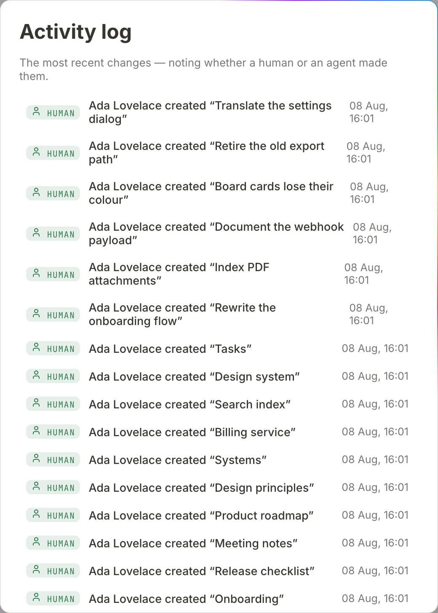

# History and audit

salt.md keeps four separate records, and they answer four different questions.
Reaching for the wrong one is the usual reason somebody concludes that salt.md
does not remember something it remembers perfectly well. This page says what
each record contains, who may read it, how long it survives, and how to put an
old version of a page back.

| Question | Record | Where you read it |
| --- | --- | --- |
| What did this page look like before? | **Version history** | the page's ⋯ menu |
| Who did what across my workspaces? | **The activity log** | the account menu |
| Who looked into a workspace they are not in? | **The emergency access log** | workspace settings |
| Who is knocking on the sign-in? | **Rejected sign-ins** | the server's own log |

A fifth thing looks like a record and is not quite one: the **raw trail** on a
page — dated, append-only notes somebody wrote *while* working. It is the only
one that can say why an approach was dropped. See
[Comments and notes](comments-and-notes.md).

None of the four answers "who is on this page right now". That question has its
own answer, and it is live rather than recorded — see [Who is here right
now](#who-is-here-right-now) at the end of this page.

## Version history

A revision is a whole copy of the page's **title and body** at one moment, not a
diff. salt.md writes one whenever a page's body is written: your own editing
saved from the browser, a write over the API, or an agent writing over MCP.

**Which moment gets recorded differs by route**, and it decides what *Restore*
hands you back:

- A save **from the browser or over the API** records the state as saved. The
  newest entry is what the page says now.
- A **replace** or a **prepend** over MCP records the state as it was just
  *before* the agent wrote. So after an agent replaces a page, the newest entry
  in the list is the text it replaced, not the text it wrote.
- An **append** over MCP records the state with the appended blocks already in.

Three rules decide what ends up in the list:

- **At most one snapshot per page every two minutes.** A save inside that window
  adds nothing — twenty minutes of typing leaves ten revisions, not hundreds.
- **The newest 50 per page are kept.** When a fifty-first snapshot arrives, the
  oldest goes. (A restore made over MCP writes its pre-restore copy past that
  ceiling; the next ordinary snapshot on the page prunes back to 50.)
- **An empty body is never snapshotted**, so a page you have just created does
  not start its history with a blank.

The dialog says the same thing in one line: *Snapshots are taken on save (at
most every 2 minutes, the latest 50).*

**Properties are not part of a revision.** Changing a row's status or its due
date writes no snapshot, because the body did not change. Version history is for
the text of a page; see [Collections](collections.md) for what a row's
properties are.

### Reading and restoring

1. Open the page and click the ⋯ button in the topbar (*More*).
2. Choose **Version history**.
3. The dialog lists every kept revision, newest first: the time it was taken,
   who wrote it, and a **Restore** button.
4. Click **Restore**. salt.md asks first: *Restore the version from …? The
   current state is saved as a version first.*
5. On success a *Version restored* message appears, the dialog closes, and the
   live document is reset — anybody with that page open in an editor gets the
   restored text rather than carrying on from the old one.

If a page has no revisions yet the dialog says *No versions yet.*

**One kind of row names no person.** Content appended over MCP — the
`write_content` tool in its default append mode — records the author as `agent`
rather than the account behind the call. Every other write path records the
account's own name. *unknown* appears only for a revision that carries no author
name at all.

Two things about restoring that are easy to be surprised by:

- **Restoring is itself undoable.** The state you are leaving is written as a
  new revision before the old one is put back, so a restore can be restored. The
  two-minute rule qualifies that in the browser: if a snapshot of this page was
  already taken less than two minutes ago, no new one is written and the state
  you are leaving is the one already in the list. A restore over MCP always
  writes the pre-restore state as its own revision, throttle or not.
- **Restoring from the browser puts back the body, not the title.** The page
  keeps whatever title it has now. Restoring over MCP puts back both.

**Who may do what.** Anyone who can read the page can open its history. Restoring
needs write access — the same permission as editing. The Restore button is shown
to viewers as well, and the server refuses it, so the click ends in an error
rather than a change. See [Permissions](permissions.md).

**How long it survives.** As long as the page does. A page in the trash keeps its
full history and gets it back on restore; when the trash empties itself the page
and its revisions go together. That period is a setting, not a fixture: *Instance
settings* → *Empty the trash automatically after (days, 0 = never)*, 30 days
unless an admin changes it, and **0 turns the automatic emptying off entirely**,
which makes revisions survive until somebody deletes the page for good.
Self-hosters can set the same number with `SALT_TRASH_DAYS`, and the admin
setting wins over it. See [Trash and recovery](trash-and-recovery.md) and
[Administration](administration.md).

### Over MCP

The `revisions` tool covers all three moves on one page:

| Action | What it does |
| --- | --- |
| list (the default) | the newest revisions — 20 unless a limit is given — with author, time, size, and whether a **human** or an **agent** caused it |
| get | one older state, rendered as Markdown, without changing anything |
| restore | put the page back to it |

The **get** action is the non-destructive way to use history: it returns the old
title and body as Markdown, so an agent can lift one paragraph out of last
week's state without putting the whole page back. Both get and restore need the
revision id from the list.

The limit on **list** is 20 by default, and 100 is the largest value that is
honoured — anything above it, or below 1, silently falls back to 20 rather than
being capped. An agent asking for 500 gets 20 rows and no warning, which reads
exactly like a page with only 20 revisions. The dialog in the browser has no
limit at all and shows every kept revision.

A **read-only** API token may list and get but is refused a restore. The
human/agent column comes from the activity log below: a revision written before
that trail existed, or one that cannot be attributed, reads as *unknown*.

**A restore over MCP is itself an activity-log entry**, filed under the tool name
`revisions` with the account's name and *(MCP)* after it. An agent putting a page
back is traceable; listing and getting leave no entry, because they change
nothing.

The same three steps are HTTP routes if you prefer them:
`/api/pages/{id}/revisions`, `/api/pages/{id}/revisions/{revId}` and
`/api/pages/{id}/revisions/{revId}/restore`. See the [API](api.md).

## The activity log

Who did what, when, and whether it was a person or an agent. Open the **account
menu** — your name at the bottom of the sidebar — and choose **Activity log**.
Every signed-in account has it; there is no admin switch.

Each row carries a badge reading *human* or *agent*, the name of whoever acted,
what they did in plain words, the first 60 characters of the detail in quotation
marks, and the time. The list loads 50 entries and offers **Load more…** until
the history is exhausted; it pages backwards through everything, not just the
tail. An instance where nothing has happened says *Nothing has happened yet.*



### What is recorded

| Wording in the log | What happened |
| --- | --- |
| created | a page was created — the detail is its title |
| changed | a page's title, icon, cover, description, visibility or tags was changed over MCP (`update_page`) |
| uploaded a file to | a file was attached over MCP |
| moved to trash / permanently deleted | a page was trashed or deleted for good from the browser or the API |
| started working on: / finished working on: | an agent checked in or out of a page, with its own note as the detail |
| deactivated the account: / reactivated the account: / deleted the account: | account administration |
| deleted the workspace: / took over the workspace: / adopted the ownerless workspace: | workspace lifecycle |
| handed the instance to: | the owner role moved to another account |
| took emergency access: / ended the emergency access: | see below |

Note what *changed* does **not** cover: `update_page` over MCP touches metadata
only, and refuses a call that names none of those six fields. It never writes a
page's body.

Beyond the table, more events are recorded than have wording of their own, and
those rows show the raw action name instead of a sentence. Among them:
`write_content`, which is how **an agent writing a page's body** appears;
trashing or restoring a page over MCP; importing a Markdown file or an archive;
exporting or importing a whole workspace; creating a workspace from a blueprint;
signing in from the desktop app; approving an agent over OAuth; creating and
deleting webhooks; changing a workspace's agent access or its rules; and
discarding a page's raw trail. A row reading *added to* is old: it belonged to
the separate append tool that was folded into `write_content`, and nothing writes
it any more.

**Every mutating call an agent makes is one entry**, filed under the tool's own
name, with the account's name and *(MCP)* after it, and the tool's reply as the
detail. Two tools are deliberately not double-recorded: an agent's check-in
writes its own entry with the note as the detail, and `note` writes nothing here
because the raw trail on the page already is the record.

A [form](forms.md) submitted by somebody with no account appears as *public
form* creating a page — the form is the actor.

### What is not recorded

**Editing a page's body in the browser is not an activity-log event.** That is
what version history is for, and duplicating every keystroke-driven save into a
second list would drown everything else. The log answers "what happened to this
workspace", the history answers "what did this page say".

Reads are not recorded either. Opening a page writes nothing to any of the four
records — though it is not invisible while it happens, see [Who is here right
now](#who-is-here-right-now).

### Who sees what

- **Anybody signed in** sees events from the workspaces they can see, and only
  those. Within a workspace, entries pointing at a page they may not read are
  filtered out one by one — the detail of a *created* entry is the page title,
  and a private sub-tree must not leak its titles through a log.
- **The instance owner and instance admins** additionally see events that hang
  off no workspace at all: an account deactivated, reactivated or deleted, a
  workspace deleted, and the instance handed to another owner. Those events
  belong to no workspace, so the ordinary filter made them invisible to
  everybody — precisely the events a log is kept for. They name accounts and
  workspaces, never page titles.
- **A workspace handover is not one of those.** It is filed against the
  workspace it concerns and follows the ordinary filter like any other entry. An
  admin who hands a workspace to an heir without being a member of it will not
  find the entry they just caused.
- **An API token cannot widen this.** A token restricted to certain workspaces
  sees those workspaces only, and never the instance-wide rows, even when the
  person behind it is an admin.

An entry whose page has since been deleted **stays**. Otherwise the permanent
deletions would be the first thing to vanish from the record.

**Nothing prunes this log.** It grows for the life of the instance.

## The emergency access log

The instance owner can look into a workspace they are not a member of. There is
no way to make that impossible — whoever runs the server has the database file —
so salt.md makes it deliberate and **visible** instead.

**Taking it.** In *Manage users*, the owner opens their own account, finds a
workspace they have no access to under *Workspace access*, and clicks **Emergency
access**. salt.md asks *Emergency access to “…” — why?* and will not proceed on
less than 10 characters of reason. The reason is stored (up to 500 characters),
written to the activity log, and emailed to that workspace's admins. The
confirmation names the end time: *Read access to “…” until … — the people in
charge have been told.*

**What it grants.** Reading, for **two hours**. Not writing and not trashing — an
emergency grant carries no workspace role at all, so nothing on a page can be
changed. Three things do come with the reading, and they are worth knowing before
you take a grant:

- The workspace's pages become findable through [search](search.md) and
  reachable by direct link. The workspace does **not** join the sidebar switcher
  — that list is memberships only.
- The workspace's entries enter the owner's **activity log** scope, because that
  log follows readable workspaces rather than memberships.
- The **workspace export** answers (`/api/workspaces/{id}/export`), so a full
  copy of the workspace — pages, files, schema — can be taken over the API while
  the grant runs. In the browser that button sits in *Workspace settings*, which
  opens only for a workspace admin of a workspace they belong to, so it is not
  offered there.

**What it refuses.** A workspace you are already a member of (you do not need
it), and a **personal space**, which cannot be looked into at all: it belongs to
exactly one account, and an exception there would make the whole promise hollow —
the export above is precisely why.

**Ending it.** It expires on its own after two hours. It can be ended early from
the log. Handing the instance to another owner ends every running grant of the
outgoing one immediately.

**Reading the record.** The workspace menu → **Workspace settings** → **Emergency
access log**. Each row names the person, when they looked in, the reason they
gave, and its state: *runs until …* while it is live, then *ended early* or
*expired*. A live one carries an **End it now** button. A workspace nobody has
looked into says so plainly — *There has been no emergency access to this
workspace so far.* — so an empty record cannot be mistaken for a broken one. The
dialog states the rule at the top: emergency access allows reading only, expires
after two hours, and can be ended early at any time.

The newest 50 grants are shown, and nothing prunes them by age. They are not
indestructible, though: a grant is stored against its workspace and against the
account that took it, so deleting either removes the grants along with it.

Two limits worth knowing. Workspace settings opens for **workspace admins**, and
the *Emergency access log* row inside it is shown to the **instance owner**. So a
workspace admin who gets the email cannot open that dialog; the record and the
early revocation are reachable for them through
`/api/workspaces/{id}/break-glass` instead. And the owner who took the access on
a workspace they do not belong to has no workspace settings there either — for
them the entry in the [activity log](#the-activity-log) is the readable copy.

The visibility is the safeguard, not the permission.

## Rejected sign-ins

The fourth record does not live in the database and is not reachable from the
interface. salt.md writes **one line to its own log for a rejected sign-in
password and for a rejected API token**:

```
auth: rejected password from 203.0.113.9
auth: rejected token from 203.0.113.9
```

Those two only. A wrong password on a password-protected shared page, and a
sign-in that fails through an identity provider, write no such line — worth
knowing, because this log is what a firewall jail reads.

Under systemd that means the journal. The line carries the address, because that
is what gets banned, and the kind of credential, so a wrong password can be
weighed differently from a wrong API token. It deliberately carries **neither the
email address nor the token**: this log ends up in journald, in log shipping and
in backups, and "who did what" belongs in the activity log behind a sign-in.

A wrong **second factor** is not one of these lines either — the password was
right, and that attempt is throttled but not written.

salt.md throttles by itself as well: 30 sign-in attempts a minute per address,
and a separate budget for rejected API tokens that only failures pay into, so an
agent working with a valid token is never slowed by it. The log line exists for
the layer above that — a firewall ban costs an attacker a TCP connection instead
of a request. A ready-made fail2ban filter and jail ship in the repository under
`docs/fail2ban/`.

**Behind a proxy or a tunnel, turn on "Run behind a reverse proxy (trust
`X-Forwarded-For`)"** in *Instance settings* → *Domain & proxy* first. Without it
every visitor arrives as the proxy, every line reads the same local address, and
a ban would lock out everybody. Only turn it on when the proxy is the only way in
— see [Domain and proxy](domain.md) and [Administration](administration.md).

## What none of them keep

- **Reads.** No record is written when you open a page — not to the history, not
  to the activity log. It is not invisible while it happens, though: see
  [below](#who-is-here-right-now).
- **Text as it is typed.** Live editing is relayed between browsers and never
  interpreted on the way through; what survives a session is the saved revision.
  See [Collaboration](collaboration.md).
- **Deleted comments.** They are removed, not tombstoned.
- **Property changes.** Neither the history nor the activity log records that a
  status moved from *In progress* to *Done* in the browser.

## Who is here right now

The four records are all backward-looking. Two live signals answer the present
tense, and neither is written down:

- **People.** Anybody else with the page open appears as a dot in the topbar,
  with their picture or their initials; the tooltip reads *Also here:* and names
  them. So opening a page leaves no trace afterwards, but it is not private while
  you are there. See [Collaboration](collaboration.md).
- **Agents.** An agent that has checked in with `working_on` shows as a badge
  beside those dots, in its own colour and with its own logo, carrying the note
  it gave — "reworking the intro" rather than "working". The account behind the
  agent travels with the name, because the name itself is only a claim. A
  check-in stays until the agent checks out; the badge fades after ten quiet
  minutes and the tooltip changes from *active just now* to *last seen … ago*.
  See [Agents](agents.md).

## The raw trail, and clearing it

The notes on a page cannot be edited or removed one by one — that is what makes
them worth reading later, and the panel says so. They can be discarded **all at
once**, by anybody with write access to the page: open the trail and click
**Discard the whole trail**. salt.md asks first, the notes are gone afterwards,
and there is no undo.

The act itself is recorded in the activity log, with the number of notes removed
as the detail, so the gap in the record is a recorded decision rather than a
silence. Only a signed-in person can do it — the route refuses an API token, so
it is never the agent whose trail it is. See
[Comments and notes](comments-and-notes.md).

## Taking the records with you

The activity log is readable in the interface and at `/api/audit`, newest first,
with `?before=` and `?limit=` for paging. The limit is 50 by default and **200 at
most** — a larger or malformed value falls back to 50 rather than erroring, which
is easy to miss when paging the log out of the instance. The version history of
one page is readable per page over the API and over MCP.

For a live feed rather than a poll, use a [webhook](webhooks.md). salt.md
delivers `page.created`, `page.updated` and `page.trashed` to a URL you give it,
each signed with an `X-Salt-Signature` header. A `page.updated` fires on any save
that changed the body or the metadata, whether it came from the browser, the API
or an agent — that is the built-in way to feed page changes into a SIEM or
another system as they happen. The payload names the page and never carries its
content.

For everything else — keeping the trail after the instance is gone, running your
own queries over it — take the database. It is one SQLite file, and the
revisions, the log and the emergency grants are ordinary tables in it. An admin
can download the whole instance from *Instance settings* → **Download backup
(.tar.gz)** without shell access; that file is what `./salt restore` reads back.
See [Self-hosting](self-hosting.md) and [Administration](administration.md).
