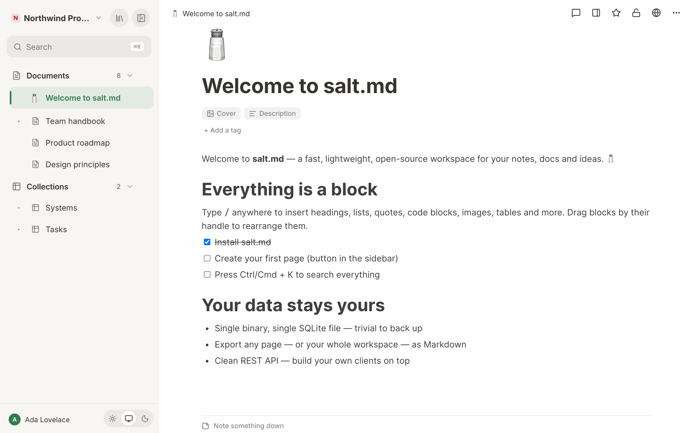
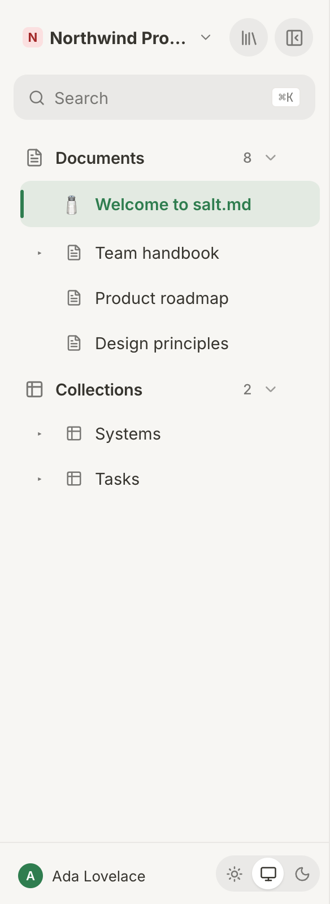

# The interface

This page describes the frame around your content: the sidebar, the document
tabs, the topbar above a page, the account menu, the theme, every keyboard
shortcut, and what changes when the window gets narrow. It does not describe
writing in a page — that is [Pages](pages.md) and
[Editor blocks](editor-blocks.md) — or working inside a collection, which is
[Views](views.md).

## The layout

Left to right, salt.md is up to four columns:

| Column | Width | When it is there |
| --- | --- | --- |
| Sidebar | 292 px, fixed | always on a wide screen; a drawer on a narrow one |
| Notes list | 292 px, fixed | only when **Notes mode** is on and the window is wider than 900 px |
| The page | the rest | always |
| Structure or comments panel | 340 px | when you open one of them |

None of the columns can be dragged wider. The sidebar can be collapsed, the
notes list is a setting, the right-hand panel is a toggle in the topbar.

Most of the time two of the four are on screen — the sidebar and the page:

Inside the page column: a tab strip (only from two open tabs), then the topbar,
then the page itself. Everything below the topbar scrolls as one — the cover
image, the icon, the title, the tags and the content leave the screen together.
Only the topbar stays.

## The sidebar

### The workspace switcher

Top left: the workspace picture, its name, and a chevron. The picture is the
uploaded logo if there is one, otherwise the workspace's icon, otherwise the
first letter of the name on a colour derived from that name.

The menu lists every workspace you are in. The current one carries a tick.
Two labels can appear beside a name: **own space** for a personal workspace, and
**open to all** for one that every new account joins automatically. Below the
separator:

- **Workspace settings** — only for an admin of that workspace
- **New workspace** — opens the blueprint shelf, if the instance lets you create
  one
- **With nobody in charge…** — only for the instance owner; lists workspaces
  nobody can look after any more

The sidebar shows the pages of the **selected workspace only**, and the choice is
remembered in this browser. The tags, the tree, the templates, the trash and
their counts are all scoped the same way. **Favourites are the exception**: that
list is built from your starred pages across every workspace, so a favourite
filed elsewhere still shows up here. See [Workspaces](workspaces.md).

### Workspace settings

One dialog holding everything about the current workspace. Settings you can read
at a glance sit in it directly; the four bigger screens are rows that open a
dialog of their own.

| Group | What is in it |
| --- | --- |
| General | **Name** (opens a rename prompt), **Picture** — an emoji from the picker or an uploaded logo; setting one clears the other |
| Access | **Members** (who is in, and in which role), **What agents may do here**, **Open to every new user**, and for the instance owner **Emergency access log** |
| Layout | **How the sidebar is arranged** — see the two shapes below |
| Conventions | **Workspace rules** — the row says so when a proposal is waiting for review |
| Data | **Files**, **Export workspace**, **Export as Markdown**, **Import workspace…**, **Delete workspace** |

**What agents may do here** has three settings: *Anything they were granted*,
*Only signed-in connections* (a permanent token is refused, even one naming this
workspace) and *No agents at all*. See [Agent access](agent-access.md).

**Delete workspace** takes every page in it along, so it asks you to type the
workspace name rather than clicking Yes. See [Workspaces](workspaces.md) and
[Permissions](permissions.md).

### Library and collapse

Two round buttons top right:

- **Library — every page** opens the full-screen library over the page. It has
  its own tab strip — **Recently used**, **Favorites**, **Shared**, **Private**,
  **All pages**, **Graph** and **Tree · agent view** — with a workspace picker, a
  filter box and a sort menu. See [Library](library.md).
- **Collapse the sidebar** slides it away. On a desktop it does not disappear:
  move the pointer to the left edge of the window and it slides back in as an
  overlay, and the same button is now **Pin the sidebar**, which puts it back for
  good. Right after you click collapse the reveal is locked until the pointer has
  actually moved away, so the click does not look as if it did nothing.

The collapse button is not shown on a narrow screen — there the sidebar is a
drawer instead.

### Search

A single row under the header, labelled **Search**, with `⌘K` on the right.
Pressing that shortcut opens the same dialog. It shows your recently opened
pages under **Recently opened** until you type. See [Search](search.md).

### Sections

Everything below is a collapsible section: an icon, a label, a count, a chevron,
and often a **+**. **Trash is built differently** — icon, label and count, no
chevron — and it scrolls inside its own 180 px.

Whether a section is open is remembered per section, in this browser. Trash is
the exception again: it starts closed every time.

| Section | Shown when | The + does |
| --- | --- | --- |
| **Favourites** | you have starred at least one page | — |
| **Tags** | the workspace has at least one tag | — |
| **Documents** (or **Pages**) | unless Notes mode is on or a tag filter is active | **New page** |
| **Collections** | the workspace uses two sections, and no tag filter is active | **New collection** |
| **Templates** | the workspace has at least one | **New page from a template** — opens the gallery |
| **Trash** | something is in it | — |

**Favourites** is a flat list; the ★ on a row removes it again.

**Tags** is a cloud of chips, each with its count, ordered by count and then
alphabetically. The section's own count is how many distinct tags there are, not
how many pages carry them; a chip's tooltip reads "*n* pages". Tags differing
only in case are one chip.

**Documents and Collections, or one tree.** A workspace decides this for itself
under *Workspace settings → Layout → How the sidebar is arranged*:

- *Documents and collections apart* (the default) gives two sections. A
  collection filed under a document is shown in **Collections**, not under its
  document.
- *One tree, filed where you put it* gives a single section, called **Pages**,
  which holds documents and collections wherever you filed them.

**The two shapes do not report the same number.** Collections counts every
collection in the workspace, wherever it is filed. Documents counts pages whose
ancestry never passes through a collection — and in one-tree mode the same count
is called Pages and includes collections, so it is the larger number. Templates
are left out of that count in both shapes, although a template page is still
drawn in the tree, so a workspace with three templates shows a count three lower
than the rows under it.

**Templates** starts closed. A row's **+** creates a new page from that template;
its **⋯** offers *Remove template flag* and *Move to trash*. See
[Templates](templates.md).

**Trash** lists only the top of each thrown-away branch and gives each entry
*Restore* and *Delete forever*. Deleting forever asks first: "Delete this page
and all its sub-pages forever?". See
[Trash and recovery](trash-and-recovery.md).

When a section has nothing in it the body says so: **No pages yet** under
Documents, **No collection yet** under Collections.

### Filtering by tag

Clicking a tag chip does not narrow the tree — it **replaces** it. Documents and
Collections both disappear and a flat list of every page in the workspace
carrying that tag takes their place, collections included, no matter how deep
they are filed. A banner above it shows the tag and a **Clear filter ×** button.
With no matches the list says **No pages.**

Those rows are for going somewhere and nothing else: they carry no **+** and no
**⋯**. Templates and Trash stay where they are below the filter.

### A row in the tree

Each row is a chevron, an icon and a title. What you can do with it:

| Gesture | Result |
| --- | --- |
| Click | opens the page in the tab you are in |
| ⌘-click / Ctrl-click | opens it in a new tab |
| Middle-click | opens it in a new tab |
| Right-click | opens the same menu the **⋯** shows |
| Click the chevron | folds the row open or shut |
| Drag | moves the page |

Hovering a row reveals two buttons: **+** (*Add inside*) and **⋯** (*More*). On
a touch device they are always visible, because there is no hovering.

The **+** asks what to add: **Page** or **Collection**. The section headers keep
a direct **+** instead, because there the section already answers the question.

The **⋯** menu, in order:

| Entry | Note |
| --- | --- |
| **Open in new tab** | |
| **Add to favorites** / **Remove from favorites** | |
| **Duplicate** | |
| **New collection inside** | |
| **Move to top level** | only when the page has a parent |
| **Move to workspace** → one entry per other workspace | only with more than one workspace; takes the whole subtree along and files it at the top level there |
| **Files in this subtree** | every upload on this page and everything under it — see [Files](files.md) |
| **Save as template** | takes a *copy* as the template; this page stays a normal page |
| **Export Markdown** | |
| **Move to trash** | |

### Collections in the tree

A collection has a chevron even though its rows are not part of the page tree.
Unfolding it loads the first 50 rows and lists them. A row that carries
sub-pages gets a chevron of its own and unfolds them, so a dossier under a deal
is reachable from the sidebar four levels down. Rows carry the same **+** and
**⋯** as any other row, and a right-click opens the same menu.

**Rows cannot be dragged, and nothing can be dropped on them.** Only tree items
carry the drag handlers, so the gesture below does not exist inside an unfolded
collection — use *Move to workspace* or the row's own page to move it.

A collection nested inside another collection is not one of its rows — it is
drawn as a full tree item, with the whole menu, so it can be moved back out.

While the rows load the list says **Loading…**; an empty collection says
**No entries**.

### Moving pages by dragging

Drag a row onto another one. Where you release decides:

- the top 30 % → **before** that page
- the bottom 30 % → **after** it
- the middle 40 % → **inside** it, and the target unfolds

A page cannot be dropped on itself or on anything below it. Drops are live for
everyone: the tree reloads from the server's change feed, so a page an agent
moves appears in your sidebar without a reload.

### The footer

Your avatar and name, and beside them the theme switch.

## The account menu

Clicking your name opens it. It closes again when you click anywhere outside it,
and opening any of its dialogs closes whatever else was open.

| Entry | What it opens |
| --- | --- |
| **Agents & MCP** | connecting an agent — see [Agents](agents.md) |
| **Profile** | see below |
| **API tokens** | see [Agent access](agent-access.md) |
| **Activity log** | see [History and audit](history-and-audit.md) |
| **Subscribe to calendar** | see [Automation](automation.md) |
| **Two-factor (2FA)** | see [Account](account.md) |
| **Language and time** | see [Language and time](language-and-time.md) |
| **Notes mode** | toggle, with a dot showing its state |
| **Salt fonts** | toggle, with a dot showing its state |
| **Manage users** | instance admins only — see [Administration](administration.md) |
| **Instance settings** | instance admins only |
| **Sign out** | |

### Profile

Your picture, name, email, colour and password in one dialog.

- **Upload picture** takes any image; once there is one, **Remove picture**
  appears beside it. Without a picture the circle shows your initial on your
  colour.
- **Colour** is a fixed palette of ten swatches — the same ten the server hands
  out when an account is created. It is the colour you appear in beside a
  comment and in the presence dots.
- **New password (blank = unchanged)**, at least 8 characters, with a
  confirmation field that only appears once you start typing one.
- **Changing the email or the password asks for your current password.** The
  field appears as soon as either changes and Save stays disabled until it is
  filled in — a session left open must not be enough to take over the account.
- **Two-factor authentication** is a row with a **Manage** button that opens the
  2FA dialog in place of this one.

Changing your password signs your other sessions out and says so.

## The tabs

Open pages are chips across the top of the page column. The strip appears from
the second tab — one document needs no tab bar.

- **Clicking a page anywhere does not add a tab.** It navigates the tab you are
  in, the way a browser tab does. Use ⌘-click, middle-click or *Open in new tab*
  to add one.
- A new tab opens directly after the active one and is focused.
- **✕** closes a tab, and so does a **middle-click** on it.
- Closing the active tab activates the neighbour that slides into its place.
  Closing the last one does not leave you on an empty screen; a page is picked
  for you.
- Back and forward restore the exact set of tabs that entry had, not just the
  address.
- Switching workspace leaves the tabs alone. A tab can go on showing a page from
  a workspace the sidebar is no longer displaying.
- The set of open tabs is remembered in this browser. A tab whose page was
  trashed or deleted elsewhere drops out on its own, within a moment of the
  change arriving, so no ghost tabs pile up.

## The topbar

Above every page: a breadcrumb from the top of the tree down to where you are,
each part clickable, and a row of icons on the right.

Left of the breadcrumb, a hamburger appears in exactly two situations: on a
narrow screen, and on a desktop where you collapsed the sidebar. It opens the
sidebar again.

The icons, left to right:

| Icon | Tooltip | What it is |
| --- | --- | --- |
| an agent's mark | its name, the account it signed in through, its note, how long it has been here, and either **active just now** or when it was last heard from | which agent says it is working on this page. The note stands beside the name only while one agent is here; with two it is in the tooltip alone |
| coloured dots | **Also here: …** | up to three people editing right now, then **+n** |
| speech bubble | **Show comments** / **Hide comments** | opens the comment panel; carries the number of open comments. Not shown on a collection — its *rows* carry comments, not the collection itself |
| panel | **Show structure** / **Hide structure** | the structure panel — see below |
| star | **Add to favorites** / **Remove from favorites** | |
| padlock | **Private (only you) — click to share with the workspace** / **Visible to the workspace — click to make it private** | see [Permissions](permissions.md) |
| globe | **Share to web (read-only link)** | see below |
| **⋯** | **More** | everything below |

If an agent said how long it expected to be, the tooltip ends with **checked in
for about …**. See [Agents](agents.md).

### The structure panel

Four things, top to bottom:

1. **Where this page sits** — the chain of parents from the top of the tree
   down, each one clickable, closed by a row reading **This page**. It is left
   out on a top-level page, where it would say nothing.
2. ***Sub-pages*** — the whole subtree, not just its first level, indented.
   Empty: **No sub-pages**. A collection has no such section at all: its rows
   are its sub-pages and they live in the table.
3. ***Files*** — every upload on this page and the pages under it, with its
   size, and the page it hangs off whenever that is not the one you are on.
   Empty: **No files**. See [Files](files.md).
4. ***Linked from*** — the pages that link here. Empty: **Nothing links here**.

Clicking a **PDF** opens it full-screen in a preview with **Download** and
**Close**; Escape closes it too. Every other kind of file opens in a new tab.

The structure panel and the comment panel share the same strip on the right, so
opening one closes the other. Both remember whether they were open, in this
browser, across pages.

### Sharing to the web

The globe opens a small menu: the read-only link in a field that selects itself
when you click it, **Expires:** with **Never**, **In 1 day**, **In 7 days** or
**In 30 days**, an optional **Password (optional)** field, and two buttons —
**Copy** and **Stop sharing**. See [Sharing](sharing.md).

### The ⋯ menu

It holds: *Add a description* (or *Remove description*), *To the comments*,
*Version history*, *Import (.md / .zip)*, an **Export** group with
*Markdown (.md)*, *Web page (.html)* and *Print / as PDF*, and *Move to trash*.
On a narrow screen it also holds the three icons that stepped aside — comments,
*Make it private* / *Make it visible to the workspace*, and share to web.

**With the viewer role in a workspace the menu is shorter.** Everything that
changes the page is dropped: *Add a description*, *Remove description*,
*Import (.md / .zip)* and *Move to trash*. What is left is *To the comments*,
*Version history* and the Export group. See [Permissions](permissions.md).

## Theme and typeface

The theme switch has three states, not two:

| Option | Behaviour |
| --- | --- |
| **Light** | always light |
| **Automatic — follows the system** | follows your operating system, and changes the moment it does |
| **Dark** | always dark |

Automatic is the default for a new browser. A choice you made before this
existed is kept. The setting lives in the browser, not in your account, so each
device can differ — and it is also offered on the sign-in screen, in the top
right corner, so arriving at a login page at night does not mean a screen of
white.

**Salt fonts** in the account menu switches between the bundled typefaces (Inter
for text, JetBrains Mono for code and labels) and your system font. Bundled is
the default; the font files are only fetched once they are used.

Printing the browser window ignores the theme: it is always a light, chrome-free
document — no sidebar, no topbar, no tabs, no panels. **The *Print / as PDF*
entry only takes that route for a collection.** On a document it opens a
standalone print view in a new tab instead, which is what makes the entry work
on a phone, where a browser's own print command does nothing. See
[Import and export](import-export.md).

## Notes mode

A third column between the sidebar and the page: documents in the workspace as
cards with a snippet, a thumbnail, when the page changed and its first two tags,
**most recently changed first**. It is not quite every document — templates are left out, and so
are pages filed directly under a collection. Collections and their rows are not
in it either.

The head carries the word **Notes**, a count and a pen button (**New note
(⌥N)**). Below it, **All** and **Untagged**; pick a tag chip in the sidebar and
those two are replaced by the tag itself with an × to clear it. An empty list
says **No notes yet — write the first one.**, **Everything is tagged. 🎉** or
**No notes tagged #…** depending on why it is empty.

Turn it on in the account menu. It is off by default. Two things change while it
is on: the sidebar drops its document tree (the middle column is the document
list now), and the tag chips filter that list instead of the tree.

The column is there when the window is wider than 900 px. At 900 px and below it
is gone and the sidebar takes its tree back — except at exactly 900 px, where
both switches fire at once and neither list is shown; one pixel either way
brings navigation back.

## Keyboard and pointer

| Keys | Does |
| --- | --- |
| `⌘K` / `Ctrl+K` | opens the search dialog — pressing it again closes it |
| `⌥N` / `Alt+N` | a new page at the top level of the current workspace |
| `Ctrl+Alt+←` / `Ctrl+Alt+→` | previous / next tab, wrapping around. Ignored while you are typing, and needs at least two tabs. `⌘` is deliberately not part of it: that combination belongs to the browser |
| `↑` `↓` `Enter` | in the search dialog, once you have typed: move through the results, open the selected one. The recently-opened list is click-only |
| `Escape` | closes the search dialog, any open menu, an image opened full-screen, a file preview, the icon picker, and a confirmation |
| `Enter` | confirms a dialog that asks for a single line of text |
| `Enter` in the tag field of a page | commits the tag — and so do `,` and `Tab`. `↑` `↓` move through the suggestions, `Escape` closes them, and `Backspace` in an empty field removes the last tag |
| `⌘Enter` / `Ctrl+Enter` | posts a comment |
| `Enter` in a page's raw trail | posts the note; `Shift+Enter` makes a new line. See [Comments and notes](comments-and-notes.md) |
| `Enter` in a page title | jumps into the body instead of breaking the title over two lines |
| ⌘-click, Ctrl-click or middle-click | opens a page in a new tab |
| middle-click on a tab | closes it |
| right-click | opens the ⋯ menu of a sidebar row, a collection row in the sidebar, or a board card |

The shortcut badge beside **Search** reads `⌘K` on every platform; `Ctrl+K`
works just as well.

## What happens on a narrow screen

| Width | What changes |
| --- | --- |
| 1200 px and below | an agent's note beside its name is dropped — it is in the tooltip |
| 900 px and below | the notes list is gone; whichever right-hand panel is open floats over the text instead of pushing it aside. The structure panel narrows to 280 px, the comment panel takes the full width |
| 768 px and below | the sidebar becomes a drawer over the page with a dark backdrop; the hamburger in the topbar opens it, the backdrop closes it, and picking a page closes it. Every input grows to 16 px so tapping a field does not zoom the page on iOS |
| 640 px and below | the topbar keeps the structure toggle, the star and **⋯**; comments, private/visible and share to web move into that menu |

The drawer has no close button of its own. Below 768 px the collapse button in
the sidebar header is hidden, so the backdrop and picking a page are the two
ways out.

On a device without a mouse, everything that is normally revealed on hover is
permanently visible — the row buttons, the tab's ✕, the section **+**, the cover
buttons — and the hit areas grow: a tree row is at least 44 px tall, a tag chip
32 px. Decorative hover effects are switched off, because with no pointer to
leave the element they stay stuck after a tap and look like a fault.

If you have asked your system to reduce motion, every transition and animation
is effectively switched off.

## Messages and overlays

**Toasts** appear centred at the bottom of the window and disappear after four
seconds. They are announced to screen readers. They carry both failures and
confirmations — "Workspace renamed" arrives the same way a failed save does, and
every one of them is drawn in the warning colour with a ⚠ in front of it.

Toasts are not the only way the app reports a problem. Dialogs and the sign-in
screen show their errors inline, in the dialog itself. A page that will not load
replaces the document with its own screen — "This page could not be loaded."
and a **Back to workspace** button.

**The upload bar** is a three-pixel line across the top of the window while a
file is uploading.

**Images** in a page open full-screen on a click. Click the dark area around the
picture, or press Escape, to close it — clicking the picture itself does
nothing, so a mis-aimed click does not shut the view. Images narrower than 80 px
never open at all, and neither do avatars, cover images, bookmark previews,
pictures inside a button, and anything inside the editor or inside a link.

**One dialog at a time.** Opening any dialog closes whatever else was open and
closes the mobile drawer. Confirmations are the exception: they layer on top, so
"are you sure" can appear over the dialog that asked.

**A file dropped anywhere other than a page** is swallowed on purpose. Without
that, the browser's own behaviour would replace the whole application with the
dropped file and lose what you had open. See [Files](files.md).

Two full-screen messages you may meet:

- **Cannot reach the server** — "salt.md could not load your workspace", with a
  **Retry** button. See [Troubleshooting](troubleshooting.md).
- **No pages yet** — the first-run state, with **New page** and
  **Import (.md / .zip)**. If your account is in no workspace at all it says
  **No workspace** instead, and offers to create one if the instance allows it.

After the server is updated under you, a message says **A new version is
available — reload the page**. It comes both from the first request after load
and from the live change feed, so an open tab learns about a deploy without
being touched.

## What this browser remembers

These are stored per browser, not on your account. A second device starts with
the defaults.

| Remembered | |
| --- | --- |
| the selected workspace | |
| the open tabs, and the last eight pages you opened | |
| whether the sidebar is collapsed | |
| which sidebar sections are open — Favourites, Tags, Documents, Collections and Templates. **Trash is not**: it starts closed every time | |
| whether the structure or comment panel is open | |
| theme, typeface, notes mode | |

Your language, region, time zone, clock and week start are the opposite: they
live on the account, so your phone and your laptop agree. See
[Language and time](language-and-time.md).
