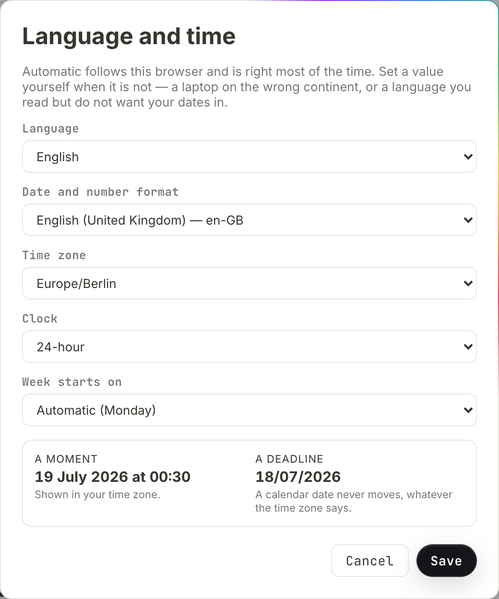

# Language and time

salt.md speaks the language your browser asks for and writes dates the way your
region writes them, without anybody configuring anything. This page is about the
five settings that exist for when that guess is wrong — a laptop your employer
set to the wrong continent, a language you read but do not want your dates in —
and about the one rule that decides how every date on your screen behaves: a
timestamp moves with your time zone, a calendar date never does.

The settings belong to your **account**, not to the browser you happen to be
sitting at. Nobody else can change them, not even an administrator.

## Opening the dialog

1. Click your name and avatar at the bottom of the sidebar.
2. Choose **Language and time**.

The dialog opens with a line saying what it is for: *"Automatic follows this
browser and is right most of the time. Set a value yourself when it is not — a
laptop on the wrong continent, or a language you read but do not want your dates
in."*

Underneath the five dropdowns sits a **preview**: one sample moment and one
sample deadline. Every pick you make shows up there immediately, the language
included — pick Deutsch and the sample moment is spelled in German before
anything is stored. (That last part holds while **Date and number format** is on
Automatic, which is what decides the spelling; a manually chosen format keeps its
own.) The language is the exception in exactly one way: the **interface** around
you keeps its old wording until you press **Save**. While a language change is
pending, a line appears under the picker saying *"The language changes when you
save."*

Press **Cancel**, or click outside the dialog, and nothing is kept — the preview
is undone with it. There is no Esc shortcut on this dialog; opening another
dialog closes it the same way Cancel does.

**Save** stores all five and applies them at once. The interface switches
language on the spot, with no reload.

## The five settings



| Setting | What it decides | Automatic means |
| --- | --- | --- |
| **Language** | the language of the interface | what your browser asks for |
| **Date and number format** | date order, decimal and thousands marks, sorting, month and weekday names | your browser's regional variant of that language |
| **Time zone** | which clock face a timestamp is shown on | your machine's own zone |
| **Clock** | 12-hour or 24-hour times | what the region implies |
| **Week starts on** | the first column of a calendar | what the region implies |

Every one of them is a single dropdown whose first entry is **Automatic**, and
that entry names in brackets what it currently amounts to — **Automatic
(Europe/Berlin)**, **Automatic (24-hour)**, **Automatic (Monday)**. On an account
that has not set that value by hand, the bracketed name is exactly what automatic
resolves to. A setting whose automatic value is invisible is one people switch to
manual merely to find out what it was.

### Language

Two languages ship today: **English** and **Deutsch**. English is the source
language of the product, so English is never a translation and never has gaps.

Automatic walks your browser's list of preferred languages and takes the first
one salt.md has a catalogue for; if there is none, English. That is why a German
browser gets a German interface on the very first visit, with nobody having
chosen anything.

The language changes the interface — menus, buttons, dialogs, dates spelled in
words. It does not change anything you or your colleagues wrote. See
[what the settings do not reach](#what-the-settings-do-not-reach) for the few
things that stay English on purpose.

It is also announced to the browser itself, which is what makes spell-check use
the right dictionary and hyphenation break words the right way. The same
announcement carries the writing direction, so a right-to-left language would lay
the page out right to left rather than needing a separate switch.

### Date and number format

A short, curated list of eighteen regional tags rather than every tag the browser
knows, because the problem being solved is "my laptop says en-US but I write
dates the European way", and a thousand-entry dropdown does not help anybody do
that. Each entry reads as a name and its tag — **German (Germany) — de-DE**,
**English (Ireland) — en-IE** — spelled in whatever language you are reading.

The list covers `de-DE`, `de-AT`, `de-CH`, `en-GB`, `en-US`, `en-IE`, `en-AU`,
`en-CA`, `fr-FR`, `fr-CH`, `it-IT`, `es-ES`, `nl-NL`, `pl-PL`, `pt-BR`, `sv-SE`,
`da-DK` and `cs-CZ`.

This is deliberately a **separate** setting from the language. salt.md ships one
catalogue per language, not per country — writing British and American copies of
the same sentences would be maintenance for nothing — but dates and numbers
really are regional. A bare "English" means American to a browser, so an
English-reading user in Dublin or Sydney would get 07/18/2026 instead of
18/07/2026, and an Austrian groups thousands differently from a German. Left on
automatic, salt.md formats with whichever regional variant of your language your
browser already asked for: your operating system settled that question long ago
and got it right.

What this setting reaches is wider than dates:

- **Numbers in [rollups and formulas](relations-and-rollups.md)** — the decimal
  mark and the thousands grouping. A plain number property is **not** reformatted:
  it shows the value the way it was typed, so 1234.5 stays 1234.5 on a German
  account.
- **File sizes** — "1.5 MB" or "1,5 MB". The unit itself is never translated.
- **Sorting.** Text columns sort the way the chosen language sorts, not by
  character code. German files Ä with A, Swedish files it at the end, and Czech
  treats Ch as a letter of its own. Sorting also ignores case and orders embedded
  numbers as numbers, so "page 2" comes before "page 10".
- **Month and weekday names**, and phrases such as "yesterday" or "5 minutes
  ago". These come from the format setting, not from the language — so an English
  interface set to `de-DE` will spell its months in German.

Those relative phrases, which is what you read beside a comment or in the notes
list, follow a fixed scale: under 45 seconds it says "now", then minutes, then
hours, then days up to a week. Past a week it stops being relative and shows the
day and month instead — with the year added as soon as the date is not in the
current year, because "18 Jul" on its own could be any of several.

**Beyond the eighteen.** The dropdown offers eighteen; the server accepts
anything shaped like a regional tag, so a value such as `en-NZ` can be stored by
a script signed in as you and will be used for formatting. The dialog has no
entry for a tag outside its list and cannot display one — picking any entry
replaces it.

### Time zone

Every zone your browser knows, listed by IANA name (`Europe/Vienna`,
`America/Los_Angeles`). On a browser too old to offer the list, the dropdown
holds **Automatic** alone; that is correct behaviour, not a broken list.

The zone changes **timestamps only** — see the next section, which is the whole
point of this page.

If a stored zone is one your browser cannot use, timestamps fall back to your
machine's own zone rather than disappearing. salt.md's server checks the shape of
a zone name but not its existence: the server binary carries no time-zone
database at all, so the browser is the authority on which zones are real.

### Clock

**24-hour** or **12-hour**, overriding whatever the region would have chosen.
An English-speaking user who wants 14:30 and a German-speaking one who wants
2:30 pm are both catered for, independently of everything else.

### Week starts on

**Monday**, **Sunday** or **Saturday** — Monday across most of Europe, Sunday in
the US and Japan, Saturday across much of the Arab world. It moves the
[calendar view](views.md) grid and its column headings together, so the month is
never shifted by a day. It is the calendar alone: a timeline has one column per
day and no weekday headings, so there is nothing there for this setting to move.

## A moment moves. A day does not.

This is the rule worth understanding, because getting it wrong is how a contract
expires a day early.

salt.md keeps two different things that both look like dates:

**A moment** is an instant on the world clock: when a page was last edited, when
a comment was written, when a file was uploaded, when a revision was saved. It is
stored in UTC and shown on your clock. Two people in Berlin and Tokyo see
different times for the same edit, and that is correct.

**A day** is a calendar date with no time zone attached: the value of a
[date property](properties.md#date), a deadline, an entry in a calendar or
timeline view. A deadline on the 18th is the 18th in Auckland and the 18th in Los
Angeles. Converting it would move it.

The dialog shows both, side by side, so you can watch the difference as you
change the zone:

| Preview | Note under it |
| --- | --- |
| **A moment** | *Shown in your time zone.* |
| **A deadline** | *A calendar date never moves, whatever the time zone says.* |

Both samples are the same date — 18 July 2026, at 22:30 UTC for the moment. Set
your zone an hour and a half or more ahead of UTC — continental Europe in summer,
all of Asia — and the moment tips over into the 19th while the deadline stays on
the 18th. An hour ahead is not enough: that reads 23:30, still the 18th. Set it
to Honolulu and the moment falls back to the 18th at midday; the deadline still
says the 18th.

**A day can carry a time, and that changes nothing.** The date field in the
interface writes a bare day, but a value written over the API or by an agent may
be a day plus a time, `2026-07-18T14:30`. It is then shown as the day and the
time — and it is still never converted. 14:30 is 14:30 for every reader, in
every zone.

**There is one deliberate exception, and it has a direction.** "What day is it
now" is a question about an instant, so it follows your zone — and exactly one
thing asks that question: the urgency colour on a due date. A date is red once
its day has passed and amber while it is today or tomorrow, both measured against
today in *your* zone; beyond tomorrow it is plain text. You see the colour
wherever a date is displayed rather than edited — on board and gallery cards, and
on the properties of a page you can only read. In a table or a list the cell is
an editable date field and carries no colour.

The setting decides which day *now* falls on for that colouring. It never touches
a day that is already stored. And it does not reach the other place you see
"today" either: the highlighted cell in a calendar view and the today mark on a
timeline come from the machine's own date, so somebody whose zone setting is far
from their machine's can see a date coloured overdue while the calendar still
highlights the day before.

This behaviour is pinned by automated checks that run the formatting code on six
machine time zones and, on each of them, with the time-zone setting pushed to the
furthest east and the furthest west there are. Breaking it would shift every
deadline by a day for everybody west of Greenwich, which is exactly the kind of
bug nobody notices in the office where it was written.

One small asymmetry to expect: when you *edit* a date property, the little date
picker is your browser's own control, so its layout follows your operating
system. The value you read afterwards is rendered by salt.md and follows the
format setting.

## Automatic is a real state

Automatic is not a label on top of a hidden default — it is the absence of a
decision, stored as an empty value. There is no third state, no "auto" keyword,
and no difference between an account that has never opened this dialog and one
that has set every field back to Automatic. You can return any single setting to
Automatic at any time without touching the others.

If you submit a value salt.md cannot use — a malformed zone name, a clock that is
neither 12 nor 24 — that one field is stored as automatic and the others are
kept. The dialog then shows what was actually stored rather than what was asked
for, so you are never left believing a setting took that did not.

## Where the settings live

**On your account, on the server.** That is the point: your phone and your laptop
show the same language and the same clock, and a new browser needs no setup.

Your browser does keep a copy, for two reasons only. It means the first frame
after a reload is already in the right language instead of flashing English, and
it means the sign-in screen comes up the way you last had it — before sign-in
there is no account to ask. The copy is never the source of truth; the moment you
sign in, the account's settings win. If you had chosen a language in an early
version of salt.md, that choice is carried over rather than reset.

**Nobody can change them for you.** They are written through an endpoint of their
own, `/api/me/prefs`, which identifies the account by the signed-in session and
takes no user id at all — so there is no "whose" to get wrong. An administrator
editing your account cannot reach them. Neither can an
[API token](agents.md): the endpoint refuses tokens outright. A token is a key to
content, and setting somebody's clock format is not administration, it is
reaching into how their screen looks.

There is also **no instance-wide language.** Every account decides for itself, and
a new account starts on automatic.

## What the settings do not reach

- **Email that salt.md sends is English.** An invitation goes to somebody who has
  no account yet, so the server has no way of knowing what language they read.
  See [Mail](mail.md).
- **A page you share publicly is English for everyone.** The password prompt, the
  "Not found" page for a dead link and the print bar of an exported page are
  built by the server as plain HTML with no translation layer, and they do not
  know who is reading. A shared collection prints its values raw as well —
  `2026-07-18`, and numbers with a dot. See [Sharing](sharing.md).
- **The calendar feed you subscribe to** carries dates as dates: a date property
  with no time becomes an all-day entry, which your calendar app then displays in
  its own way. A date that carries a time becomes a timed entry with no zone
  attached, so the calendar app reads 14:30 as 14:30 wherever it is. Your salt.md
  zone setting has no effect on the feed.
- **[Search](search.md) folds and stems the same way for everybody.** Umlauts and
  accents are folded before indexing, and a handful of German endings are trimmed
  to make compound words findable. That is a property of the index, not of your
  language setting — it applies whichever language you read in.
- **Dates in an [imported](import-export.md) spreadsheet** are read by a fixed
  list of written forms, not by your region: `18.07.2026` is read day-first,
  `07/18/2026` month-first, and any time in the column is dropped. Numbers are
  read with a comma as a decimal mark, so a value already grouped as `1,234.5`
  cannot be read and the cell is left empty.
- **Agents and scripts** read and write raw values — `2026-07-18` for a calendar
  date, UTC for a timestamp. Formatting is a reading concern, so nothing an agent
  writes depends on who is looking. See [Agents](agents.md).
- **Anything you typed.** Translation covers the interface, never your content.

## Adding a language

A language is one JSON file in the source tree plus one line in the language
list, and there is a script that does the tedious part. This is work in the
source: catalogues are compiled into the frontend, so a new language means
rebuilding salt.md, not dropping a file onto a running server. See
[Self-hosting](self-hosting.md).

From the `web` directory:

```
node scripts/translate.mjs --list        # which languages exist, how complete
node scripts/translate.mjs fr --dry      # print what is missing, write nothing
node scripts/translate.mjs fr            # write or extend src/locales/fr.json
```

`--list` prints, per language, how many of the strings in use it has and — the
number that actually tells you what is left to do — how many of its entries were
written by machine and have never been read by a person.

What makes this safe to run whenever you like:

- **Only missing keys are touched.** A line a native speaker corrected by hand is
  never overwritten, so topping a language up does not undo review work.
- **Machine-written entries are recorded** in a companion file, so it stays
  answerable which lines nobody has read yet. Correct an entry, remove its key
  from that list, and it counts as human from then on.
- **Plural forms are asked for, not assumed.** The script works out which plural
  categories the target language actually distinguishes — Polish needs three,
  Arabic six — and requests one form for each.
- **No API key needed.** Without one the script writes nothing and prints the
  missing strings as JSON together with a ready-made instruction block, which you
  can hand to a translator or paste into any chat tool. Somebody contributing
  Portuguese should not need an account anywhere.

One step is not automatic: add the new code to the language list in
`src/i18n.ts` so it appears in the picker. The script says so after it has
written a catalogue itself — on the no-key path it never gets that far, so check
it yourself.

Two properties of the translation system are worth knowing before you start. The
**English source text is the key** — `t('Manage users')`, not `users.manage` — so
a string with no translation yet falls through as correct English rather than as
a broken identifier, and a partial catalogue is immediately usable. The cost is
the mirror image: editing an English sentence orphans its translation. The build
refuses a catalogue that has drifted — an entry nobody asks for any more, or a
string with no entry — so the drift is loud rather than silent, and a language
being worked on is finished before it ships.

## Related

- [Your account](account.md) — sign-in, two-factor, tokens, leaving
- [Properties](properties.md#date) — how a date property behaves
- [Views](views.md) — the calendar view, which reads the week-start setting
- [Comments and notes](comments-and-notes.md) — where relative times appear
- [Troubleshooting](troubleshooting.md)
