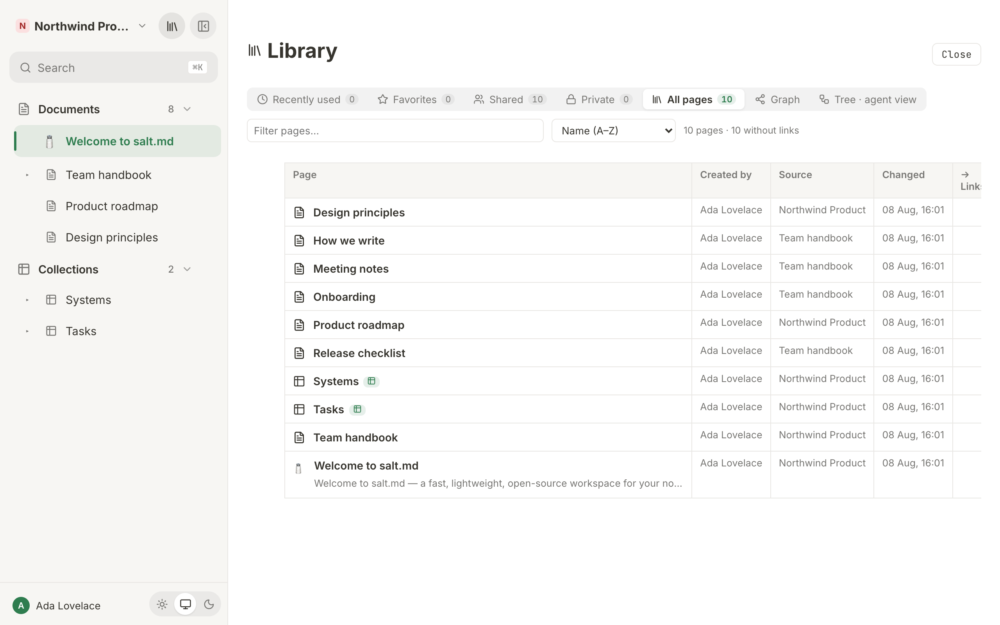
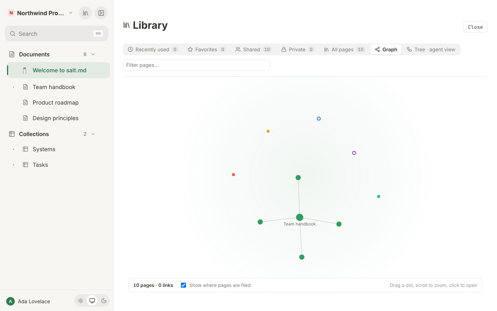

# The library

The library fills the main area with every page of one workspace — a shelf you
browse rather than a list you read. It answers "where is that thing" when the
sidebar is too narrow and search is too precise: what you had open lately, what
you starred, what the rest of the workspace can see, what only you can see, and
two views of the whole structure at once — an indented tree and a graph.

Creating a workspace opens a second shelf — of ready-made workspaces. The
interface does not call that one a library; the
[last section](#making-a-workspace-from-a-ready-made-one) is about it.

## Opening it

Click the book icon in the sidebar header, tooltip **Library — every page**. It
fills the main area, replacing whatever page was open. The sidebar stays where
it is on a desktop; on a phone the drawer closes. Close the library with the
**Close** button at the top right, or by opening any page from it — every
navigation leaves the library.

The library has **no address of its own**. It cannot be bookmarked or linked to,
and the browser's Back button does not close it — it moves the page underneath
instead, leaving the library open on top. Use **Close**.

There is no keyboard shortcut for the library. `⌘K` / `Ctrl+K` opens
[search](search.md), which is the faster route when you already know the title.

## What is on the shelves

The library lists **pages**: documents and collections alike. What it does not
list:

- **Pages in the trash.** They live in [Trash](trash-and-recovery.md).
- **Rows of a collection** — with one exception. A row that carries sub-pages of
  its own appears, because otherwise its sub-pages would have no parent to hang
  off. A bare row does not; a collection can hold tens of thousands of them, and
  they belong in the collection's own [views](views.md).
- **Anything you are not allowed to read.** Private pages belonging to other
  people do not appear, in any tab, including the graph — except to a workspace
  admin, who can read everything in their workspace.

[Templates](templates.md) **do** appear, on every shelf and in the tree. A
template has no home in the sidebar, so the library is usually the only place
you can see the whole set of them; each one shows up as an ordinary page, filed
where it was made. The graph is the single exception — see
[What the graph leaves out](#what-the-graph-leaves-out).

A collection nested inside a document, or inside another collection, is a page
like any other here and is shown with a small table badge, tooltip
**Collection**.

### If you are a workspace admin

A workspace admin may read every page in that workspace, private ones included,
and the library applies that rule everywhere: on the shelves, in the tab counts,
in the tree and in the graph. Two consequences worth knowing:

- Your **Private** shelf is not a list of your own private pages. It is every
  page in the workspace marked private, whoever owns it.
- Your page counts are higher than a member's, and the difference is other
  people's private work.

If you are not an admin, nothing of the sort reaches you: a page whose parent —
or grandparent — is somebody else's private page is left out along with
everything under it. See [Permissions](permissions.md).

## The tabs

Seven tabs sit at the top. Five of them are shelves — the same table, filtered
differently — and two are whole-structure views. Each shelf carries a count, so
you can see how much is behind a tab before clicking it; the Graph and Tree tabs
carry none.

| Tab | What it holds |
| --- | --- |
| **Recently used** | The pages this browser opened last, newest first |
| **Favorites** | Everything you starred |
| **Shared** | Every page the workspace can see |
| **Private** | Every page only its owner can see |
| **All pages** | Everything the two above add up to |
| **Graph** | Every page as a dot, every connection as a line |
| **Tree · agent view** | The indented hierarchy, with page ids and Markdown links |

The library opens on **Recently used**, except in a browser that has never
opened a page — there it opens on **All pages**, so the first thing you see is
not an empty shelf. A shelf with nothing on it reads **No pages.**

### Recently used

At most **eight** pages, and they are remembered **per browser**, not on your
account: your laptop and your phone keep different lists. Clearing site data
clears them. This shelf has its own order — the order you opened them in — and
the first sort option is called **Last opened** here rather than **Name (A–Z)**
for that reason.

### Shared and Private

These two split the shelf by *visibility*, which is a different thing from
[public sharing](sharing.md):

- **Private** means a page its owner and the workspace admins can read, and
  nobody else. In the table's **Source** column such a page shows a padlock and
  the word **Private**.
- **Shared** means visible to the members of its workspace. It says nothing
  about whether the page has a public link.

A page with a public share link still counts as **Shared** or **Private** by its
workspace visibility. See [Permissions](permissions.md) for what each means.

### All pages

Everything, plus one extra number in the status line: after the page count it
adds **{n} without links** — how many of the listed pages have neither an
outgoing @-mention nor an incoming one. Those are the pages nothing points at
and which point at nothing; on a wiki-shaped workspace that number is the
clearest measure of how connected your instance actually is.

## The workspace picker

If you belong to more than one workspace, a dropdown appears between the tabs
and the filter box. It opens on the workspace you are currently working in —
which is what "my pages" means to somebody who has seven — and **All
workspaces** is one pick away. With a single workspace the dropdown is not
shown at all.

The picker filters everything downstream from it at once: the shelves, the
counts on the tabs, the tree and the graph. That is deliberate — it is why a
tab count can never disagree with what is under it. The two link columns are the
exception, and they are described [below](#-links-and--backlinks).

It is **not remembered**. Reopen the library and you are back on your current
workspace. A remembered filter is the one people forget they set and then report
as "half my pages are gone".

## Filtering and sorting

**Filter pages…** is a plain title filter, applied as you type. It is not full
text — it matches the page title only. For content, use [search](search.md).

In the shelves it simply hides non-matching rows. In the tree it behaves like a
tree filter: a page stays visible if it matches *or* any page below it matches,
so a hit deep in a hierarchy keeps its whole chain of parents on screen, and the
matching titles themselves are highlighted.

**On the Graph tab the filter box has no effect.** It stays on screen, and
typing in it changes nothing — the graph is narrowed by the workspace picker
alone.

The sort dropdown offers four orders:

| Option | Orders by |
| --- | --- |
| **Name (A–Z)** (or **Last opened** on the Recently used shelf) | Title, or the order you opened them in |
| **Recently changed** | Last change, newest first |
| **Most backlinks** | How many pages point at this one |
| **Most outgoing links** | How many pages this one points at |

The two link orders fall back to the title when counts are equal. The sort
dropdown is hidden on the Graph and Tree tabs, which have no rows to sort.

What you typed in the filter box and the order you chose **survive a tab
switch** — move from Favorites to All pages and both are still in force. Only
closing the library clears them, and that is also the moment the workspace
picker snaps back to your current workspace.

## The columns

Each shelf is one table with six columns.

### Page

The icon, the title, and — where the page has one — the first line of what is
inside it: the page's description, or failing that a plain-text snippet the
server derives from its content. Below that, up to four of the page's
[tags](pages.md) as coloured chips. If the page has an image in it, its first
image is shown as a thumbnail at the right of the cell. A collection carries the
**Collection** badge next to its title. A page with no title reads **Untitled**.

Clicking anywhere in this cell opens the page.

### Created by

The name of the account that owns the page.

### Source

Where the page comes from, in one of three forms:

1. **Its parent page**, as a button — click it to jump up one level.
2. **Private**, with a padlock, if the page has no parent and only its owner
   (and the workspace admins) can see it.
3. **The workspace name**, if the page sits at the top level and is not private.

### Changed

When the page was last changed, in your own [time zone and
format](language-and-time.md).

### → Links and ← Backlinks

Two counts of @-mentions between pages: outgoing (**→ Links**, tooltip *Outgoing
@-links*) and incoming (**← Backlinks**, tooltip *Incoming links (backlinks)*).
An empty cell means zero. These count only real page mentions typed into page
bodies — not [relations](relations-and-rollups.md) between collection rows, and
not the parent/child hierarchy.

Two things about these numbers that the rest of the library does not do:

- **They ignore the workspace picker.** They are counted over every page you can
  read, in all of your workspaces. So a page can show three outgoing links while
  the graph beside it draws one, because the other two point somewhere the
  picker is hiding.
- **They are fetched once, when the library opens.** Add a mention in another
  browser tab and this column does not notice. Close the library and open it
  again to recount.

## Tree · agent view

This tab shows the real hierarchy — every live page of the chosen workspace
under its actual parent, templates included — indented, with two things the
sidebar does not give you:

- the **first eight characters of the page id**, in small grey type. Hover the
  row and its tooltip shows the id in full: this is the only place in the
  interface where you can read a whole page id off the screen.
- an **md** button on every row, tooltip **Copy Markdown link**. It copies your
  instance's address followed by `/api/export/{id}` to the clipboard and
  confirms with *Markdown link copied*. Opening that URL downloads the page as
  Markdown — a collection comes out as a Markdown table of its rows. The link
  needs a signed-in browser or an [API token](api.md); it is not a public link.

The md button only appears when you hover a row on a desktop. On a touch screen
it is always visible. Clicking anywhere else on a row opens that page and leaves
the library.

The tab is named for what it is useful for: it is close to how an agent sees
your instance over MCP, where `list` with `kind: "pages"` returns the same
hierarchy as indented text. (The note above the tree still calls that tool
`list_pages`, which was its name before the MCP catalogue was consolidated.) The
two are not identical — the MCP answer also includes collection rows, which this
tab drops. Templates appear in both. See [Agents](agents.md) and
[MCP tools](mcp-tools.md).

A page whose parent is not in the list — because the picker is showing one
workspace and the parent is elsewhere — is drawn at the top level rather than
dropped.

Nothing on this tab writes anything. It is read-only throughout.

## Graph

The graph draws every page the workspace picker lets through as dots on a canvas
and lets a force simulation settle them into shape. It runs entirely in your
browser; nothing is sent anywhere while you drag it around. It cools to a
near-stop after a few seconds rather than jittering forever, and never quite
freezes.

At the bottom sits a bar with the counts (**{n} pages · {n} links**), one
checkbox and a reminder: **Drag a dot, scroll to zoom, click to open**.

### What a dot is

One dot is one page.

- **Filled** = a document. **A ring** = a collection — the same distinction the
  sidebar makes, so the picture needs no legend.
- **Size** is how connected the page is: the more lines meet at a dot, the
  bigger it is. It grows with the square root of the count, so one page with
  fifty children does not swamp the picture.
- A page with **two or more connections** carries its title permanently.
  Everything else shows its title when you point at it. Titles longer than 26
  characters are cut short. Zoom out far enough and all the titles disappear —
  otherwise the screen is a wall of text with a graph behind it.

### The two kinds of line

This is the part worth reading, because keeping them apart is what makes the
graph tell you anything.

| Line | Means | Drawn |
| --- | --- | --- |
| **Filed under** | The page's parent — where it sits in the tree | Thin, grey, quiet |
| **Mention** | An @-link from one page's body to another | Bright, in the colour of the page it comes *from* |

The filing lines are the thing the sidebar already tells you, so they are drawn
to stay out of the way. The checkbox **Show where pages are filed** — which
starts **on** — turns them off entirely, both from the drawing and from the
simulation, so the graph re-settles into a shape built only from mentions.

What it does *not* change is how big the dots are, which titles stay on screen,
and which neighbours light up when you point at one. All three are worked out
once from every connection, filing included, so a well-filed page keeps its size
after its lines are gone.

The mention lines are what a graph is for: the connection nobody filed anywhere,
which no tree can show. Giving each one the colour of its source page means a
line leaving one cluster for another is visibly a crossing.

Only mentions are counted in the bar's link number. Filing lines are not.

A mention is drawn **only when both of its pages are in the picture**. Narrow
the workspace picker to one workspace and every mention that crosses into
another one disappears from the graph — silently, because the page at the far
end is not there to draw a line to. The **All workspaces** setting is the way to
see those.

### How the colours are chosen

By **root** — the top-level page a dot ultimately hangs off — not by workspace.

Colouring by workspace would be useless in the common case: most people keep
everything in one, and the whole picture would come out a single shade. By root,
every project, area or customer file gets its own colour inside one workspace.

There are ten colours and they cycle. They are handed out **largest family
first**, so the house green lands on whatever your instance is mostly about
rather than on whichever page happened to be created first.

When a page's parent is not in the picture — most often because the parent is a
[template](templates.md), which the graph does not draw — the walk up stops
there: the highest page still shown becomes the root, and that family gets a
colour of its own.

### Moving around

| Action | Result |
| --- | --- |
| Point at a dot | It glows, its neighbours stay lit, everything else fades; the title appears in the top-left corner |
| Drag a dot | It follows the pointer and the whole graph stirs back into motion around it |
| Drag empty space | Pans the view |
| Scroll wheel | Zooms, between a quarter and three times |
| Click a dot | Opens that page and leaves the library |

All of these are **mouse actions**. The canvas also switches off the browser's
own pan and pinch, so on a phone or a tablet a tap opens a page and nothing else
responds: the graph cannot be dragged, panned or zoomed by touch.

### What the graph leaves out

Templates are not drawn. Pages in the trash are not drawn. A mention is only
drawn when both ends are pages you can read — an @-link pointing into somebody's
private page is left out entirely rather than shown as a stub.

On a very large instance the mutual push between dots is applied to the first
**700** pages only, so a very big graph settles less evenly than a small one. It
still draws every page and every line.

## The sidebar's two tree modes

The sidebar has its own arrangement setting, and it is a common source of "where
did my collection go". It is a per-workspace choice, made by a workspace admin
in **Workspace settings → Layout → How the sidebar is arranged**:

| Choice | What the sidebar shows |
| --- | --- |
| **Documents and collections apart** | Two sections, **Documents** and **Collections**. A collection filed under a document is shown in Collections, not under the document. *Two sections. Good when the databases are the point.* |
| **One tree, filed where you put it** | One section, called **Pages**, holding documents and collections together, each where you filed it. *A collection stays under its document. Good for documentation.* |

Split is the default. The rule behind it in one sentence: a collection is hidden
under its document **only when there is a second section that shows it** — which
is why the mixed tree hides nothing at all.

The library ignores this setting, and it ignores two more the sidebar applies:
the sidebar's **Documents** section leaves out templates and everything filed
under a collection, and the library's **Tree · agent view** leaves out neither.
So the library's tree is the place to check where a page really sits. More in
[Workspaces](workspaces.md).

## Making a workspace from a ready-made one

Creating a workspace opens a shelf of ready-made ones rather than a name prompt
and an empty sheet.

Open the workspace switcher at the top of the sidebar and choose **New
workspace**. (Instance admins always see the entry; everybody else sees it when
your instance lets members create workspaces — see
[Administration](administration.md).) The dialog is headed **Start with a
ready-made workspace**, with the note: *Each one brings its databases, views and
house rules — and no data. You fill it.*

### What is on the shelf

- **Empty workspace** — *Start from nothing and build it yourself.*
- **Software team** — *What we run, and what still has to be done to it.*
- **Sales pipeline** — *Companies on one side, deals on the other, and a board
  you can drag.*
- **Content calendar** — *Every channel, every piece, and the date it goes out.*
- Under **Or like one you already have**, each of your existing workspaces that
  is not a personal one, offering *Its databases and rules, without the
  content.* A personal workspace — the one tagged **own space** in the workspace
  switcher — is never offered as a pattern for a team workspace, so it does not
  appear here. If you have no others, the whole section is absent.

Each **ready-made** card names how much is in it — so many databases, so many
columns, so many views, and *house rules* when the blueprint carries them. Those
numbers, and the preview you get when you open the card, are **read out of the
blueprint itself** rather than typed beside it, so they cannot advertise
something you will not get, down to the real colours of the select options. The
**Empty workspace** card and the copies of your own workspaces carry no counts —
there is nothing to count that the card does not already say.

The blueprints ship inside the salt.md binary. A fresh self-hosted install has
the shelf immediately, with no network call and no sign-up anywhere. You do have
to be signed in to see it.

### Creating one

1. Click a card. A ready-made card opens its preview, listing each database with
   its icon, its view chips, its columns and their options, plus the first line
   of the blueprint's **House rules** if it has any. **Empty workspace** shows
   *No databases, no rules — a blank workspace.* instead, and one of your own
   workspaces shows *Copies the databases with their columns, options and views,
   plus the workspace rules. Rows and documents stay where they are.*
2. Give it a **Name**. A blueprint pre-fills its own title; change it to
   whatever the workspace is for. Copying your own workspace and starting from
   empty both begin with the field blank.
3. Press **Create workspace**, or press Enter in the **Name** field. You land in
   the new workspace.

To leave without creating anything: **Back** returns from a card to the shelf
(the arrow beside the heading does the same), **Cancel** closes the shelf, and
clicking the dark area outside the dialog closes it from either screen.

What arrives is structure only: databases, columns, options, views and the
workspace rules. No rows and no documents — a blueprint has none, and copying an
existing workspace deliberately leaves its content behind. Use
[Import and export](import-export.md) if you want the content too.

Creating a workspace from a blueprint is written to the
[audit log](history-and-audit.md).

Nothing on the shelf costs anything today. The mechanism for paid blueprints
exists and refuses rather than handing one out, so if you ever see a blueprint
that will not create, that is what happened.

## Limits worth knowing

- **Recently used holds eight pages and lives in the browser**, not on your
  account.
- **Templates are on the shelves but not in the graph.** If the **All pages**
  tab's count is higher than the page count in the graph's own bar, the
  difference is your [templates](templates.md).
- **The link counts are @-mentions only**, and they are counted across all your
  workspaces regardless of the picker. Relations, rollups, parent/child filing
  and plain URLs are not counted in **→ Links** and **← Backlinks**, and only
  @-mentions become bright lines in the graph.
- **The graph is a mouse thing.** Tapping a dot opens its page; dragging,
  panning and zooming need a pointer.
- **The library has no URL.** It cannot be bookmarked, shared as a link, or
  closed with the Back button.
- **The library is read-only.** Nothing here renames, moves, trashes or creates
  a page; the only thing it writes is a Markdown link to your clipboard.
