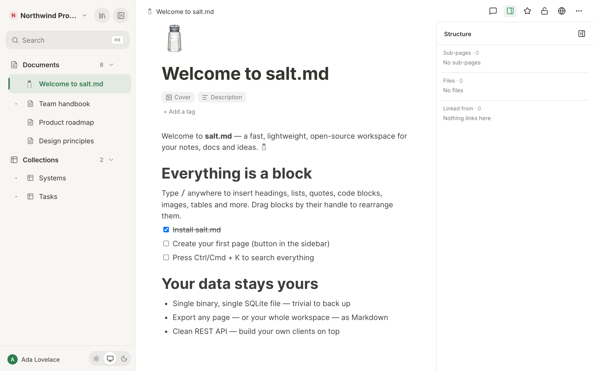
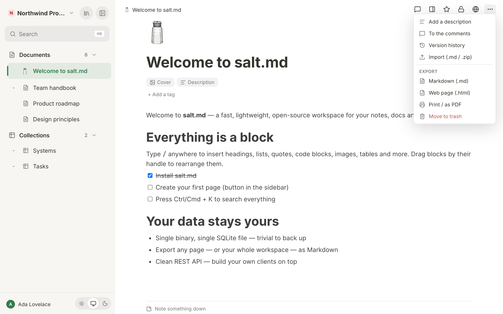

# Pages

A page is the unit everything in salt.md is made of. It carries a title, an
optional icon and cover, an optional one-line description, tags, a body of
blocks, and any number of pages filed underneath it. A collection (a database)
is a page too, and so is every row inside one — which is why a row can have
sub-pages, a cover and a comment thread like anything else. This page covers
everything you can do to a page itself: making one, dressing it, filing it,
linking it, attaching files to it, copying it, printing it. What goes *inside*
the body is [Editor blocks](editor-blocks.md).

Every page has an address of the form `/p/<id>`, and that is what the browser
shows while you read it.

## Creating a page

There are six ways in, and they differ only in where the new page lands.

1. **The sidebar section header.** The `+` beside **Documents** (or **Pages**,
   when the sidebar is in mixed mode) makes a new document; the one beside
   **Collections** makes a new collection. Both land at the top level of the
   workspace the sidebar is currently showing.
2. **Inside another page.** Hover a row in the sidebar tree and press `+`
   (**Add inside**). It asks what to put there — **Page** or **Collection** —
   and files it under that page. Database rows carry the same `+`, so a dossier
   under a deal is an ordinary thing to build. To reach a row's `+` you have to
   unfold its database first; see [Sub-pages](#sub-pages-and-the-sidebar-tree).
3. **The ⋯ menu of a tree row**, entry **New collection inside**.
4. **`⌥N`** (Alt-N) anywhere makes a new top-level page in the workspace the
   sidebar is showing. `⌘N` is reserved by browsers and cannot be intercepted,
   which is why the shortcut is this one.
5. **From a mention.** Typing `@` or `[[` and then a name that does not exist
   yet offers `Create "…"` — see [Page links](#page-links-and-backlinks).
6. **From a template**, from an import, or over MCP.

A new page is created with no title and you land in it immediately. Nothing
puts the cursor in the title — click the title to name it. Until you name it, it
is called *Untitled* everywhere it appears.

A page created **under a parent** inherits that parent's workspace. A page
created **at the top level** goes into the workspace selected in the sidebar.
You must be able to write to the parent, and be a member of the workspace.

## The title

The title sits under the icon and above the body. It is a single line of text
that wraps onto as many lines as it needs — the field grows with it, and it
re-measures when the column gets narrower (a collapsed sidebar, a smaller
window). Pressing **Enter** in the title does not insert a line break; it jumps
the cursor into the body.

The limit is 2000 characters in the browser and over the REST API: a longer
title is refused rather than truncated. An agent writing over MCP is not held to
it — see [Limits](#limits).

Editing the title saves after half a second of quiet, and the breadcrumb at the
top of the screen follows along as you type. If a save fails you get the notice
*Title/icon not saved* and the change is kept for a later retry rather than
thrown away.

## Icon

The icon appears large at the head of the page, in the breadcrumb, in the
sidebar tree, in search results and on board cards. Click it to open the
picker; on a page that has none, the **Emoji** button under the title opens the
same picker.

The picker has three tabs and a bin:

| Tab | What it offers |
| --- | --- |
| **Emoji** | the full emoji set, grouped by category, with a search box |
| **Icons** | line icons — **Lucide** (a curated set of about 380) or **Material** (the full set, about 7,400), with a row of colour dots |
| **Upload** | your own picture: *PNG, JPG, GIF or SVG — shown square, as an icon.* |
| **Remove icon** | the bin button beside the tabs, which clears the icon |

The two icon sets are different in kind. Lucide is a hand-picked selection
shipped with the application, so it is instant and deliberately small. Material
is the complete set and is fetched the first time you open that tab; while it is
arriving the grid says *Loading Material icons…*. Search terms ignore hyphens
and spaces, so `arrow-right` and `arrowright` both find the same glyph.

Whatever you pick is stored as one short string: an emoji, `lucide:Rocket`,
`mdi:Rocket`, either of those with a colour (`lucide:Rocket:#e03131`), or the
path of an uploaded image.

## Cover

Under the title, the **Cover** button appears while a page has none. It opens a
menu with **Upload image** and eighteen gradient swatches. All the gradients run
light-to-dark from the left, because the page icon docks at the left edge and
has to stay readable against them.

Once a page has a cover, the two buttons live on the cover itself:
**Change cover** and **Remove**.

A cover can only be **an image you uploaded** or **a gradient**. An external
image address is refused — a stored `url()` pointing at somebody else's host
would fire a request from every reader's browser each time the page opens, which
is a tracking beacon planted in a document other people read. Agents are refused
by the same rule, and their error names the two forms a cover may take.

## Description

A short line under the title, meant for what the title cannot say. Add it with
the **Description** button under the title, or from the ⋯ menu with
**Add a description**; the same menu then offers **Remove description**. The
placeholder is *Add a description…*, and an empty one disappears again when you
click away.

In the browser and over the REST API it is capped at 2000 characters, and
anything longer is trimmed on save. It is shown to readers who cannot edit as
plain text. The description is also the subtitle of the page's row in the
[Library](library.md) — where a page without one falls back to the first line of
its body instead.

## Tags

Tags are lightweight labels that cut across the tree. A page sits under exactly
one parent, but it can carry any number of tags — and a tag gathers pages from
anywhere in the workspace, wherever they are filed. They sit under the title as
coloured chips.

- Type in the field (**+ Add a tag**, or **+ Tag** once there is one) and press
  **Enter**, **comma** or **Tab** to add.
- As you type, tags already used elsewhere are suggested with how often they
  occur; near-misses are marked *similar*. Arrow keys move through the list,
  Enter takes the highlighted one — which is what stops you creating a second
  spelling of a tag you already have. **Escape** closes the list.
- **Backspace** in an empty field removes the last tag.
- The `×` on a chip removes it. Clicking the chip's label opens
  **Colour**: *Default* plus Gray, Brown, Orange, Yellow, Green, Blue, Purple,
  Pink and Red.

A tag's colour is **shared by everyone in the workspace** — it belongs to the
tag, not to the page or to you. *Default* means no override: the colour is then
derived from the tag's own name, so the same tag looks the same everywhere
without anybody deciding anything.

The server normalises every tag it stores: a leading `#` is dropped, runs of
whitespace become `-`, empties fall out, duplicates are removed
case-insensitively (the first spelling wins), each tag is cut to 40 characters
and each page keeps at most 30. Agents write through the same normaliser, so
they cannot create variants the interface would never produce.

The sidebar has a **Tags** section listing every tag with its count; clicking
one filters the tree to the pages carrying it.

If a label wants a *value* as well as a name, it wants to be a collection
property instead — see [Properties](properties.md).

## Row properties

When the page you are looking at is a row of a collection, its typed properties
are shown as a panel under the title, one label and value per line, editable in
place. They are the same cells the table and the board use, including the option
editor. See [Collections](collections.md).

## Sub-pages and the sidebar tree

Any page can hold pages. Nesting is unlimited, and the sidebar tree shows it.

**How the tree is shaped is a workspace setting**, not a personal one. Open the
workspace menu at the top of the sidebar, choose **Workspace settings**, and
under **Layout** → **How the sidebar is arranged** pick one:

| Choice | What it does |
| --- | --- |
| **Documents and collections apart** | two sections, **Documents** and **Collections**. A collection filed under a document is listed under Collections, not under the document. |
| **One tree, filed where you put it** | one section, called **Pages**. A collection stays under the document it was filed in; there is no Collections section at all. |

Split is the default. Everyone in the workspace sees the same shape.

Three rules are worth knowing because they look like inconsistencies and are
not:

- **A collection's rows are not sub-pages in the tree.** A database can hold
  tens of thousands of rows; they belong in its table, not in the sidebar. A row
  that *itself* has live sub-pages does appear, because otherwise its children
  would float loose with no parent to sit under.
- **A collection filed under a document stays a collection** in split mode: it
  is listed under **Collections**. In mixed mode there is no second section, so
  it stays under its document.
- **The number beside a section heading counts the whole section**, folded rows
  included — not the rows currently on screen.

**Unfolding a database.** A collection in the tree has a chevron. Opening it
lists its rows, so you can walk collection → row → sub-page without opening the
table first. Two things about that list: it loads the **first 50
rows** (a row that sorts later still appears if it carries sub-pages, so a
subtree is never unreachable), and a database nested inside another database is
drawn as a proper tree item rather than as a row, so it keeps its full ⋯ menu.

## Tabs

salt.md keeps several pages open at once, like an editor rather than like a web
page. Three ways to open one in a new tab:

- **Open in new tab** — the first entry of the sidebar ⋯ menu.
- **⌘-click** (Ctrl-click on Windows and Linux) a row in the sidebar tree.
- **Middle-click** a row in the sidebar tree.

A new tab opens immediately after the active one and takes focus. Ordinary
clicking navigates the tab you are in, so the number of tabs only grows when you
ask for it.

The strip of tabs appears above the page **only once there are two** — a single
document needs no tab bar. Each tab shows the page's icon and title; click one
to switch, click its `×` or middle-click it to close. Closing the active tab
lands you on the tab that slides into its place.

`Ctrl+Alt+←` and `Ctrl+Alt+→` cycle through the open tabs. The shortcut is
ignored while you are typing, and it deliberately does not use ⌘ — on macOS
`⌘⌥←/→` is the browser's own tab switch.

## The sidebar ⋯ menu

Every row in the sidebar tree — and every database row listed under an unfolded
collection — carries the same menu. Reach it with the ⋯ button that appears on
hover, or by **right-clicking the row**, which is faster and works the same way.

| Entry | When it is there | What it does |
| --- | --- | --- |
| **Open in new tab** | always | opens the page beside the current one |
| **Add to favorites** / **Remove from favorites** | always | the same star as the top bar |
| **Duplicate** | always | deep copy — see [Duplicating](#duplicating) |
| **New collection inside** | always | a collection filed under this page |
| **Move to top level** | the page has a parent | drops the parent link |
| **Move to workspace** | you belong to more than one | lists the others |
| **Files in this subtree** | always | see [Files on a page](#files-on-a-page) |
| **Save as template** | always | snapshot copy — see [Templates](templates.md) |
| **Export Markdown** | always | downloads this page as `.md` |
| **Move to trash** | always | this page and everything under it |

The last two are worth pointing out because the page's own top bar has them too
and people learn only one of the two places. Both menus do the same thing.

## Files on a page

**Drop a file from the desktop anywhere on the page** — onto the cover, the
title, the tag strip, the empty space beside the text, or into the text itself.
While you drag, the page outlines itself and says *Drop to add to this page*.
A drop that lands in the text is placed exactly where the pointer was; a drop
anywhere else is appended after the last block.

Files are uploaded **one at a time**, on purpose: uploads are size-capped and
the server sizes PDF text extraction to the memory it has, and ten at once from
a folder drag is the shape that has taken an instance down before. A failure
does not stop the rest — dropping five and getting four plus a named failure
beats getting nothing. The default cap is 50 MB per file and an administrator
can change it.

A PDF dropped onto a page **becomes searchable**, because the upload carries the
id of the page it landed on. See [Files](files.md) and [Search](search.md).

**Clicking a PDF in the body opens it in a viewer** rather than downloading it:
a framed preview with the file's name, **Download** and **Close**. Escape closes
it too. Only PDFs stored on this instance open this way — a file block pointing
at a foreign address keeps opening the normal way. Anything that is not a PDF is
handed to the browser.

**Files in this subtree**, in the sidebar ⋯ menu, answers the other question:
*show me every document filed under this*. It opens a dialog headed
**Files below "…"** listing every file on that page and everything beneath it,
with size, date and the page carrying it; you can filter by name or page and
narrow to one file type, and clicking a page name jumps to it. The same list
without a page restriction is in the workspace settings.

This is not the same list as the structure panel's **Files** section — that one
is always the page you are standing on, this one is anywhere in the tree.

## The structure panel

The **PanelRight** icon in the top bar opens a column on the right: *Show
structure* / *Hide structure*. It is headed **Structure** and holds up to four
parts:

| Section | What it lists |
| --- | --- |
| (unlabelled, at the top) | the chain of pages above this one, indented, closing with **This page** |
| **Sub-pages** | the whole subtree, depth-first and indented, with a count. Empty: *No sub-pages* |
| **Files** | every file on this page **and its sub-pages**, with kind, size, and — when it came from a sub-page — which one. Empty: *No files* |
| **Linked from** | every page that links here, with a count. Empty: *Nothing links here* |

Clicking a file opens a PDF in the built-in viewer and hands anything else to
the browser in a new tab.

The ancestor chain only appears when there is one, and the **Sub-pages** section
is left out entirely on a collection — showing "0 sub-pages" beside a table full
of rows would read as a fault.

Whether the panel is open is a **reading preference, not a property of the
page**: it stays open as you move through the workspace, and it survives a
reload. It shares the right-hand strip with the comments panel, so opening one
closes the other — two columns in that width would leave neither usable.

## Page links and backlinks

Two triggers, one result:

- **`@`** — mention a page
- **`[[`** — the same thing, for wiki-link muscle memory

Both open the same list: up to twelve pages whose title contains what you have
typed, each marked *Page* or *Database*, plus — when you have typed something —
`Create "…"`, which makes a new page with that title and links it in one motion.
That new page is created at the **top level of your default workspace**, not
under the page you are writing in; move it afterwards if it belongs somewhere.

The twelve are the first twelve matches, not the twelve best: there is no
ranking, so type a little more when what you want does not appear.

Either way you get a real **page link**: a chip in the text that carries the
target's id and its label. Clicking it navigates in the tab you are in. This
matters because the backlink index reads page links and nothing else — a
hand-typed URL is just text. (The [graph](library.md) draws page links as one
kind of line and where a page is filed as another, so a page with no page links
is not necessarily a dot on its own there.) A Markdown link to a page of this
instance is converted into a real page link on import.

On the receiving side, everything pointing at a page is listed as
**Linked from · N**: at the foot of the body when the structure panel is closed,
and inside the panel when it is open — never in both places. On a collection
there is no foot-of-body strip, because the body of a collection is its table,
so open the structure panel to see its backlinks. Nobody maintains that list; it
is rebuilt from the content every time a page is saved.

Links you cannot see are not shown: a backlink from a page you have no access to
is filtered out per page, not just per workspace.

## Favourites

The star in the top bar pins a page to the **Favourites** section at the top of
your sidebar: *Add to favorites* / *Remove from favorites*. The same entry is in
the sidebar's ⋯ menu, and the ★ beside a favourite removes it again.

Favourites are **per person**. Starring something does not put it on anybody
else's sidebar, and a favourite that points at a trashed page drops out of the
list on its own. New favourites are added to the end of the list; there is no
way to reorder them in the interface.

Use them for the handful of pages you open every day. Everything else is faster
to reach with `⌘K` — see [Search](search.md).

## Moving a page

**By dragging.** Drag a row in the sidebar tree onto another. The upper third of
the target means *before it*, the lower third *after it*, and the middle
*inside it* — a drop inside also expands the target so you can see where the
page went.

**By menu.** The sidebar ⋯ offers **Move to top level** (only when the page has
a parent to leave) and, when you belong to more than one workspace,
**Move to workspace** with the others listed.

Rules the server enforces, in the interface and over MCP alike:

- A page cannot become its own parent, and cannot be moved into its own subtree.
- Re-parenting happens **within one workspace**. Hanging a page under a parent
  in another workspace is refused, because children are listed in places that do
  not re-check permissions — database views, the Markdown export, the calendar
  feed.
- Moving to another workspace is therefore its own act: it takes the **whole
  subtree** along and drops the parent link, so the page arrives at the top level
  of the new workspace. The old parent stays where it is.
- A move to another workspace is **refused outright when the subtree holds
  private pages belonging to somebody else**. Not skipped — refused, with
  nothing moved. You may well be an admin in the target workspace, and admins
  can read private pages there, so carrying them along would be a way to make
  another person's notes readable. Leaving them behind is no option either:
  they would hang off a parent in a workspace nobody there can see.
- A move to another workspace is also **refused when you are a viewer in the
  target workspace**, because a viewer cannot add pages to it.

Comments, revisions, favourites, share links and the live editing session all
hang off the page id, which does not change — a move takes them with it.

## Duplicating

**Duplicate** in the sidebar ⋯ makes a deep copy: the page, its whole subtree,
and — for a collection — its property schema and its views. The copy is added at
the **end of the same list** as the original, titled **Copy of <name>**, and you
are taken to it. Duplicate the first of ten sub-pages and the copy appears
tenth, not second.

Only the parts you are allowed to read are copied. A branch you cannot see is
skipped, together with everything under it, rather than quietly becoming yours.

**Save as template** in the same menu is the same act with one difference: the
*copy* becomes the template and keeps this moment's state, so the page you were
standing on stays an ordinary page and later edits to it never change what the
template offers. See [Templates](templates.md).

## The top-bar ⋯ menu, in full

The top bar carries, from left to right: which agent is working here, who else
is on the page, the comments button with a count of unresolved comments, the
structure toggle, the favourite star, the private/workspace lock, the share-to-web
globe, and **⋯** (*More*).

| Entry | When it is there | What it does |
| --- | --- | --- |
| **Add a description** | you can edit, and there is no description | shows the description field |
| **Remove description** | you can edit, and there is one | clears it |
| **To the comments** | not on a collection | always *opens* the comments panel |
| **Version history** | always | the revision list — see [History](history-and-audit.md) |
| **Show comments** / **Hide comments** | narrow screens only, and not on a collection | toggles the panel |
| **Make it private** / **Make it visible to the workspace** | narrow screens only | the same as the lock icon |
| **Share to web (read-only link)** | narrow screens only | the same as the globe |
| **Import (.md / .zip)** | you can edit | reads a Markdown file or a zip — see [Import and export](import-export.md) |
| **Markdown (.md)** | always | downloads this page as Markdown |
| **Web page (.html)** | always | downloads a document as a standalone HTML file. On a collection it falls back to Markdown — a table is the faithful form of its rows, so what arrives is a `.md` file |
| **Print / as PDF** | always | see below |
| **Move to trash** | you can edit | this page and everything under it |

A collection carries no comments at all, so neither the comments button, the
count, **To the comments** nor **Show comments** exists on one.

On a phone the lock, the globe and the comments button step out of the top bar —
six icons side by side made the head of the page look busier than its content —
and reappear in this menu, so nothing becomes unreachable.

**Move to trash** is here because it is the one menu every page has. A database
row, and anything filed under one, never appears in the sidebar tree, so before
this there was no way to throw one away from the interface at all. Trashing the
page you are standing on takes you out of it. See
[Trash and recovery](trash-and-recovery.md).

The exports cover **this page only** — sub-pages are not included. For a whole
tree or a whole workspace, see [Import and export](import-export.md).

## Printing

**Print / as PDF** behaves differently for the two kinds of page, on purpose.

For a **document** it opens a clean standalone version in a new tab: no
application chrome, a readable measure, print-tuned page breaks that keep
headings, images, tables and list items from being split. A bar at the top —
visible on screen, never printed — offers **Print / Save as PDF** and reminds
you that on a phone it is *Share → Print, or "Save to Files"*. On a desktop the
print dialog opens by itself a moment after the page loads.

For a **collection**, the browser's own print dialog opens on the view you are
looking at, so what you print is the table, board or calendar as arranged.

## Privacy and sharing, in one line each

The **lock** toggles a page between *Visible to the workspace* and
*Private (only you)*, and the setting is inherited by everything under it. The
**globe** mints a read-only link anyone can open without signing in, with an
optional expiry (*Never*, *In 1 day*, *In 7 days*, *In 30 days*) and an optional
password, and **Stop sharing** revokes it. Both are covered properly in
[Permissions](permissions.md) and [Sharing](sharing.md).

## Saving, and what else lives on a page

Nothing has a Save button. The body is written back about a second and a half
after you stop typing, and once more when you leave the page — that last flush is
what makes a mention you just inserted show up as a backlink on the other side.
Title, icon, cover, description and tags save half a second after the last
change, merged into one write, so a title edit followed straight away by a cover
change does not cancel the first.

Below the body of every document and every row sits the **raw trail** — dated,
append-only notes written while the work happens. Comments live in their own
panel beside the document. Both are [Comments and notes](comments-and-notes.md).
Two people opening the same page see each other's cursors and edits live; that is
[Collaboration](collaboration.md).

## Over MCP

Agents work on the same pages through the same checks. The interface calls these
things collections; the MCP surface calls them databases, and both names are
correct where they stand.

| Tool | What it does here |
| --- | --- |
| `create_page` | title, parent or workspace, initial Markdown, icon, cover, description, tags, and row properties — all in one call. `template_id` builds the page from a template instead, and then only `title` applies alongside it |
| `get_page` | one page as Markdown; `include_children` returns the whole subtree in one answer |
| `update_page` | title, icon, cover, description, tags, visibility, `parent_id` (empty string = top level), `workspace_id` (moves the subtree), `favorite` |
| `write_content` | Markdown into the body: `append` (the default), `prepend` or `replace` |
| `duplicate_page` | the deep copy described above; returns the new id |
| `save_as_template` | the snapshot copy |
| `set_trashed` | `true` moves the page to the trash and the whole subtree goes with it. `false` restores **only the page named** — its sub-pages have to be restored one by one. (Restoring in the browser brings the whole batch back; the two paths differ here.) |
| `get_links` | with a page id: what points at it. Without: the whole graph, plus orphans |
| `list` | `kind: "pages"` for the tree, `"tags"` for what exists already, `"files"` for attachments — and for files, `under` narrows to one page and its sub-pages |
| `revisions` | the version history: list it, read one older state as Markdown, or restore it. Restoring saves the current state first, so it is itself reversible |
| `set_sharing` | mints the page's public read-only link, or revokes it |
| `upload_file` | attaches a file from base64 data; with a page id it becomes a block on that page, and a PDF becomes searchable |
| `working_on` | announces that the agent is working on this page, shown live to anyone watching. Call it again with `done: true` at the end |
| `note` | appends one line to the page's raw trail. It can never be edited or removed — correct a wrong one by adding another that says so |
| `embed_database` | puts an existing collection into a document, by reference |
| `get_permissions` | can_read / can_write / can_delete, before attempting a write |

Two honest limits. `write_content` with `mode: "replace"` goes around the live
editor, so anyone with the page open at that moment loses their unsaved edits —
appending cannot do that, which is why it is the default. And an agent that has
been connected since before a release keeps the tool list it fetched then; a
renamed tool only appears after it reconnects.

The REST equivalents are `/api/pages`, `/api/pages/{id}`,
`/api/pages/{id}/duplicate`, `/api/pages/{id}/backlinks`, `/api/export/{id}`,
`/api/upload`, `/api/files` and `/api/favorites/{id}` — see [API](api.md).

## Limits

| Thing | Limit |
| --- | --- |
| Title | 2000 characters in the browser and over the REST API; longer is refused. Not enforced on the MCP path |
| Description | 2000 characters in the browser and over the REST API; longer is trimmed on save. Not enforced on the MCP path |
| Tags per page | 30 |
| Tag length | 40 characters |
| Tag colours | Default plus nine named colours |
| Cover | an uploaded image or a gradient; external addresses refused |
| File upload | 50 MB per file by default; an administrator can change it |
| Revisions kept | the newest 50 per page, at most one snapshot every two minutes |
| Page links offered by `@` / `[[` | the first 12 pages whose title contains what you typed |
| Database rows listed in the sidebar tree | the first 50, plus any row carrying sub-pages |
