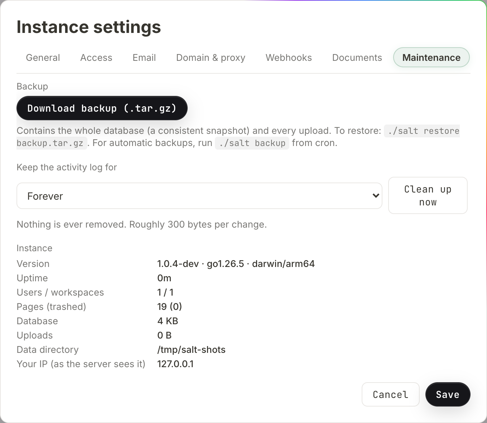

# Self-hosting

This page is for whoever runs the server. It covers every way to install
salt.md, every environment variable and what it defaults to, how the process
decides how much work it can afford, what the startup log is telling you, how it
defends itself against somebody guessing passwords, and how to back up, restore
and update without losing anything.

salt.md is **one process**. The frontend is compiled into the binary, SQLite is
a pure-Go library (the builds have CGO switched off), and nothing else has to be
running: no database server, no Node, no Redis, no reverse proxy unless you want
one. Everything the instance owns lives in one directory.

## Installing

### The installer script

```sh
curl -fsSL https://raw.githubusercontent.com/saltmd/salt.md/main/install.sh | sh
```

That installs it and starts it, and prints the address to open. `SALT_NO_START=1`
installs without starting, and a non-interactive run never starts it, so this is
safe in a provisioning script.

**On a Linux server it installs a service.** Run as root on a machine with
systemd, the one-liner does not leave a process in your terminal: it creates the
system account `salt`, writes `/etc/systemd/system/salt.service`, keeps the data
in `/var/lib/salt` and enables the unit. The instance then starts on boot, comes
back by itself after a crash, and your shell is free. Running it again later
replaces the binary and restarts the service, so the same command is also the
upgrade. `SALT_NO_SERVICE=1` opts out.

Anywhere else — a Mac, a machine without systemd, or without root — it runs in
the foreground, which is what you want when you are only trying it out.

On a machine with `wget` and no `curl`, which is common on minimal server
images, fetch the script with that instead. Only this line changes; the script
downloads with whichever of the two it finds, and stops with a clear message if
neither is installed:

```sh
wget -qO- https://raw.githubusercontent.com/saltmd/salt.md/main/install.sh | sh
```

The script reads `uname` and picks the matching prebuilt binary — Linux and
macOS, x86-64 and arm64. It installs to `/usr/local/bin/salt` when that
directory is writable, uses `sudo` when it is not, and falls back to
`~/.local/bin` when there is no `sudo` either. It then prints how to run the
binary, and warns you when the directory it chose is not on your `PATH`.

Two variables change what it does:

| Variable | Effect |
| --- | --- |
| `BIN_DIR=/path` | install there instead of the automatic choice |
| `SALT_VERSION=v1.6.13` | download that release tag instead of `latest` |

The tag needs its leading `v` — it goes into the download URL unchanged.

The installer does **not** verify a checksum. If that matters to you, take the
manual route under [Updating](#updating), which does.

Windows is not covered by the script (it stops with "Unsupported OS"), but a
`salt-windows-amd64.exe` is published with every release — download it by hand.

### Docker

```sh
docker run -d --name salt --restart unless-stopped \
  -p 8420:8420 -v salt-data:/data --memory=4g \
  ghcr.io/saltmd/salt.md:latest
```

The image is published for `linux/amd64` and `linux/arm64`. It runs as an
unprivileged user, sets `SALT_ADDR=:8420` and `SALT_DATA=/data`, declares
`/data` as a volume and exposes 8420.

**Set `--memory`.** A container with no limit cannot tell how much of the host
it is meant to get, so salt.md assumes a small machine — see
[Memory](#memory-and-what-it-changes) for what that costs you.

### Docker Compose

The repository ships a `docker-compose.yml`. Run it from a checkout:

```sh
docker compose up -d
```

By default it **builds the image from the source in that directory** (`build: .`).
To use the published image instead, uncomment the `image:` line and comment out
`build:`. The rest of the file sets `mem_limit: 4g`, the named volume
`salt-data` mounted at `/data`, `SALT_ADDR` and `SALT_DATA`, and
`restart: unless-stopped`. Two entries are commented out and waiting for you:
`SALT_MEMORY_MB`, and the pair `SALT_TLS_CERT` / `SALT_TLS_KEY` for serving
HTTPS directly — you supply the mount for the certificate files yourself.

### From source

```sh
make build     # frontend, then backend
./salt
```

Needs Go 1.25, which is what `go.mod` requires. The frontend is built with
Node 20 in the container image and in the release workflow; no minimum Node
version is declared anywhere, so that is what has been proven rather than a
floor.

`make frontend` runs `npm run build`, which runs the whole check gate first:
type checking, the translation catalogue, the date formatting suite, the
card-layout, drop-file and tree-mode rules, and this wiki against the code.
Seven steps, any of which fails the build. That gate is deliberate; a build that
skips it can ship a broken string catalogue.

### As a systemd service

The repository ships a unit at `deploy/salt.service` **and an installer for
it**. With a `salt` binary in hand, run as root:

```sh
./deploy/install.sh ./salt
```

That creates the system account `salt`, installs the binary to `/opt/salt/salt`,
creates `/opt/salt/data` owned by that account, installs the unit into
`/etc/systemd/system/salt.service`, and runs `systemctl enable --now salt`. It
finishes by printing "salt.md is running on port 80."

The unit itself:

```ini
[Service]
User=salt
Group=salt
WorkingDirectory=/opt/salt
ExecStart=/opt/salt/salt
Environment=SALT_ADDR=:80
Environment=SALT_DATA=/opt/salt/data
AmbientCapabilities=CAP_NET_BIND_SERVICE
Restart=on-failure
RestartSec=2
KillSignal=SIGTERM
TimeoutStopSec=20
```

`CAP_NET_BIND_SERVICE` is what lets an unprivileged user bind port 80.
`TimeoutStopSec=20` matters: on `SIGTERM` the binary stops the Cloudflare
connector, drains requests still in flight (up to 12 seconds), waits briefly for
the connector to confirm, and closes the database cleanly. Cut the timeout
shorter and you can interrupt that.

## First run

Open the address the server printed and you get the setup screen:
**"Create the first (admin) account for this workspace."** — *Your name*,
*Email*, *Password (min. 8 characters)*, then **Create workspace**.

Whoever completes that becomes the **instance owner**, gets a workspace, and is
its admin. The screen is available exactly once: with an account already in the
database, setup answers "setup already completed". A fresh data directory also
gets one seeded page, *Welcome to salt.md* — deleted, it does not come back on
the next start.

From there, [Administration](administration.md) covers who may sign up,
[Mail](mail.md) covers invitations and password resets, and
[Reaching your instance](domain.md) covers domains and certificates.

## The command line

The binary takes a handful of subcommands before it decides to be a server:

| Command | What it does |
| --- | --- |
| `salt` | start the server |
| `salt backup [file]` | write a consistent archive (default `salt-backup.tar.gz`) |
| `salt restore <file>` | unpack an archive into the data directory |
| `salt version` | print the version and exit |
| `salt fix-notion-rows` | one-time cleanup of Notion-imported row bodies |

Three things about this list are easy to get wrong.

**Only those four words are subcommands.** Anything else — including
`salt --version` — is not recognised, and the process goes on to **start a
server**. On a machine where the service is already running that means a second
instance on the same port, and a command that never returns. Read the version
from the log, from `salt version`, or from `/api/health`.

**The subcommands read `SALT_DATA` too.** `salt backup` run from cron without
the same `SALT_DATA` as the service looks in `./data`, finds nothing, and stops
with "no database at …". A systemd unit's `Environment=` lines are not inherited
by your shell, so set the variable on every command line.

**Only two of them need the server stopped.** `fix-notion-rows` opens the
database directly and takes its single connection. `restore` needs it stopped
for a different reason: a running server holds `salt.db` open and keeps writing
to the very file the archive is replacing. `backup` is designed to run beside a
live instance, and `version` touches nothing.

## Configuration

Every variable carries the `SALT_` prefix. The prefix is not optional: a bare
`DATA=/srv/salt` is silently ignored and the server writes into `./data`.

| Variable | Default | What it does |
| --- | --- | --- |
| `SALT_ADDR` | `:8420` | listen address |
| `SALT_DATA` | `./data` | data directory — database and uploads |
| `SALT_MEMORY_MB` | detected | how much memory to assume (below) |
| `SALT_TRASH_DAYS` | `30` | days before trashed pages are purged; `0` disables |
| `SALT_TLS_CERT` | empty | certificate file — serves HTTPS directly |
| `SALT_TLS_KEY` | empty | matching key file |
| `SALT_RESTORE_FORCE` | empty | any value lets `salt restore` overwrite an existing database |
| `SALT_IMPORT_ALLOW_PRIVATE` | empty | must be exactly `1`; lets the URL importer reach private addresses |
| `SALT_UPDATE_CHECK` | empty | set to `0` to stop the daily check for a newer release |

Notes worth having before you hit them:

- **TLS needs both halves.** With only `SALT_TLS_CERT` set and no key, neither
  TLS branch applies and the server listens as plain HTTP without complaining.
- **`SALT_TLS_CERT` also switches off the built-in Let's Encrypt path**, even
  when the certificate setting in the admin dialog is active. One or the other.
- **`SALT_TRASH_DAYS` loses to the admin setting.** The retention is read from
  the setting first, the variable second, and 30 last. The Instance settings
  dialog shows the effective number in *Empty the trash automatically after
  (days, 0 = never)* and writes it as a setting when you press **Save** — after
  which the variable no longer has any effect.
- **`SALT_IMPORT_ALLOW_PRIVATE` opens a door that is shut on purpose.**
  Importing a page from a URL refuses every address that is not publicly
  routable: loopback, private ranges, link-local (which is where the cloud
  metadata endpoint `169.254.169.254` lives), multicast. Set the variable to `1`
  and that refusal is lifted for the whole process, so imports can reach a wiki
  or a ticket system on your own network. It is deliberately a startup variable
  and not an API setting: whoever runs the service makes that decision, and an
  agent cannot. Leave it unset on anything reachable from outside.
- **Three limits are settings, not variables.** *Max. file size per upload (MB)*
  (1 to 2048, default 50), *Sign-in session length (days)* (1 to 365, default
  90) and *Public base URL (for links, mail, calendars)* all live in Instance
  settings → **General**. The public base URL is the one to fill in first: mail
  links, calendar subscriptions and share links are all built from it.

## Where things live

Everything is under `SALT_DATA`. The admin dialog shows the **configured** path
as *Data directory* under Instance settings → **Maintenance** — as given, not
resolved, so an instance started with the default shows `./data` there rather
than an absolute path.

| Path | What it is |
| --- | --- |
| `salt.db` | the database — pages, workspaces, accounts, the search index |
| `salt.db-wal`, `salt.db-shm` | SQLite's write-ahead log and its shared index |
| `files/` | every upload, one file each under a generated id, served under `/files/` |
| `bin/` | `cloudflared`, downloaded on demand when you start a tunnel |
| `certs/` | Let's Encrypt cache, only when the built-in HTTPS is active |

Uploads are **not** deduplicated: each upload gets a fresh random name, so the
same bytes uploaded twice are two files on disk. The name a person gave the file
lives in the database, not on disk — see [Files](files.md).

The database runs in WAL mode on a **single connection**. That is why
`fix-notion-rows` and `restore` want the server stopped while `backup` can run
beside it, and why a recent change may be sitting in `salt.db-wal` rather than
in `salt.db` — see [Backing up](#backing-up).

## Memory, and what it changes

salt.md sizes its most expensive work — extracting text out of PDFs so it is
searchable — to the memory it believes it has. It looks in this order:

1. `SALT_MEMORY_MB`, if it is a positive number.
2. The container's cgroup limit (`memory.max` on cgroup v2,
   `memory.limit_in_bytes` on v1).
3. `/proc/meminfo`.

With one deliberate exception: **inside a container with no limit set, it
assumes 2 GiB** rather than believing `/proc/meminfo`, which inside a container
reports the *host's* memory. A 512 MB container on a large host would otherwise
talk itself into work that gets it killed. If the host itself is smaller than
2 GiB, the smaller figure wins.

What the number actually decides:

| Available memory | Largest PDF whose text is indexed | Extractions at once |
| --- | --- | --- |
| unknown (no `/proc/meminfo` — e.g. macOS) | 10 MB | 1 |
| under 4 GiB | 1 % of it, never below 5 MB | 1 |
| 4 GiB to under 12 GiB | 1 % of it, never above 50 MB | 2 |
| 12 GiB and up | 50 MB | 3 |

The thresholds are binary (4 GiB, 12 GiB), and **the 50 MB ceiling bites well
before the last row**: 1 % of 5 GiB is already over it, so a 5, 8 or 11 GiB
machine all end up at exactly 50 MB. More memory buys you extraction slots after
that, not a bigger file.

Two further caps do not scale at all. **Only the first 500 KB of a PDF's
extracted text is indexed**, on every machine — full-text search over a whole
book is not worth the database weight, so a long document is searchable by its
opening rather than throughout. And the upload limit is a setting
(*Max. file size per upload (MB)*), not a function of memory.

salt.md also tells Go's garbage collector where the ceiling is — 80 % of the
figure — so the heap does not grow past a container limit and get the process
killed.

**Getting this wrong never breaks an upload.** A PDF over the limit is stored,
listed, previewed and downloadable exactly as usual; only its text stays out of
the search index. That is the whole cost, and it is why the limit scales itself
instead of asking you.

Set `SALT_MEMORY_MB` by hand in one case: **nested containers**, such as Docker
inside an LXC container. There the cgroup file says "no limit" and
`/proc/meminfo` reports the outermost host, so neither source knows the truth.
Elsewhere, `--memory` on the container is the better answer because it is also
enforced.

## Reading the startup log

A healthy start is **one to four lines**, depending on what changed. On an
unchanged Linux instance you get two: the memory line and the listening line.
The index lines appear only when an upgrade moved an index version — their
absence is the good case. A machine with no `/proc/meminfo` (macOS) drops the
memory line too, leaving one.

They are printed in this order.

**`search index: rebuilt (version 3, 736 pages)`**
The full-text index was rebuilt because its version changed — normally after an
upgrade that touched the tokenizer. **The absence of this line is meaningful**:
it means the running binary recognised the index it found, which is exactly what
you want to see after a restore. A companion line, `search index: N of M pages
could not be indexed`, appears just before it when some pages failed.

**`file index: built (version 2, 626 files on 248 pages, 0 unreferenced)`**
Same idea for the file list. "Unreferenced" counts files on disk that no page
mentions — workspace logos and profile pictures are always in that number, since
they hang off a workspace or an account rather than a page. See
[Files](files.md).

**`memory: 16000 MB available, soft limit 12800 MB, PDF indexing up to 50 MB, 3 extraction(s) at a time`**
The conclusion of the section above. If a PDF is not searchable, this line says
why. It is **missing entirely when the memory figure cannot be read** — on
macOS, for instance — and in that case the conservative defaults apply: 10 MB
per PDF, one extraction at a time. Setting `SALT_MEMORY_MB` brings the line
back.

**`memory: no container limit is set, so this assumes a small instance. Run with --memory=<size> …`**
Printed only when the process is in a container, has no cgroup limit and no
`SALT_MEMORY_MB`. It is the 2 GiB assumption announcing itself.

**`memory: SALT_MEMORY_MB="…" is not a positive number of megabytes — ignoring it`**
A typo in the variable. Detection continues as if it were unset. This one is
written whenever the figure is worked out, which happens before anything else at
startup — so it appears above every other line here, and again later whenever a
PDF is sized up.

**`salt.md 1.6.16 listening on :8420 (data: /opt/salt/data)`**
The server is up. Two variants: `(TLS, data: …)` when you supplied a certificate
pair, and `(auto-HTTPS for notes.example.com, data: …)` when the built-in
Let's Encrypt path is active — that one listens on `:443` and answers the ACME
challenge on `:80`.

**`tunnel: autostart (stored token)`, then `tunnel: connected (token)`**
A Cloudflare tunnel configured earlier coming back up by itself. On failure you
get `tunnel: cloudflared exited (…)` followed by `tunnel: retrying in 5s`.

During operation, two lines are worth recognising:

- `auth: rejected password from 192.0.2.9` — one per rejected credential. See
  [Keeping guessers out](#keeping-guessers-out).
- `pdf extract 9f3c1e…f7.pdf: skipped for indexing, N bytes is over the M byte
  limit (the file itself is stored and listed as usual)` — not an error, and the
  parenthesis is the point. The name in that line is the **stored** name, a
  generated id plus the extension, not the name the file was uploaded under.
  Grepping the log for `contract.pdf` finds nothing; look the id up in the file
  list instead.

A clean shutdown prints `received terminated, shutting down…`, then
`stopped cleanly`.

## Health

```
GET /api/health
{"status":"ok","version":"1.6.16"}
```

No credential needed. It **pings the database**, so it distinguishes a
live-but-broken process from a healthy one: when the database does not answer,
the response is `503` with `{"status":"unavailable"}`. Point an uptime monitor,
a Docker health check or an orchestrator at it.

One inconsistency to know about when you compare strings: a release **binary**
is stamped with the tag as written (`v1.6.16`), while the **container image** is
stamped without the leading `v` (`1.6.16`). Same release, two spellings.

Instance settings → **Maintenance** shows the same facts in the browser:
*Version* (with the Go version and the OS/arch it was built for), *Uptime*,
*Users / workspaces*, *Pages (trashed)*, *Database* and *Uploads* as sizes on
disk, *Data directory*, and *Your IP (as the server sees it)* — the last one is
how you check whether a reverse proxy's headers are arriving, since it shows
`proxy headers active` when that setting is on.



In the background, every 30 minutes the server drops expired sessions, discards
idempotency keys older than a day, prunes its rate-limit buckets, sweeps stale
OAuth state, and empties trash past the retention.

## Keeping guessers out

An instance on the open internet gets knocked on. Two mechanisms answer that,
and they are worth having together.

**The server throttles wrong credentials itself**, per client address, with a
token bucket:

| What | Budget | Burst |
| --- | --- | --- |
| sign-in attempts (login, and accepting an invitation into an existing account) | 30 a minute | 10 |
| rejected API tokens | 60 a minute | 20 |
| public form submissions | 20 a minute | 8 |
| MCP tool calls — per account, not per address | 240 a minute | 60 |

Sign-in over budget answers `429` with "too many login attempts, please wait".
The token bucket is fed **only by rejected tokens**, and once an address has
burned through it, bearer tokens from that address are cut off before the
database is even consulted. A valid token never pays in, so an agent making
hundreds of calls a minute is never throttled by this.

**Every rejected credential is logged**, in a fixed format:

```
auth: rejected password from 192.0.2.9
auth: rejected token from 192.0.2.9
```

The address is there because that is what gets banned. The email and the token
deliberately are not: this line ends up in the journal, in log shipping and in
backups, and "who did what" belongs in the audit log behind a login — see
[History and audit](history-and-audit.md).

That format is a parsing contract, and `docs/fail2ban/` in the repository is
what reads it: a filter (`salt.conf`) and a jail (`jail.local`, 20 hits in
10 minutes, banned for an hour). Copy them to `/etc/fail2ban/filter.d/` and
`/etc/fail2ban/jail.d/`, reload, and check the jail with
`fail2ban-client status salt`. The in-process limit always works and stops when
the process does; the jail puts the ban in the firewall, where it costs the
attacker a TCP connection instead of a request.

Two conditions decide whether any of this sees the truth:

- **Behind a proxy or a tunnel, turn on the trust-proxy setting first**
  (below), or every visitor arrives as `127.0.0.1` and you would ban your own
  tunnel.
- **Behind Cloudflare, ban at Cloudflare.** A local firewall rule cannot help:
  the connection comes from `cloudflared` on the same machine.

Verify the filter against a real journal before trusting it — a jail that
matches nothing looks exactly like a jail with nothing to do.

## Backing up

Two things need saving, and they are both under `SALT_DATA`: the database and
the `files/` directory. Nothing else in that directory is irreplaceable.

**Use the built-in command.** It takes a transactionally consistent snapshot of
the database (`VACUUM INTO`, so anything still in the write-ahead log is
included) and adds every upload, into one gzip'd tar:

```sh
SALT_DATA=/opt/salt/data salt backup /var/backups/salt-$(date +%F).tar.gz
```

This is **safe against a running instance** — it opens its own read connection,
which WAL mode allows. That makes it a cron job rather than an outage. The admin
dialog says the same: *"For automatic backups, run `./salt backup` from cron."*

Watch the free space on the **destination** filesystem. The snapshot is written
uncompressed next to the destination as `<destination>.db.tmp` first and only
then packed, so you need room for the whole database on top of the finished
archive. The temporary file is removed either way.

**Or download one from the browser.** Instance settings → Maintenance →
**Download backup (.tar.gz)**. The file is named
`salt-backup-<date>-<time>.tar.gz`. This is **owner-only**, not admin-only:
"Only the owner can download an instance backup — it contains every workspace."
An admin who manages accounts does not get everybody's content by pressing a
button.

If the wrong person holds that right, the role can move: as owner, open the
users dialog, select an active admin and press **Hand over the instance**. It is
one-way — afterwards you are an ordinary admin and only the new owner could hand
it back. See [Administration](administration.md).

**The browser can download a backup but never upload one.** Restoring is a
command on the machine, so an operator who only ever uses the interface has no
recovery path. Make sure somebody has shell access before you need it.

**If you insist on copying by hand, stop the server first.** Copying `salt.db`
on its own while the server is writing gives you a stale database, because the
recent changes are still in `salt.db-wal`. Copy `salt.db`, `salt.db-wal` and
`salt.db-shm` together, or conclude nothing from what you got. This is the
single most common way a "backup" turns out to be worthless.

A backup is a clone of the instance. To move *content* somewhere else — a page,
a workspace, everything you can see, as Markdown — use the export routes
instead: `/api/export/{id}` for one page, `/api/workspaces/{id}/export` for a
whole workspace, `/api/export` for everything. [Import and
export](import-export.md) covers them.

## Restoring

```sh
systemctl stop salt
SALT_DATA=/opt/salt/data salt restore /var/backups/salt-2026-08-07.tar.gz
systemctl start salt
```

The server must be stopped: it holds `salt.db` open and would keep writing to
the very file the archive replaces. (The restore itself never opens the
database — it only unpacks the archive.)

It **refuses to overwrite**: with a `salt.db` already in the directory you get
"…/salt.db already exists; set SALT_RESTORE_FORCE=1 to overwrite". That guard is
there because the mistake it prevents is unrecoverable. Any non-empty value of
the variable lifts it.

Restoring drops any stale `salt.db-wal` and `salt.db-shm` first, so the restored
database is never mixed with journal state from the instance it replaced, and it
rejects an archive containing a path that points outside the directory.

It does **not** empty the directory, though: files that the archive does not
contain stay where they are. For a clean restore, restore into an empty
directory. Uploads that no page references any more are harmless — they show up
in the count of unreferenced files and nowhere else.

## Updating

A release publishes two artefacts from the same tag: five binaries plus a
`SHA256SUMS.txt` on the GitHub Release (which is where the installer fetches
from), and a container image on GHCR tagged both with the version and as
`latest`.

**Installed with the script:** re-run it. Pin with
`SALT_VERSION=v1.6.13` if you do not want the newest.

**By hand, with the checksum verified:**

```sh
mkdir -p /tmp/salt-1.6.16 && cd /tmp/salt-1.6.16
wget -O salt-linux-amd64 \
  https://github.com/saltmd/salt.md/releases/download/v1.6.16/salt-linux-amd64
wget -O SHA256SUMS.txt \
  https://github.com/saltmd/salt.md/releases/download/v1.6.16/SHA256SUMS.txt
grep salt-linux-amd64 SHA256SUMS.txt | sha256sum -c -

systemctl stop salt
SALT_DATA=/opt/salt/data /opt/salt/salt backup /var/backups/salt-before-1.6.16.tar.gz
cp -a /opt/salt/salt /opt/salt/salt.bak
install -m 755 salt-linux-amd64 /opt/salt/salt
systemctl start salt
```

The `SALT_DATA=` on the backup line is not decoration. That shell is sitting in
the download directory and knows nothing about the unit's `Environment=` lines,
so without it the command looks in `/tmp/salt-1.6.16/data` and stops with
"no database at …".

Download into a **fresh, empty directory**. `wget` without `-O` does not
overwrite an existing file — it writes `salt-linux-amd64.1` beside it — and a
checksum check then happily verifies the old file against the old sums file and
reports success. Keeping the previous binary next to the new one is the whole
rollback plan, and it takes one line to use.

**With Docker:** `docker pull` first (it changes nothing until you replace the
container), then stop, back up the volume, and recreate. The stop is the only
downtime and also the only moment a clean copy of the volume is possible, so do
both in one go.

**Migrations run on start and only ever add to your content.** Columns and
tables are created if missing; nothing of yours is dropped or rewritten in
place. The derived indexes are the exception, and deliberately so: when the
search-index or file-index version moves, that index is dropped and rebuilt from
your pages and your files directory. Nothing is lost — both are derived from
content that stays put — but the first start after such an upgrade does real
work before it listens. Skipping versions is fine; an instance can migrate
across several releases in one start.

**Verify by behaviour, not by the version string.** A mislabelled build reads
exactly like a correct one. Compare `sha256sum /opt/salt/salt` against the
published `SHA256SUMS.txt`, or pick something the new version has and the old
does not and check for that. The version string is the last thing to trust.

## Reaching it from outside

Out of the box the server answers on `:8420` on your own network. Everything
below is in Instance settings → **Domain & proxy**;
[Reaching your instance from outside](domain.md) walks through each route in
full, including why the public base URL has to be set whichever you choose.

**1 · Try it right away (quick tunnel).** One button, **Start quick tunnel**, no
account and no domain: salt.md downloads the official `cloudflared` on first use
and gives you a temporary `trycloudflare.com` address pointing at this instance.
The dialog shows the URL with a **Copy** button beside it. The address changes
every time you start it, which makes it right for showing somebody the instance
and wrong for anything permanent.

**2 · Permanently, with your own domain (Cloudflare Tunnel).** Paste a tunnel
token from a free Cloudflare account and press **Connect**. Nothing has to accept
incoming connections, and salt.md restarts the tunnel by itself after a reboot.

**3 · Straight to HTTPS (no Cloudflare, e.g. a VPS).** Enter a hostname, tick
**Active**, restart. salt.md fetches its own Let's Encrypt certificate and
listens on 80 and 443. Needs the DNS A record pointing at the machine and both
ports reachable.

**4 · Your own reverse proxy.** Below the three cards, *Manual — your own
reverse proxy*:

- The checkbox **Run behind a reverse proxy (trust `X-Forwarded-For`)**. Switch
  it on only when a proxy really is in front — the instance then sees real
  client addresses in the audit log, the sign-in throttle and the *Your IP* row.
  With it on and no proxy, a visitor can forge their address and walk past both
  the throttle and any fail2ban jail.
- The field **Internal address of the instance (upstream)** — where the proxy
  should send traffic. It starts as the address you are looking at the dialog
  from.
- Ready-made configuration blocks generated from those two values plus your
  public base URL: **Caddy (automatic HTTPS)**, **Cloudflare Tunnel (no open
  port needed)** and **nginx**. Each has a copy button; nothing has to be typed
  out by hand.

`SALT_TLS_CERT` and `SALT_TLS_KEY` are the fifth way: your own certificate pair,
served directly by salt.md, no proxy and no Let's Encrypt.

## When something is wrong

[Troubleshooting](troubleshooting.md) collects symptoms. The three that belong
to the server rather than to the product:

- **Port open, requests hanging.** The database runs on one connection; one
  request that cannot finish blocks the rest. Check the log for an extraction or
  an import.
- **A PDF is not searchable.** Read the `memory:` line at startup and the
  `pdf extract … skipped for indexing` line. If the PDF is long rather than
  large, remember the 500 KB text cap. The file itself is fine either way.
- **A restore looks like it did nothing.** Check for a `search index: rebuilt`
  line. Its *absence* is the proof that the binary recognised the database it
  opened.
