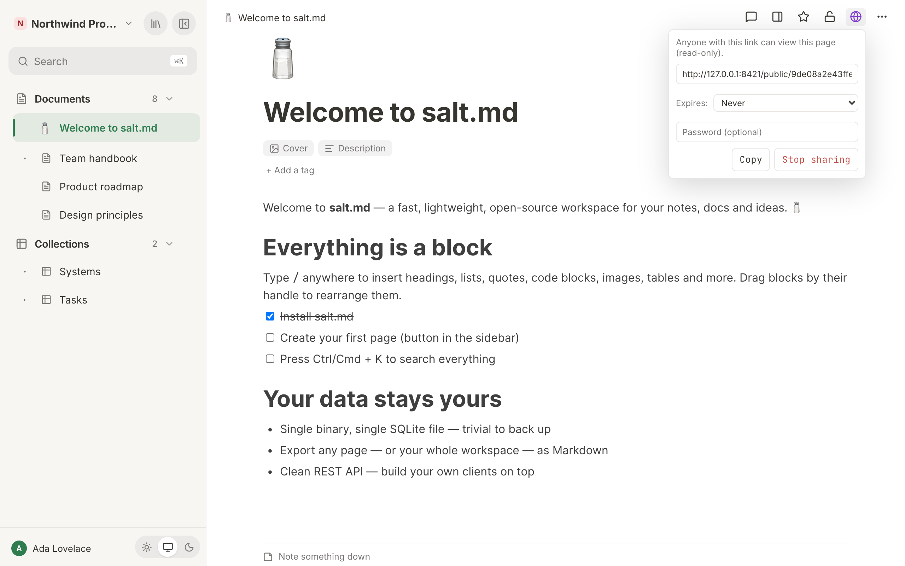

# Sharing

salt.md is private by default: every page needs a signed-in account with access
to the workspace it lives in. Publishing a page is the one deliberate exception.
It turns a single page into a read-only web page at an unguessable address that
anyone can open without an account. This page covers how to publish, what the
link can carry (an expiry date, a password), exactly what a visitor sees and
what they never see, and how to take it back.

Two words are easy to confuse and mean different things. A page that is
**visible to the workspace** is visible to the people in that workspace, all of
whom are signed in. A page that is **shared to the web** is readable by whoever
holds the link. The rest of this page is about the second one; the first is
covered in [Permissions](permissions.md).

## What a public link is

One page, read-only, no account, no session. The address looks like this:

```
https://salt.example.com/public/4f9c2ab1e07d3856c2f1a904bb73e5d81c6a
```

The token is 18 random bytes written as 36 hexadecimal characters. Nothing about
it can be guessed, and it names nothing — not the page, not the workspace, not
the person who published it.

Four things follow from how the link is served:

- It is a **standalone HTML document**. The app is not involved, and no
  JavaScript runs. It opens on anything, including a phone browser with
  scripting switched off.
- It carries **that page and nothing else**. Sub-pages, the rest of the
  workspace, search, the sidebar — none of it is reachable from a public link,
  because none of it is in the document.
- It is **live, not a snapshot**. Every visit reads the page as it stands at
  that moment. What you write after publishing reaches whoever holds the link
  about a second and a half after you stop typing, without you doing anything.
  A link is a standing window on the page, not a copy of it.
- The response carries `X-Robots-Tag: noindex`, which asks search engines not to
  index the page. Engines that honour the header will leave it alone. It is a
  request, not a wall — treat the link itself as the secret.

There is exactly **one public link per page**. Publishing again mints a new
token and the previous one stops working immediately.

## Publishing from the editor

1. Open the page.
2. Click the globe button in the topbar. Its tooltip is
   **Share to web (read-only link)**. On a narrow window the topbar keeps only
   the star, the panel button and **More**; the globe moves into that ⋯ menu
   under the same name.
3. The menu opens and **the link is created straight away**. The field reads
   `Creating…` for the moment it takes, then holds the address. Above it:
   "Anyone with this link can view this page (read-only)."
4. Optionally pick an expiry under **Expires:** — `Never`, `In 1 day`,
   `In 7 days` or `In 30 days`.
5. Optionally type a password into the **Password (optional)** field. It takes
   effect when you leave the field.
6. **Copy** puts the address on the clipboard. Clicking into the field selects
   the whole address, for a browser where the clipboard button is blocked.



Three behaviours of this menu are worth knowing before you use it a second time.

**Opening the menu publishes the page.** There is no "publish" button and no
confirmation. If you open the globe menu to see whether a page is shared, you
have shared it. Use **Stop sharing** to undo that.

**The menu never shows an existing link.** Nothing in salt.md reports whether a
page is currently published, so the dialog cannot show you the link you made
last week — it makes a fresh one, and the old one dies at that moment. The same
happens when you change the expiry or leave the password field: each of those
re-mints the link. So the address you send out is the address you copied in that
sitting; a link that has been passed around cannot be given a password
afterwards without breaking it.

**A second sitting publishes an unprotected link.** The expiry and the password
live only in the open menu, never on the page. Navigate away and back, or
reload the browser, and the menu reopens at `Never` with an empty password box —
and mints a link on exactly those settings. A page that carried a password and a
seven-day expiry yesterday is public with neither from the moment somebody opens
its globe menu today. If protection matters, set it again in the same sitting
and hand out the new address.

Taking protection off works the same way, which is the one useful side of it:
clearing the password field and leaving it, or setting **Expires:** back to
`Never`, mints a fresh open link. There is no separate "remove password" — the
removal is a new link without one, at a new address.

### Who can publish

Publishing needs **write access** to the page: an admin or a member of its
workspace. A viewer sees the globe button, and clicking it produces the message
"Sharing failed".

Somebody else's private page is the exception. Only its owner and the
workspace's admins can read such a page at all, and write access is built on
read access — so an ordinary member cannot publish a colleague's private page
any more than they can open it.

**The link belongs to the page, not to the person who made it.** Anyone with
write access can publish and revoke, and they all act on the same single link.
A colleague opening the globe menu on a page you published replaces the address
that is already circulating; their **Stop sharing** kills it.

## The address in the link

The host in the link is not necessarily the address you are looking at. salt.md
picks the best external base it knows, in this order:

| Source | Used when |
| --- | --- |
| The configured public base URL | An administrator has set one |
| The built-in HTTPS domain | A domain is configured and switched on |
| The active Cloudflare tunnel address | A tunnel is running |
| The address of your own request | Nothing else is configured |

That is why a link copied from `http://localhost:8420` can come back as
`https://salt.example.com/public/…` — the point is that the link works from
outside, which the address in your browser bar may not. See
[Your own domain](domain.md).

**The host is decided once, when the link is minted**, and baked into the text
you copy. It is not worked out again per visit. If the tunnel is switched off
later, or the configured domain changes, a link already sitting in somebody's
inbox stops resolving — although the token behind it is still perfectly valid.
Publish again to get an address on the new host.

## Expiry

An expiry is absolute and counted from the moment the link was minted, not from
the last visit. `Never` is the default.

The first request after the expiry deletes the link and shows the visitor a
plain page:

> **Not found**
> This link is invalid or has expired.

An expired link and a made-up link are indistinguishable from outside, which is
deliberate — a visitor learns nothing about whether the page exists.

Over MCP the expiry is a number of days and is not limited to the four choices
the menu offers.

## Password protection

A password is optional and independent of the expiry — a link can have both,
either or neither.

A visitor who opens a protected link gets a small form instead of the page:

> 🔒 **Protected page**
> This page is protected by a password.
> `Password` [ **Open** ]

A wrong password redisplays the form with **Wrong password.** in red. The
password is sent in the form body, so it never appears in the address bar or in
a browser history entry.

Three properties of this that surprise people:

- **There is no session.** Nothing is remembered after the page is shown, so
  every fresh visit — including a reload — asks again.
- **The password cannot be read back or changed in place.** It is stored
  scrambled together with the token, and neither you nor an administrator can
  recover it. Setting a different one re-mints the link.
- **It is a second lock on an already unguessable door.** The link is the real
  secret; the password stops a forwarded link from being casually opened by
  whoever it was forwarded to. It is not an account, and it identifies nobody.

## What a visitor sees

The document is the page, rendered plainly: the page icon and title as the
heading, the description underneath it if the page has one, then the content.
The browser tab shows the page title. There is no navigation and no sign-in
prompt.

There is no salt.md branding **on the document**. The two gates in front of it
are the exception, and both name the product in the browser tab: the password
form's tab reads "salt.md — protected page", the "Not found" page's tab reads
"salt.md".

Content survives with its structure: headings, bullet and numbered lists,
checklist items (as ticked boxes that cannot be clicked), quotes, code blocks,
tables, dividers, callouts, toggles (which open and close), columns, bookmarks
and links.

Links behave in two different ways, which matters if the page was written by
somebody else:

- A link carried by a **file, image or bookmark block** is checked. Anything
  that is not `http`, `https` or `mailto` is replaced by a dead link.
- A link written **inside the text** goes out exactly as it was typed. It is not
  checked and not rewritten.

What is **not** in the document:

| Not included | What the visitor gets instead |
| --- | --- |
| Sub-pages | Nothing. Only the page you shared |
| Links to other pages of your instance | A link into the app, which lands on the sign-in screen |
| An embedded collection | A link into the app, labelled `▦ Datenbank` — fixed text, not the collection's name, and not the rows |
| Files uploaded into this instance (images, attachments) | A broken image or a dead link — they sit at an address that needs a signed-in account. An image whose address points at another website loads normally |
| The cover image | Nothing |
| Properties of a database row | Nothing; only the row's title and body |
| Comments, notes, version history | Nothing. They are never part of a share |
| A table of contents block | Nothing; it is built by the app |
| A table's header row | Ordinary cells. The document has no header row, so the first row is not set apart |

The file limitation is the one that catches people out. An image you dropped
into a page is stored at an address that requires a signed-in account, and a
public page's `` points at that address — so the picture that is there for
you is missing for the visitor.

If the images matter, use **⋯ → Print / as PDF** and send the PDF. That view
opens in a tab of the app, where you are still signed in, so the pictures are
in the document you print. **⋯ → Web page (.html)** does not help: the
downloaded file goes through the same renderer and points at the same internal
addresses, so it shows the same gaps as the public page
([Import and export](import-export.md)).

### Publishing a collection

A collection can be published too, from the same globe button, and it renders
differently: as raw Markdown in a monospaced block. Nothing is turned into a
web page — the visitor reads the title on the first line with its `#` still in
front of it, then a pipe table.

- **Every row that is not in the trash**, in the collection's own order — not
  the filter, sort or grouping of any [view](views.md). A board's columns and a
  calendar's dates have no meaning here.
- **One column per property**, in schema order, with Title first.
- **Rollup, formula and backrelation columns are empty.** Those values are
  worked out when the app reads a collection, and the public table does not work
  them out. The headings are there; the cells are blank.
- **The other columns print what is stored, not what the app shows you.** A
  checkbox is `✓` or blank; select and multiselect show the option names; a date
  is the stored value (`2026-07-18`), never reformatted for the visitor's
  region; a number can carry trailing zeros (`3.2500`); a checklist stays empty.
  A relation prints the internal ids of the pages it points at, and a person
  column prints the internal id of whoever was picked from the member list —
  ids, not titles and not names.
- **Rows marked private are included.** The private flag governs who may read
  the page inside salt.md; it does not filter this table. Check a collection for
  private rows before you publish it.
- Sub-pages of the rows are not included.

## Sharing more than one page

There is no "share this branch". A sub-page has its own globe button and its own
independent link, and publishing the parent does nothing for it — so a small
tree means publishing each page separately and sending several addresses.

The links between those pages do not join up either. A link from one of your
pages to another always points into the app, even when the target has a public
link of its own; a visitor who clicks it lands on the sign-in screen.

## Turning it off

**Stop sharing** revokes the link at once **if you have write access to the
page**. The next visitor gets the "Not found" page. There is no grace period and
no way to bring a revoked token back — publishing again produces a new address.

The menu empties and closes either way. A refused revoke looks exactly like a
successful one, so a viewer who clicks **Stop sharing** has not revoked
anything, and nothing on screen says so.

Three related cases:

- **Moving a page to the trash** does not revoke its link. The link stays alive
  and shows a bare "Not found" — the page for a token that is still valid but
  has nothing to show — while the page is in the trash; restoring the page makes
  the same link work again ([Trash and recovery](trash-and-recovery.md)).
- **A page in the trash can still be published.** Publishing does not look at
  the trash, so the link is minted and is genuinely live; it answers
  "Not found" until somebody restores the page, and then works.
- **Deleting a page for good** — emptying the trash, or the automatic purge —
  takes the link with it.

Nothing else revokes a link. Renaming or moving the page does not; the link
follows the page. Changing the page from workspace-visible to private does not.
Removing the person who published it from the workspace does not.

## What is never shared

- Sharing a page does not share the workspace it lives in, and gives a visitor
  no way to reach anything else in it ([Workspaces](workspaces.md)).
- A public link grants no session and no identity. A visitor cannot edit,
  comment, search, or see who else has the link.
- A page that is **private** can still be published, and the link works. The
  lock icon in the topbar and the globe beside it are separate switches
  ([Permissions](permissions.md)).
- The **Shared** shelf in the library means "visible to the workspace" — the
  opposite of private. It is not a list of published pages, and there is no such
  list anywhere: no counter and no marker in the sidebar. Publishing from the
  browser leaves no trace in the [audit log](history-and-audit.md) either — an
  agent's `set_sharing` does, see below. If you need to know whether a page is
  published, the honest answer is to revoke and republish it.
- An API token is not a share. It carries the full identity of the person who
  made it ([Agents](agents.md)).

## Publishing over MCP and the API

An agent connected over MCP publishes with **`set_sharing`**
([MCP tools](mcp-tools.md)):

| Argument | Meaning |
| --- | --- |
| `page_id` | The page. Required |
| `public` | `true` mints the link, `false` revokes it. Required |
| `expires_in_days` | Optional. Any number of days; omitted means never |
| `password` | Optional |

It returns the page id, the finished URL, the expiry, and the sentence "Anyone
with this link can read the page without signing in. Sharing again replaces this
link." Revoking a page that was not published answers plainly that it was not
shared, rather than failing.

The rules are exactly the interface's rules, on purpose: one live link per page,
and publishing again replaces the old token. Three differences apply on top:

- It counts as a **write**. A read-only API token is refused, as is a viewer,
  and a workspace that has closed itself to agents refuses it too
  ([Agent access](agent-access.md)).
- **It is recorded.** Every write an agent makes is written to the activity log,
  and this one is no exception: the entry names the agent, the action
  `set_sharing` and the page. The reply it stores includes the finished address,
  though the **Activity log** dialog shows only the first 60 characters of it,
  which stop short of the link. This is the one route by which publishing leaves
  a trace at all ([History and audit](history-and-audit.md)).
- Minting a public link is not a reading operation. An agent should do it when a
  person asked for it, and not on its own initiative.

Over HTTP the same two acts are `POST /api/pages/{id}/share` — with
`expiresInDays` and `password` in the body, answering with the token and the
finished URL — and `DELETE /api/pages/{id}/share`. There is also
`GET /api/public/{token}`, which returns the shared page as JSON — title, icon,
cover, content and type — for anything that wants to render the page itself. A
password travels there in an `X-Share-Password` header. Neither of the public
endpoints needs an account. See [The API](api.md).

## Public forms

A published page is read-only in both directions: a visitor takes information
away and cannot put any in. The other half of that — a stranger filling in
fields and a row appearing in your collection — is a **form view** on a
collection, published separately from the view itself. It is a different link,
with its own on and off switch, and turning off a page share does not touch it.

A form share also does the one thing a page share does not: it reports its own
state. The form view shows **Public** with **Copy link** and **Revoke** beside
it when it is live, and **Share publicly** when it is not — so a form, unlike a
page, can be checked without being re-minted. See [Forms](forms.md).
