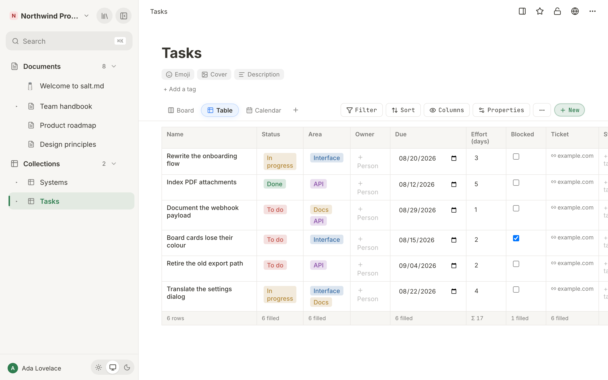
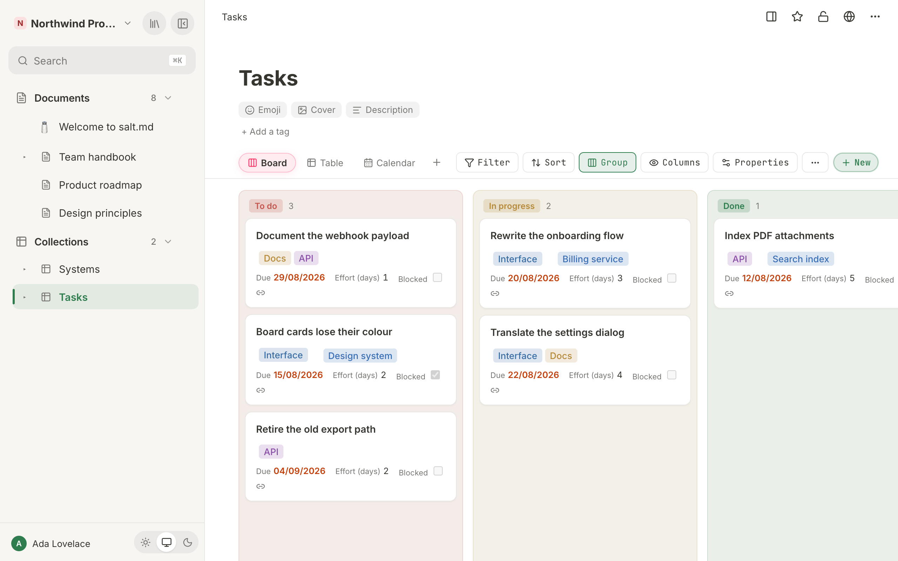
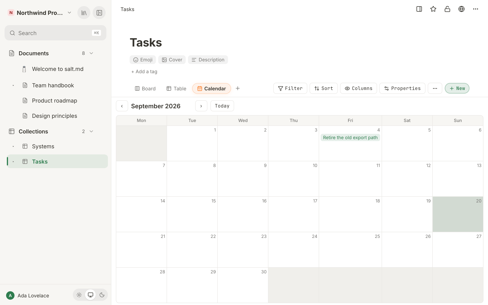

# Views

A **view** is a saved way of looking at one collection: a type (table, board,
calendar and four more), the conditions a row must meet to appear, the order the
rows come in, and which properties are shown. A collection can have as many
views as you like and they are independent — filtering the board changes nothing
about the table. What they never do is change the rows themselves. Every view of
a collection reads the same rows; only the drawing differs.

This page covers all seven view types, what each one needs before it can draw
anything, the options each one offers, and how filters, sorting and visible
columns work. The rows and the schema behind them are in
[Collections](collections.md); the property types are in
[Properties](properties.md).

One thing to know before the rest: **a view is not a personal setting.** It is
stored on the collection, so a filter you add is the filter everyone sees in
that view, on every device — the next time they open the collection. If you want
your own cut of the data, add a view rather than change one.

## The seven types

| Type | Draws | Needs |
| --- | --- | --- |
| `table` | rows and columns, one column per property | nothing |
| `board` | cards in columns | a select, multi-select or relation to group by |
| `list` | one quiet line per row | nothing |
| `gallery` | cards with the row's cover image | nothing |
| `calendar` | a month grid, rows on their day | a date property |
| `timeline` | bars across a day grid | a start date; an end date is optional |
| `form` | fields that create a row when submitted | nothing |

A collection that has just been created carries two views: **Board**, grouped by
the Status property, and **Table** — in that order, so the board is what opens
first.

A database created by an agent gets those same two views, whatever schema the
agent supplied — including a Board grouped by a property with the id `status`.
If the schema has no such property the database opens on *This board needs a
Select property to group by. Open ⚙ Properties to add one.* Point the board at a
real property with the **Group** button, or with `set_view` and `group_by`, or
remove the board and keep the table.

### `table`

The plainest view, and the only one that shows every visible property including
the ones that are empty. The first column is always **Name** and links to the
row; after it comes one column per visible property, in schema order. Cells are
editable where you stand: type into a number, tick a checkbox, pick a select
option. Editing a select option's name or colour from a cell changes the schema,
so it changes that option in every view and on every row.



Under the title sit the row's tags, and a coloured dot appears beside a row an
agent is working on right now.

When the table has rows, its foot is a calculation row. Under each column it
shows either a sum (`Σ`, for number, rollup and formula columns) or how many
cells are filled. It is not configurable — there is one aggregate per column and
it follows the type. The left-hand cell counts the rows: **42 rows**, in your
own language. On a table with no rows there is no foot at all, only the
empty-state line.

**Sub-items.** When the collection has a relation property pointing back at
itself, the settings bar offers a picker: **No sub-items**, or that property.
Choose it and the table becomes a tree — a row that points at other rows in the
same collection gets a `▾` to fold them away and a `▸` to bring them back (the
buttons are labelled **Collapse** and **Expand** for screen readers). Rows drawn
as children are not repeated at the top level. Two things this does not do: a
relation that loops back on itself cannot make the display loop, and a row whose
parent is filtered out is not lost — it simply becomes a top-level row.

Which branches are folded is yours alone and is not stored on the view. Leave
the collection and come back and everything is open again.

The table scrolls sideways when there are more columns than screen.

### `board`

Cards in columns, one column per option of the property it groups by, plus a
catch-all column at the end whose name is **No** followed by the property's name
— **No Status** on a board grouped by Status. That last column holds rows with
no value — and rows whose value points at an option somebody has since deleted,
so a card can never disappear from the board entirely.



Each column heading is a chip with the number of cards beside it. A select or
multi-select lends the chip its option's own colour; columns made from a
relation, and the catch-all column on every board, are grey — a row has no
colour to give.

A board can group by a **select**, a **multi-select** or a **relation**:

- Grouping by a select is the usual case: one column per status.
- Grouping by a **multi-select** puts a card in every column it belongs to. The
  same card is then on screen more than once, and each copy has its own menu.
- Grouping by a **relation** turns the rows of the *other* collection into the
  columns — one column per customer, per system, per whatever the rows point at.
  The column headings are those rows' titles.

Which one it is, is chosen with the **Group** button in the settings bar; it
lists every select, multi-select and relation property in the schema.

**Moving a card.** Drag it. With a mouse the drag starts after a few pixels; with
a finger you hold the card for about a third of a second first (a short vibration
where the device does one), because otherwise every attempt to scroll the board
would pick a card up instead. A floating copy follows the pointer, the target
column lights up, and a column scrolls by itself when you hold a card near its
top or bottom edge.

Note what a drag onto a multi-select or relation board does: it **replaces** the
value with that one option. It does not add to what is there. And dragging a card
into the catch-all column **clears** the value altogether — that is the only way
to unset a grouped property without opening the row.

Every card also has a `⋯`, and a right-click anywhere on the card opens the same
menu:

| Entry | What it does |
| --- | --- |
| **Open** | Opens the row as a page. |
| **Move to** → a column | Same as dragging. Only columns the card is not already in are listed, and picking **No …** clears the value. |
| **Move to trash** | Asks *Move “…” to the trash?* with the row's title first, then moves the row to the trash. Reversible from [Trash](trash-and-recovery.md). |

At the bottom of every column is **＋ New**, which creates a row with that
column's value already set and opens it. Under the catch-all column it creates a
plain row with nothing set.

**What a card shows** is decided by role, not by schema order, so cards look
alike no matter how the schema grew: coloured chips first (select, multi-select,
relation), then facts with their field name (numbers, dates, checkboxes,
checklists, rollups, formulas), then one short text, then small icons for the
values that only need to say "this exists" — email, phone, postal address, link.
People from every person property collapse into one stack of faces in the corner.
The field name is left off a fact only when the card has a single fact and the
property is called Date, Datum, Number or Zahl, where repeating it would say
nothing.

A card prints at most **eight** lines of facts and text together, and only ever
one text — a second one goes below the line however few facts there are. What is
left over is counted rather than dropped: **+3 more** opens it in place and
**less** folds it away again. Open a card's tail and it closes itself when you
leave the view; it is a glance, not a setting.

The property the board groups by is left off its own cards, since the column
heading already says it, and empty select fields stay invisible until you hover
the card — so a status can be set without opening the row, without putting a row
of dashes under every title. Open comments show as a speech bubble with their
count.

### `list`

One line per row and deliberately not a narrow table: no header row, no column
grid, nothing scrolls sideways. The icon and title lead, the tags follow, and
then the first three visible properties trail quietly behind — still editable,
so a select can be changed from the line. Which three depends on schema order
and on what you have hidden; hide a column and the next one moves up. Anyone who
wants to compare values down a column takes the table instead.

### `gallery`

A responsive grid of cards, each at least 200 px wide. The top of the card is the
row's **cover** — the image or gradient set on the row itself. A row without one
shows its icon on a plain panel instead.

Below the cover: the title, the tags, and the visible properties. Select and
multi-select are editable straight on the card and are shown even when they are
empty, so you can set one. Every other property is read-only here and is left off
entirely when it has no value, which is why gallery cards are different heights —
and why the table, not the gallery, is where a missing value is visible.

### `calendar`

A month grid. Every row that has a value in the chosen date property appears in
that day's cell as a clickable entry with its icon, title and tags. Rows without
a date simply do not appear.



The head of the calendar has `‹`, the month and year, `›`, and **Today**, which
jumps back to the current month. Which day the week starts on follows your
language and region — Monday across most of Europe, Sunday in the US and Japan,
Saturday in much of the Arab world — and the column headings are rotated to
agree with it. You can override it under **Week starts on** in your
[account settings](account.md).

A date property is a calendar date and is never shifted by a time zone: a row
dated the 18th sits on the 18th for everyone.

One limit: the calendar's date property is chosen when the view is created — the
first date property in the schema — and the settings bar has no control to change
it afterwards. An agent can change it with `set_view` and `date_prop`. Without a
usable one the view says *This calendar needs a Date property. Open ⚙ Properties
to add one.*

### `timeline`

A horizontal day grid with a sticky title column on the left, one bar per row,
month headings across the top and a line marking today. Clicking either the label
or the bar opens the row.

The settings bar carries two pickers for this view, and only for this view:

| Picker | Options | Effect |
| --- | --- | --- |
| **Start:** | **Start: —**, or any date property | Where the bar begins. Choosing the dash clears the choice, and the timeline falls back to the first date property in the schema. |
| **End:** | **End: (none)**, or any date property | Where the bar ends. With none, every bar is one day wide. |

When you create a timeline it takes the first date property as its start and the
second as its end, if there is one. A row without a start date is left out. If no
row has one, the view says *No entries with a date yet. Set a start date so they
appear on the timeline.* With no start property at all it says *This timeline
needs a Date property as its start. Open ⚙ Properties to add one.*

The visible range always contains today: it runs from three days before the
earlier of today and the first start, to four days after the later of today and
the last end. So a plan that lies entirely in the future begins three days before
today, not three days before the first bar.

### `form`

A form view turns the collection into something that can be filled in — by you,
or, once published, by anyone with the link. Submitting creates one row.

The form is: a required **Title** field (placeholder *Name of the entry*), then
one field per **fillable** visible property. Fillable means one of seven types:

| Type | Field |
| --- | --- |
| text | a text box |
| number | a number box |
| date | a date picker |
| checkbox | a tick box |
| select | a dropdown of its options |
| multi-select | chips you switch on and off (*No options defined* when it has none) |
| person | a text box |

Everything else — url, checklist, relation, rollup, formula, backrelation — never
appears on a form. There is nothing to type into a calculated value, and a
relation would mean handing a stranger a list of your other rows.

The heading and the description above the fields are edited in place, on the form
itself, and are stored on the view (*Description (optional) — explains what the
form is for.*). A form view has no Filter, Sort or Group button and no **New**
button — the form is the way rows are made here.

You can use the form yourself before it is published, and pressing Enter in the
**Title** field submits it. Your own submission is confirmed differently from a
visitor's: *Sent* / *Your answer has been saved.* with a **Send another answer**
button.

The submit button reads **Absenden**. Its label is stored on the view, but no
control in the interface writes it and `set_view` does not accept it, so the
German fallback is what everybody gets unless the view configuration is written
directly through `/api/collections/{id}`.

**Publishing.** The bar above the form has **Share publicly**. Press it and a
link is created and copied to your clipboard; the bar then shows a **Public**
badge, **Copy link** and **Revoke**. The link looks like `/form/<token>` on
whatever address your instance publishes under.

Two things about that link are worth knowing before you send it out:

- **Copy link mints a new one.** The token is stored only as a hash, so the
  existing link cannot be recovered — pressing **Copy link** creates a fresh
  link, and the one you handed out earlier stops working. A collection has one
  live form link at a time.
- **The first form view wins.** If a collection has two form views, the published
  link always renders the first one in the tab order.

What a visitor sees is the collection's icon, the heading, the description, the
same fields, a submit button and a *Made with salt.md* line; then *Thank you!*,
*Your answer has been submitted.* and a **Send another answer** button. The
heading is the form's own if it has one and **the collection's name otherwise**,
so give the form a heading when the collection is called something you would not
send to a stranger.

Beyond that they see nothing: not a row, not the rest of the workspace — the link
grants "write one row", never "read the page". Submissions are rate-limited per
address, the title is required and a title over 2000 characters is refused,
values that are not valid for their property are dropped (a select value that is
not one of the options, a number that arrives as text), text is cut at 4000
characters, and a
form on a collection that has been moved to the trash stops accepting anything.
If the link has been revoked, the visitor gets *Form not found* and *This link is
not valid or has been switched off.*

Hiding a property under **Columns** hides it on the public form too. More on the
published side in [Sharing](sharing.md#public-forms).

## The settings bar

The view tabs sit on the left of the collection's toolbar; everything that
configures the current view sits on the right, in this order:

| Control | What it opens |
| --- | --- |
| **Start:** / **End:** | Timeline only — which date properties the bars use. |
| **No sub-items** / a relation | Table only, and only when a relation points back at this collection. |
| **Filter** | The conditions a row must meet. Shows the count: `Filter (2)`. |
| **Sort** | One property, ascending or descending. |
| **Group** | Board only — which property makes the columns. |
| **Columns** | Which properties this view shows. Shows `Columns (4/7)` when anything is hidden. |
| **Properties** | The schema editor: add a property, change a type, edit select options. It edits the collection, not the view, so it changes every view at once. This is the **⚙ Properties** the empty-state messages point at. |
| **⋯** (*View options*) | Rename, move and remove this view. |
| **＋ New** | Creates an *Untitled* row and opens it. Every view except a form has it. |

**Filter**, **Sort**, **Group** and **Columns** light up in the accent colour as
soon as anything is set, so you can see that a view is filtered without opening
the popover.

On a narrow screen (about 640 px and below) those four popovers dock to the
bottom of the window instead of hanging under their button, and take up to about
three quarters of its height.

## Filters

A filter is a property, an operator and usually a value. Several filters on one
view are **ANDed**: a row has to satisfy all of them.

Add one with **+ Add filter…** in the **Filter** popover; remove it with the `✕`
beside it.

Seven operators exist. Which of them are offered depends on the property type,
and the labels change to suit it:

| Property type | Operators offered |
| --- | --- |
| number, rollup, formula | is · is not · **greater than** · **less than** · **between** · is empty · is not empty |
| date | is · is not · **after** · **before** · **between** · is empty · is not empty |
| text, person | is · is not · **contains** · is empty · is not empty |
| select, multi-select, relation | **is any of** · **is none of** · is empty · is not empty |
| everything else | is · is not · is empty · is not empty |

What they mean:

| Operator | Matches |
| --- | --- |
| `is` | equal to the value — or, on a list property, containing it |
| `is_not` | not equal, **and an empty value counts as "is not X"** |
| `is_empty` | nothing there: no value, an empty text, an empty list |
| `is_not_empty` | anything there |
| `contains` | the value as a substring, also inside a list |
| `gt` | greater than. Numeric as soon as the value you type is a number — a cell holding text then counts as 0. Otherwise both sides are compared as text, which is what makes **after** work on dates. |
| `lt` | less than, same rule |
| `between` | inside a range, **inclusive at both ends** — a range named by two dates contains the days it is named after. Takes two values, and does nothing until both are set. |

Where the values come from a fixed list — a select, a multi-select, a relation —
`is` and `is_not` take **several** values at once and read *is any of* and *is
none of*. That is one condition with two boxes ticked, not two conditions that
happen to be about the same column: "class is none of A, H" is a single thing to
read and a single thing to change.

**A condition with nothing filled in does not filter.** It waits, and says so.
It used to compare against the empty string and therefore match nothing, so the
table went blank the moment you added a condition — before you had typed
anything. If you want the rows that really have no value, that is `is empty`.

Three behaviours that surprise people:

- **`is_not` includes the empties.** A row with no status counts as "not done".
  That is usually what is meant on a working board and occasionally not.
- **`is` and `contains` look inside lists.** Filtering a multi-select or a
  relation for one value needs no special operator.
- **You never type an id.** The value box adapts to the property: a select offers
  its options, a checkbox offers **Checked** and **Unchecked**, and a relation or
  backrelation offers the titles of the rows it points at. Free text is only for
  the types that have nothing to offer.

The row **title** is not a property and cannot be filtered. To find rows by
title use [Search](search.md).

**Filtering happens twice.** The conditions go to the database first, so a
collection with fifty thousand rows is narrowed before anything is sent; what is
left arrives in batches of 200 until all of it is here, which is why a board
column's count is a true count and not "the first page of results". Then the
browser applies the same conditions again to what arrived — this time with the
calculated values filled in, which the database did not have.

That second pass is the whole reason the next paragraph reads the way it does.

**Filters on calculated values are unreliable.** A rollup, a formula and a
backrelation are not stored on the row. They are worked out when the rows are
read, which happens *after* the database has filtered — so to the database they
look like nothing at all:

| Operator on a rollup, formula or backrelation | What you get |
| --- | --- |
| `is`, `contains`, `>`, `<`, `is not empty` | an empty view — the database matched nothing |
| `is not`, `is empty` | every row passes the database, and the browser then narrows it correctly |

So two of the seven happen to give the right answer and five give a blank screen.
Build a view on neither: put the condition inside the rollup instead (see
[Properties](properties.md#rollup)), or keep a stored property alongside it. The
operators are offered in the popover all the same.

**Sorting is not affected.** A sort on a rollup or a formula works in the
interface, because every row is loaded and the browser sorts the finished
values. Over the API and over MCP, where a `limit` cuts the result short, it does
not — there the sort is the database's alone.

## Sorting

One property, **Ascending** or **Descending**, or **No sort** — the popover
behind the **Sort** button. Text is compared the way your language sorts it, so
accented letters land beside their plain forms instead of after Z; numbers are
compared as numbers.

With no sort, rows keep the order they have in the collection: the manual
position first, then when they were created. That is also the order cards come in
inside a board column and across a gallery.

Like a filter, a sort belongs to the view and applies for everybody looking at
it.

## Which properties a view shows

The **Columns** button opens two lists, **Shown** and **Hidden**, each row with
its type icon and an eye. Click a row to move it between the lists. **Hide all**
and **Show all** do the obvious, and the popover says *Nothing shown* or
*Nothing hidden* when a list is empty.

Hiding is per view and reaches every renderer, not just the table: hidden
properties disappear from table columns, board cards, gallery cards, the three
properties a list line shows, the fields of a form and the fields of the
published form.

**Do not hide the property a view is built on.** A board that groups by Status
and hides Status can no longer find it and falls back to the message *This board
needs a Select property to group by. Open ⚙ Properties to add one.* The same
applies to a calendar's date property and a timeline's start. There is no reason
to hide it anyway — a board already leaves the grouping property off its own
cards.

## What a view leaves out without saying so

Two absences are silent by design.

**Rows you are not allowed to see.** A row marked private belongs to the person
who made it. It is filtered out in the database, before the total is counted, so
it is missing from every view, from the batch loading and from every board column
count. A workspace admin sees everything. Nothing on screen says a row was left
out — the count is simply the count of what you may read. See
[Permissions](permissions.md).

**Nothing at all.** An empty view says *No rows yet — click ＋ New above.* when
the collection is empty, and *No rows match the current filter.* when it is not.
The two are worth telling apart before you go looking for lost data.

## Creating, renaming, reordering and removing views

1. **Add a view** with the `+` at the end of the tabs (tooltip *Add view*). The
   menu offers **Table**, **Board**, **Gallery**, **Calendar**, **Timeline**,
   **List**, **Form**. The new view is named after its type, is appended at the
   end, and opens straight away.
2. **Rename** by double-clicking the tab, or through `⋯` → **Rename view**.
3. **Move** it along the strip with `⋯` → **Move left** / **Move right**. The
   entries grey out at the ends. The order of the tabs is the order they are in;
   the first tab is what opens when someone opens the collection.
4. **Remove** with `⋯` → **Remove view**. It happens at once, without a
   confirmation, and takes the view's filters, sort and hidden columns with it.
   The rows are untouched. On a collection with one view the entry is not
   offered — a collection needs something to draw.

The `⋯` carries the tooltip *View options* and sits in the settings bar on the
right, not inside the tab.

When a new view is created, sensible defaults are filled in so it draws something
immediately: a board takes the first select or multi-select property, a calendar
the first date property, a timeline the first date property as its start and the
second as its end. If the schema has none of those, the view says what it is
missing.

Changes save as you make them, and are what everybody gets the next time they
open the collection. Row changes travel live: a card someone else moves moves on
your screen too, in this collection and in the same collection embedded in a
document. A change to the view itself — a filter, the sort, hidden columns, a new
tab — does not. A second browser that already had the collection open keeps the
configuration it fetched when it opened, and picks the new one up on a reload.

An embedded collection is the same collection, with the same views — changing a
filter there changes it everywhere.

Copying a set of views to another collection is not something the interface can
do. What it can do is copy a whole workspace's structure:
`workspace(from_workspace:)`, and the blueprint shelf under **New workspace**,
take the databases with their schemas *and* their views, without rows and without
documents. Filters on a relation are dropped on the way, since the rows they name
are not copied.

## Views over MCP

An agent reads and writes views with three tools.

`get_collection(page_id:)` returns the schema and every view with its id.

`set_view(page_id:)` creates a view when no `view_id` is given and changes one
when it is. It takes `name`, `type` (creating only), `group_by`, `date_prop`,
`end_date_prop`, `filters`, `sort` and `hidden`.

```
set_view(page_id: "<collection>", name: "Open", type: "board", group_by: "status",
         filters: [{property: "status", op: "is_not", value: "done"},
                   {property: "status", op: "is_not", value: "dropped"}],
         hidden: ["due"])
```

Four rules govern it:

- **Updating merges.** What you do not mention stays as it is, the same way
  `update_schema` behaves. Renaming a view does not drop its filter.
- **Empty clears.** `filters: []` removes every condition and `sort: ""` removes
  the sort — without that distinction a filter could be added and never removed.
  Clearing a board's `group_by` the same way is refused, because a board with no
  grouping has no columns.
- **A typo is refused, not ignored.** An unknown property, an unknown operator, a
  board with no `group_by`, a calendar or timeline with no `date_prop` — all
  rejected with a message naming the offending value. A view that quietly ignored
  a mistake would leave the agent reading unfiltered rows as the truth.
- **A view's type cannot be changed.** Delete it and create the new one. The type
  is what everything else in the view is describing.

`sort` is spelled `"propertyId:asc"` or `"propertyId:desc"` — the same spelling
`query_rows` uses, so there is one form to learn rather than two.

`delete_view(page_id:, view_id:)` removes a view; the last one cannot be deleted.
A read-only token is refused by both writing tools.

Three things are not reachable from MCP: a form view's heading and description,
typed on the form itself; its submit label; and a table's sub-item relation,
chosen in the settings bar.

A new view's id is derived from its name, so a view created as "Open" gets the id
`open`. Call `get_collection` if you need to be sure.

### Reading rows without a view

A view is not needed to ask a question once. `query_rows(page_id:)` takes the
same operators, the same `propertyId:asc` sort spelling, and `limit` (default 50,
maximum 500) with `offset`. It is more forgiving in one way than a view is: a
filter value may be a select option's **name** as well as its id, matched without
regard to case.

The same is available over HTTP: `GET /api/collections/{id}/rows` takes
`filter=<property>:<operator>:<value>` (repeatable, ANDed),
`sort=<property>:asc|desc`, `limit` (default 100, maximum 500) and `offset`, and
answers with the rows, the total, and the offset and limit it used. Both routes
run the same permission checks and the same database filter as a view does —
including the blindness to calculated values described above.

## Where to go next

- [Collections](collections.md) — rows, the schema dialog, nesting, embedding
- [Properties](properties.md) — all thirteen types, and what each one is for
- [Sharing](sharing.md) — publishing a form, and what is never shared
- [Agents](agents.md) — connecting an agent over MCP in the first place
