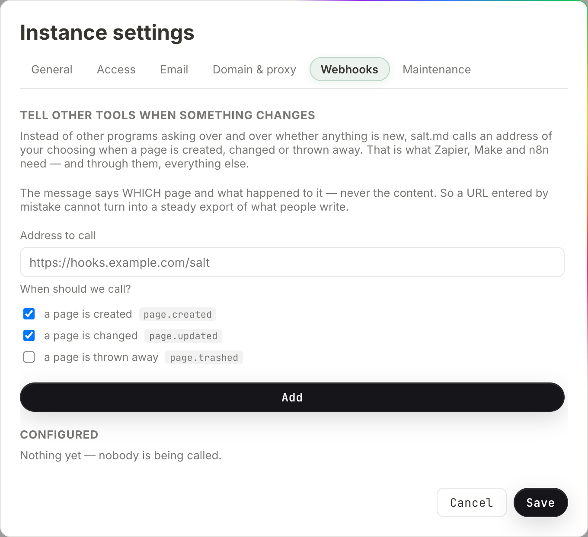

# Webhooks

A webhook is a standing instruction to call an address of your choosing when a
page is created, changed or thrown away. Instead of another program asking Salt
over and over whether anything is new, Salt calls it. That is what Zapier, Make
and n8n need to start a scenario, and it is what a script on your own server
needs to react to a page without polling.

Webhooks are instance configuration, not content. Only an instance admin can add
or remove one, and only from a signed-in browser — an [API token](api.md) cannot
reach them whatever its scope. A hook is instance-wide: it is not attached to a
workspace and it fires for pages in every workspace on the instance.

## Adding one

1. Open the user menu (your avatar, bottom left) and choose **Instance
   settings**. The item appears only for instance admins.
2. Go to the **Webhooks** tab.
3. Under **Address to call**, paste the URL your receiver listens on. It has to
   start with `https://` or `http://`, name a host, and be at most 500
   characters.
4. Under **When should we call?**, tick at least one of the three events. Each
   line shows the plain wording and the event name that will appear in the
   message.
5. Press **Add**. The button reads *Saving…* while the request is in flight.



The button stays disabled until there is an address and at least one event
ticked. If the address is rejected, the reason appears above the button —
*that does not look like a URL*, *a webhook URL has to start with https:// or
http://*, *the URL has no host*, or *that URL is too long*.

Under **Configured**, a fresh instance shows *Nothing yet — nobody is being
called.* until the first hook exists.

Adding and removing a webhook is written to the [audit log](history-and-audit.md)
with the address as the detail.

If you are creating hooks over the API rather than in the dialog, one thing is
worth knowing: an event name the server does not recognise is dropped without a
word. Sending `["page.created", "page.deleted"]` succeeds and leaves a hook
subscribed to `page.created` alone. Only when nothing survives that filter does
the server answer *Pick at least one event: page.created, page.updated or
page.trashed.* Compare the `events` field of the answer against what you sent.

## The secret, shown once

As soon as the hook is created, a box appears:

> **Copy this secret now — it is shown only once.**
>
> Your receiver uses it to check that a message really came from us. We send it
> as a signature in the X-Salt-Signature header.

Below it sits the secret — 64 hexadecimal characters — and a button labelled
**I have it**, which dismisses the box.

Copy it before you dismiss it. The secret is write-only through the interface
and through the API: nothing in the dialog and nothing in `/api/webhooks` shows
it again, for any hook, ever. If you lose it, remove the hook and add it again;
the new one gets a new secret, and your receiver has to be updated.

It is **not** hashed the way an [API token](api.md) is. A token is stored as a
hash and cannot be recovered by anybody, but a webhook secret has to stay usable
— the server computes the signature with it on every delivery — so it sits in
the database as it is. An instance backup (the owner's **Download backup
(.tar.gz)** in Instance settings → Maintenance, or `./salt backup` from cron)
therefore contains every webhook secret on the instance. Keep the archive as
carefully as you would keep the secret.

## The three events

| Event | The interface calls it | Fires when |
| --- | --- | --- |
| `page.created` | a page is created | a page is added |
| `page.updated` | a page is changed | a page's body or its details change |
| `page.trashed` | a page is thrown away | a page goes to the trash, or is deleted for good |

There are three and no more. Each one is fired from real places in the code; an
event that is documented but never arrives is worse than one that does not
exist, so the list stays short.

**Which actions actually produce a message** matters more than the names, and
the coverage is not complete. This is what fires today:

| Action | Message |
| --- | --- |
| New page, new collection, or a new row in a collection, from the browser | `page.created` |
| A page created by an agent with `create_page` | `page.created` |
| Editing a page's text in the editor | `page.updated` |
| Renaming, changing icon, cover, description, tags, visibility or properties | `page.updated` |
| Moving a page under a different parent | `page.updated` |
| Dragging a page up or down in the sidebar — a position is a detail like any other | `page.updated` |
| Marking a page as a template, or removing that flag | `page.updated` |
| An agent replacing a body with `write_content` in mode `replace` | `page.updated` |
| Moving a page to the trash | `page.trashed`, one per page in the subtree |
| Deleting a page for good from the trash | `page.trashed`, one per page in the subtree |

And this is what produces **no** message at all, which is the part worth knowing
before you build on it:

- **Any duplicate.** The ⋯ menu's **Duplicate**, **Save as template**, starting
  a page from an entry under **Templates**, and an agent's `duplicate_page` all
  take the same route through the server, and that route is silent. Duplicating
  is not noisier for agents than for people; it is silent for both.
- A collection created by an agent with `create_database`. The same collection
  created in the browser does fire `page.created` — the two paths differ.
- A database placed into a document with `embed_database`. That changes the
  document's body, and no `page.updated` follows it.
- Rows added with `create_rows`.
- Pages created by a [form](forms.md) submission from outside.
- Anything created by an [import](import-export.md) — Markdown, a ZIP archive,
  a CSV, or `import_url`. A new workspace made from the
  [blueprint library](library.md) is silent for the same reason: both write many
  pages at once, and a two-thousand-page import would otherwise become two
  thousand outbound calls.
- An agent appending or prepending text: `write_content` in its default mode
  (`append`) and in mode `prepend` are silent. Only `replace` reports.
- An agent changing details with `update_page`, `set_properties`,
  `update_schema` or `set_view`.
- An agent trashing or restoring a page with `set_trashed`.
- Restoring a page from the [trash](trash-and-recovery.md), and restoring an
  older version with `revisions`.
- Turning a page's public share link on or off. A `visibility` change fires
  `page.updated`, but a [share link](sharing.md) is a separate thing and its
  creation and removal are quiet. A receiver watching for "this page became
  reachable from outside" will never hear it.
- **Deleting a whole workspace, or deleting an account together with its
  personal pages.** Every page inside goes, and not one `page.trashed` is sent.
  This is the sharpest gap on the list: an integration keeping a mirror will go
  on holding pages that no longer exist here, with nothing to tell it otherwise.
- Comments and notes — see [Comments and notes](comments-and-notes.md).

If your integration has to see every change without exception, a webhook is not
the whole answer. Read the page list or the search index on a schedule as well.

### How often `page.updated` arrives while somebody types

Two separate timers run in the editor, and each one produces its own message.

The body is written about **1.5 seconds** after the last keystroke, and again
when you leave the page. The title, icon, cover, tags and description are
written on a timer of their own, about **half a second** after the last change
to them. Typing a title therefore produces a `page.updated` shortly after you
stop, and typing in the body produces another a second later.

A ten-minute editing session produces many messages, not one. Treat the event as
"this page changed, look at it again", not as a change list, and make your
receiver safe to run twice on the same page.

## What arrives

A `POST` with a JSON body. The body names the page and does not carry it:

```json
{
  "event": "page.updated",
  "at": "2026-08-07T09:14:02.481723Z",
  "page": {
    "id": "9f2c4ab1d0e34f7a8b5c6d7e8f901234",
    "title": "Q3 planning",
    "workspaceId": "1a4b7c9e2f5d8a3b6c0e4f7a1b2c3d4e",
    "path": "/p/9f2c4ab1d0e34f7a8b5c6d7e8f901234"
  }
}
```

- `at` is UTC, RFC 3339, with fractional seconds.
- `path` is relative. Put your instance's own address in front of it to build a
  link a person can click.
- The headers are `Content-Type: application/json`, a `User-Agent` of
  `salt.md/` plus the running version, and `X-Salt-Signature`.

Two things about the body are deliberate, and worth knowing before you build on
it.

**It never carries the page content.** Id, title, workspace and path — never the
blocks. A webhook address is typed once by an admin and then sends forever to a
host nobody re-checks; if the message carried the text, one careless paste would
become a standing export of everything anybody writes. A receiver that is
allowed to read the page can fetch it with its own credentials — see
[API](api.md).

**It carries no permission check.** The title and workspace id go out for every
page the event applies to, including a page whose visibility is private. Adding
a webhook means agreeing that the receiving host learns the titles of pages
across the whole instance. Treat the endpoint as trusted the way you would treat
a backup destination, and see [Permissions](permissions.md) for what private
means everywhere else.

One case where the body is thinner than the example: when a page is deleted **for
good**, the row is gone by the time the message is built, so `title` and
`workspaceId` arrive empty and only the id identifies it. A page moved to the
trash normally still has both.

## Verifying the signature

Every delivery carries a header:

```
X-Salt-Signature: sha256=<64 hex characters>
```

That is an HMAC-SHA256 of the **exact raw request body**, keyed with the secret
you were shown once. Compute it over the bytes as they arrived, before any JSON
parsing and re-serialising — a body that has been decoded and re-encoded will
not match.

Node.js:

```js
import { createHmac, timingSafeEqual } from 'node:crypto';

function verify(rawBody, header, secret) {
  const want = 'sha256=' + createHmac('sha256', secret).update(rawBody).digest('hex');
  const a = Buffer.from(header ?? '');
  const b = Buffer.from(want);
  return a.length === b.length && timingSafeEqual(a, b);
}
```

Python:

```python
import hmac, hashlib

def verify(raw_body: bytes, header: str, secret: str) -> bool:
    want = "sha256=" + hmac.new(secret.encode(), raw_body, hashlib.sha256).hexdigest()
    return hmac.compare_digest(header or "", want)
```

Reject anything that does not match, and use a constant-time comparison as both
examples do. Without the check, anyone who learns your URL — it travels in logs,
in proxy configuration, in a screenshot — can post whatever they like to it and
your automation cannot tell the difference.

## Which addresses a webhook may reach

Before each delivery the host name is resolved and **every** address it resolves
to is checked against a fixed list. If any of them is on the list, the call does
not happen:

| Refused | Examples |
| --- | --- |
| Loopback | `127.0.0.1`, `::1` |
| Private networks | 10.x, 172.16–31.x, 192.168.x, IPv6 unique-local |
| Link-local | including `169.254.169.254`, the cloud metadata service |
| Multicast and the unspecified address | any multicast range, `0.0.0.0` |

That list is the whole of the check. Anything not on it is dialled, including
address ranges that are not reachable from the public internet — the shared
range some providers put between a customer network and the internet (100.64.x)
is the common example. So the rule is "these are refused", not "only the public
internet is allowed".

The reason for it is not caution for its own sake. Salt sits inside a network
and can reach neighbours that the internet cannot: routers, hypervisors, the
metadata service that hands out cloud credentials. A field that makes the server
call any address an admin can type is the classic way a harmless feature becomes
a way in from outside. The check happens at delivery time and against the
resolved address, not against the text of the URL, so a host name that quietly
starts pointing inward is caught too.

**Redirects are refused.** A webhook endpoint has no reason to move, and
following a redirect is how a checked address turns into an unchecked one. A
`301` or `302` from your receiver is recorded as a failure.

There is one override, and it belongs to whoever runs the server, not to an
admin in the interface: starting Salt with `SALT_IMPORT_ALLOW_PRIVATE=1` lifts
the restriction for the whole process. Its name says import, but it opens
webhooks as well. Set it only on an instance where every URL in the settings
dialog is one you put there — see [Self-hosting](self-hosting.md).

## Delivery, failures and what you see

Under **Configured**, each hook shows its address, its events separated by
`·`, and the outcome of the last attempt: either *not called yet*, or
*last call: HTTP 200 · <time>*, formatted in your own [time
zone](language-and-time.md).

| Behaviour | Value |
| --- | --- |
| Attempts per event | one — there is **no retry** |
| Timeout | 10 seconds |
| Redirects | refused |
| Response body | ignored; only the status code is recorded |
| Order | none guaranteed — hooks are called in parallel |

What the status line can say:

- `HTTP 200`, `HTTP 500`, and so on. Any answer at all is recorded as its
  status. A `500` is not retried and is not treated differently from a `200`;
  the only difference is what you read in this list.
- `failed: …` — the call did not complete: the host did not resolve, the address
  was refused as internal, the connection timed out, or the receiver redirected.
  The reason is cut off after 120 characters.
- `bad request: …` — the stored address could not be turned into a request at
  all.

**What your receiver should answer: anything.** There is no contract to meet.
The status code is written to the status line and otherwise ignored, and the
body is never read, so `204 No Content` with an empty body is a perfectly good
reply. Nothing depends on answering quickly either, beyond the 10-second timeout
— and since there is no retry, a slow or failing answer costs you the message
rather than earning you a second one.

A webhook never affects the person who triggered it. Deliveries run in the
background, after the save has already succeeded; a receiver that is down, slow
or gone does not slow anybody's typing and never turns a successful save into an
error message. The price of that is the missing retry: if your endpoint is
unreachable for five minutes, the events from those five minutes are gone. Build
receivers that can catch up by reading the current state, not ones that
reconstruct history from the messages.

## More than one hook, and the same address twice

Nothing stops you adding several hooks, and nothing stops two of them pointing
at the same address. There is no uniqueness check and no limit on how many a
server holds. Each hook is its own thing: its own secret, its own event
selection, its own status line — and its own delivery. Two hooks on one URL mean
every matching event arrives there twice, signed with two different secrets.

If a receiver is seeing doubles, that is the first place to look.

## Changing or removing a hook

There is no edit. To change an address or the set of events, remove the hook and
add a new one — which means a new secret in your receiver. There is no pause
either: a hook is either configured or it is not.

**Remove** deletes it immediately, with no confirmation step. The next event
produces nothing for that address.

## Reading them from the API

`GET /api/webhooks` returns the configured hooks as JSON — id, url, events,
active, createdAt, lastStatus, lastAt. The secret is not among them, for any
hook, ever. `POST /api/webhooks` creates one and its answer is the only place
the secret appears. `DELETE /api/webhooks/{id}` removes one. All three need an
admin's browser session.

One field needs a warning: `active` is always `true`. It is set when the hook is
created and nothing in the product ever changes it — there is no enable/disable
switch in the dialog and no route that flips it. Read it as a field the server
consults before delivering, not as a setting you can use.

## When a webhook is the wrong tool

- **Something inside Salt should react to a change** — there is nothing for
  that. salt.md has no rule engine and no scheduler; nothing in it says "when
  Status becomes Done, send an email". The logic lives at the other end of the
  webhook. See [Automation](automation.md) for the whole map of what reaches in
  and out.
- **A program of your own wants to read and write pages** — call the API
  directly, or connect over MCP. See [API](api.md) and
  [Agents](agents.md).
- **A browser tab needs live updates** — the app's own tabs already get them
  over `/api/events` while somebody is signed in. A webhook is for programs that
  hold no session and no open connection.
